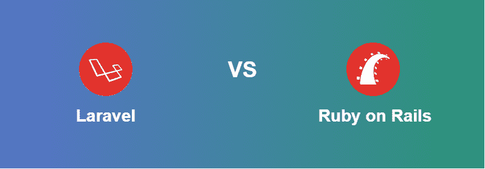
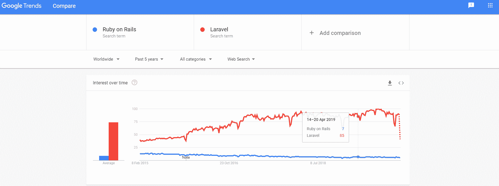

# 【Laravel 和 Ruby on Rails 的区别

> 原文:[https://www . geeksforgeeks . org/laravel 和 ruby on-rails 的区别/](https://www.geeksforgeeks.org/difference-between-laravel-and-ruby-on-rails/)

Laravel 和 Ruby on Rails 都是后端网络框架。两者在发展领域都很受欢迎，主要区别在于使用了语言。Laravel 使用 PHP，Ruby on Rails 使用 Ruby，两者都有一个庞大的社区。在投票的基础上，红宝石排在第 5 位，拉弗尔排在第 6 位。在比较它们之前，我们必须了解两者的细节和具体特征。 **[Laravel](https://www.geeksforgeeks.org/laravel-view-basics/)** 可能是一个先进的 web 应用系统，能够高效快速地规划 web 应用。它可以轻松地执行互联网应用程序的定制。这是一个开源的、利用率极高的系统，用 PHP 编写。 **Ruby on Rails** 就是这样一个系统，它用一大堆现成的亮点让工程师与众不同，这样工程师就可以基本上专注于商业原理，而不是陷入复杂的框架中。它可能是一个服务器端的网络应用系统，由 Ruby 制造。

**Laravel:** 对于几乎每个 web 应用程序，都有非常常见的主要任务，如缓存组件、会话管理、指导、验证等。Laravel 天生努力通过促进所有这些常见的任务来消除改进准备中的不便。

**特征:**

*   **模板引擎:**它有内置的轻量级模板引擎，可以用来创建布局。该模板可用于创建从简单到复杂的布局。
*   **MVC 架构支持:** Laravel 支持 MVC 架构，有很多内置功能有助于提升应用的性能。
*   **安全性:** Laravel 内置函数使用哈希和加盐密码机制，提供了很高的安全性。
*   **库和模块化:**它带有预安装的库，有助于应用程序运行良好。
*   **单元测试:** Laravel 可以一次处理多个单元测试，这将检查开发人员做出的新更改。

**Ruby on Rails:** Rails 由像 JSON 和 XML 这样的网络度量支持，它们被大量用于信息交换目的。一些理想的模型是任何处于网络进程中间的系统的标准，就像传统的布局一样，DRY 指南中工程师不是为了重复一个基本原理而聚集在一起的。Rails 有效地推进和维护了这些标准。它基于 MVC，即模型-视图-控制器框架，可以作为改进网页和 web 服务的基准。Ruby on Rails 带来的关键亮点之一是元编程。Rails 计数元编程有一些亮点，这减少了开发人员的时间，使他能够专注于交易原理。一点也不像其他一些系统，设计师应该从头开始编码，元编程给了设计师优势，为压倒性的任务。常规方法比安排更受青睐，这可以缓解开发人员的生活。

**特征:**

*   **符号垃圾收集器:** Ruby on rails 支持符号垃圾收集器这可以收集阻止系统遭受多次攻击的符号。
*   **关键字参数:**关键字参数帮助 Ruby 应用减少内存消耗。
*   **涡轮链接:**可能你体验过，有时候网页加载非常慢，因为它试图加载整个页面，但是 ROR 支持涡轮链接，只会加载页面的内容，所以比加载整个页面要快。
*   **渲染:**在 rails 5 之前，我们必须使用 gem render_anywhere 进行渲染，但是在 Ruby 5 之后，我们可以从任何地方渲染视图。
*   **URL 定制:**在 Ruby 中我们可以定制浏览器的友好 URL。

**在谷歌趋势的基础上:**

| 拉维尔 | 铁轨上的红宝石 |
| --- | --- |
| Laravel 是用 PHP 编写的，有一个简单的学习弯曲，赋予了创造力范围。 | 用 Ruby 编写的 Rails，与准备好的设计师一致，有一条浸泡学习曲线。 |
| Laravel 有几个极好的亮点，比如 Edge，它可能是一个布局引擎，也可以直接利用 PHP 代码。 | Rails 的亮点是它支持第三方插件，即 Ruby 宝石，这有助于改进，并且有很好的记录。 |
| Laravel 非常适合执行和适应性。 | Rails 的可扩展性较差。 |
| Laravel 对于具有内置验证功能的 web 应用程序来说非常出色。 | Rails brilliant 在 CoffeeScript 框架内为 web 应用程序提供了一个内置的非活动编译工具。 |
| Laravel 有一个 MVC 设计，它的声明 CLI 被称为 Artisan，可以执行诸如移动数据库、清除缓存等任务。 | Rails 是由相同的 MVC 设计支持的，通过活动记录让信息处理亮点。 |
| Laravel 适合从业务层面扩展到具有复杂交易原理的小网站 | Rails 非常适合元编程方言和为小项目编写的 web 应用程序。 |