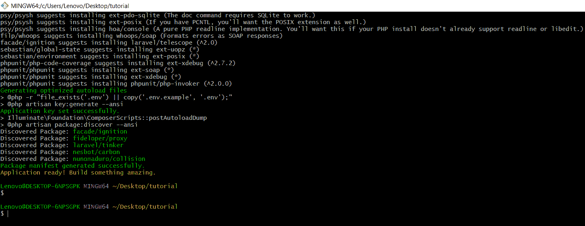
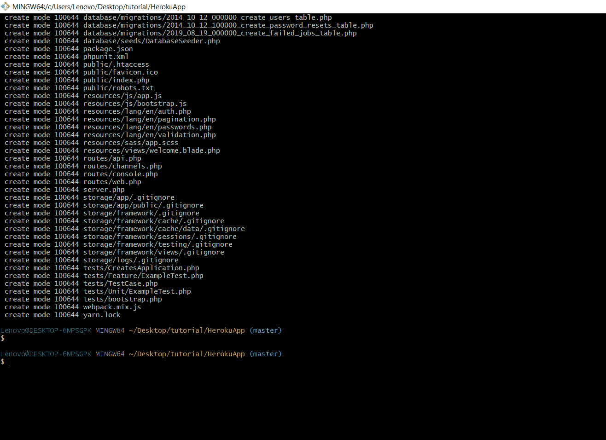
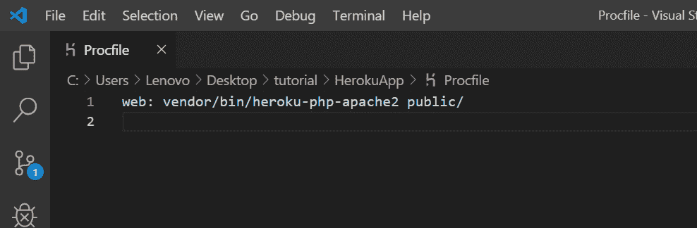
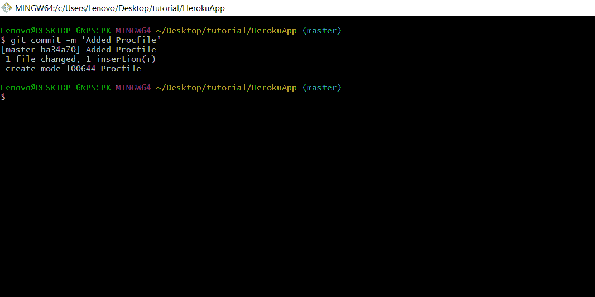
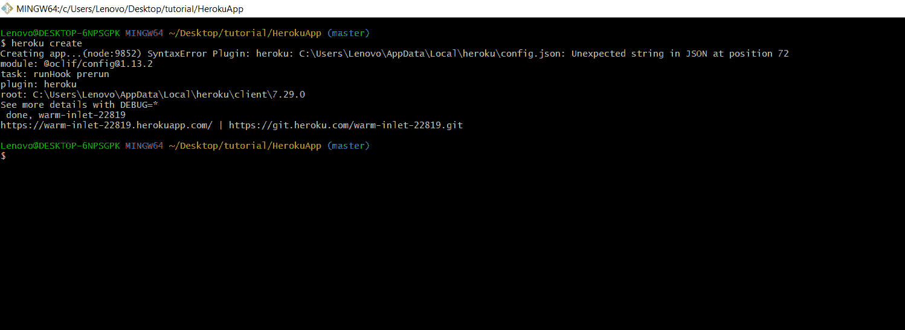
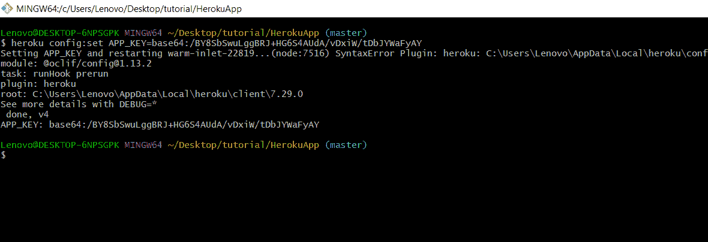
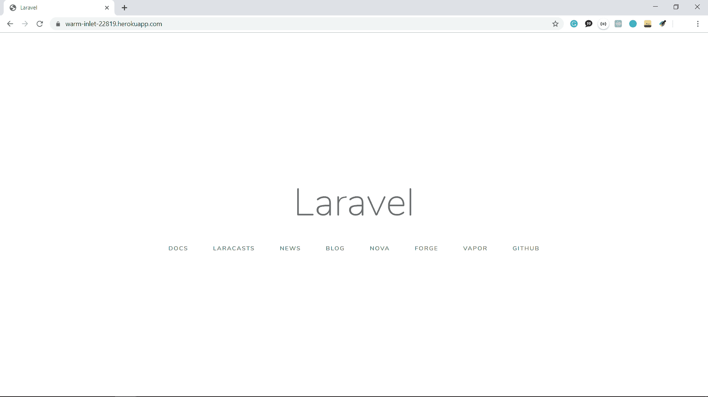

# 如何将 Laravel App 上传到 Heroku 云应用平台

> 原文:[https://www . geesforgeks . org/how-upload-laravel-app-to-heroku-cloud-application-platform/](https://www.geeksforgeeks.org/how-to-upload-laravel-app-to-heroku-cloud-application-platform/)

## 先决条件:

*   PHP 知识(Laravel)
*   一个 [Heroku](https://signup.heroku.com/) 用户账号
*   [Git](http://geeksforgeeks.org/ultimate-guide-git-github/) 版本控制的基本知识

**设置 Heroku CLI:** 可以从[这里](https://devcenter.heroku.com/articles/heroku-cli#download-and-install)下载 Heroku CLI。我们建议您查看[这篇](https://www.geeksforgeeks.org/introduction-and-installation-of-heroku-cli-on-windows-machine/)文章来安装 Heroku CLI。

**创建 laravel 应用程序:**为了创建 Laravel 应用程序，请转到您的命令行并编写以下命令。

```
$ composer create-project laravel/laravel HerokuApp --prefer-dist
```

运行上述命令后，您将看到类似如下的内容:


我们假设您的机器中安装了 composer。否则可以从[这里](https://getcomposer.org/download/)下载。

**初始化 git 存储库:** Heroku 要求应用程序是 Git 存储库。转到应用程序的根目录，输入以下命令

```
$ git init
```

初始化后，将文件添加到存储库中，并将更改提交为

```
$ git add .
$ git commit -m 'Initial commit'
```

运行以上命令后，您将看到类似如下的内容:


**创建过程文件:**根据文档，默认情况下，Heroku 从根目录提供文件。因此，为了告诉 Heroku 从**公共/** 目录中提供文件，您需要创建一个 Procfile。创建一个过程文件(*没有与此文件关联的扩展名)*)。
在文件中添加以下内容:

```
web: vendor/bin/heroku-php-apache2 public/
```

在 VS 代码中应该是这样的:


现在，将此文件添加到存储库中，并将更改提交为:

```
$ git add .
$ git commit -m 'Added Procfile'

```



**部署到 Heroku:** 现在你的应用已经准备好了，你现在可以在 Heroku 上创建一个新的应用，并将更改推送到服务器。键入以下命令，从命令行创建一个新应用程序。

```
$ heroku create
```



以上命令将创建一个有线名称如`**calm-cliffs-42104.herokuapp.com**`的网站。

现在**通过以下命令将**本地更改推送到服务器:

```
$ git push heroku master
```

你会看到如下内容:


自从你**之后还有一件事。env** 文件尚未上传到服务器，因此，您需要为 Heroku 应用程序设置一个**环境变量**。您可以通过以下命令来实现:

```
$ heroku config:set APP_KEY={your-app-key}
```

运行该命令后，您将看到类似如下的内容:


您可以通过此命令或仪表板设置更多配置(环境)变量。现在，你可以去你的[仪表盘](https://dashboard.heroku.com/apps)看看你的网站。您也可以通过以下命令打开您的网站:

```
$ heroku open
```

运行上述命令后，您将看到 laravel 的主页，如下图所示:


**注:**

*   现在，每次当你对你的应用程序进行任何更改时，你都必须**提交**更改并**将其推送到**Heroku，就像我们在本教程中所做的那样。
*   您可以通过从[仪表盘](https://dashboard.heroku.com/apps)进入应用的设置来更改应用的名称。

**参考:** [英雄库文档](https://devcenter.heroku.com/articles/getting-started-with-laravel)