# Laravel |工匠命令在 Laravel 中了解

> 原文:[https://www . geesforgeks . org/laravel-artisan-commands-to-know in-laravel/](https://www.geeksforgeeks.org/laravel-artisan-commands-to-know-in-laravel/)

[**【工匠】**](https://www.geeksforgeeks.org/laravel-artisan-console-introduction/) 是 Laravel 提供的命令行界面，有助于让生产过程变得快速简单。Laravel 有自己的命令行界面，叫做 Artisan。这就像一个 Linux 命令行，但是这些命令对于构建一个 Laravel 应用程序很有帮助。有了这个命令行工具，我们可以制作模型、控制器，还可以进行数据迁移等等。首先，我们必须将您的命令行控制台(即 windows 上的 cmd 或 Linux/Mac 上的终端)或任何其他 CLI 软件中的目录更改为您的 Laravel 应用程序的目录。

1.  **For Controller:** The following command will create a controller:

    ```
    php artisan make:controller ArticleController

    ```

    **输出:**
    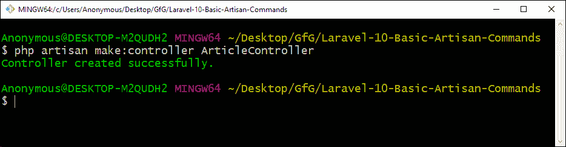

    下面的命令是一起创建一个控制器和一个模型:

    ```
    php artisan make:controller ArticleController -m Article

    ```

    **输出:**
    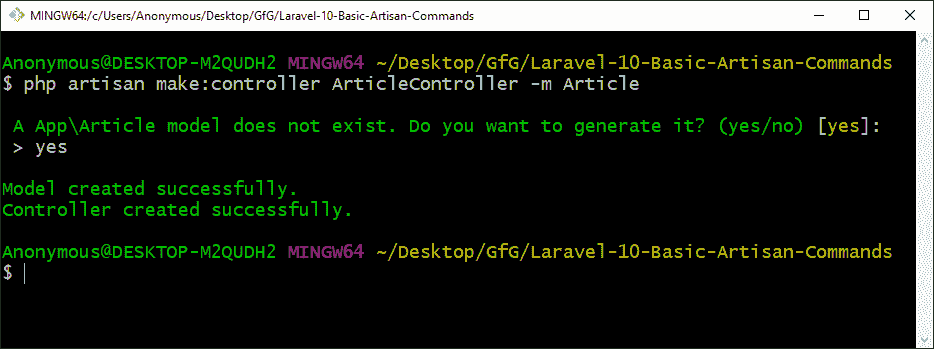

2.  **对于雄辩模型:**以下命令将创建雄辩模型:

```
php artisan make:model Article

```

**输出:**
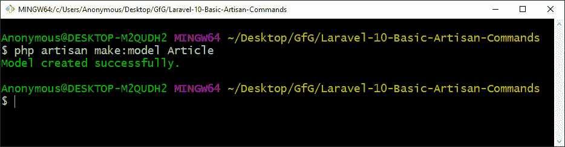

7.  **For Front-end Scaffolding:** The following command will create a front-end scaffolding for the for Bootstrap:

    ```
    php artisan ui bootstrap

    ```

    **输出:**
    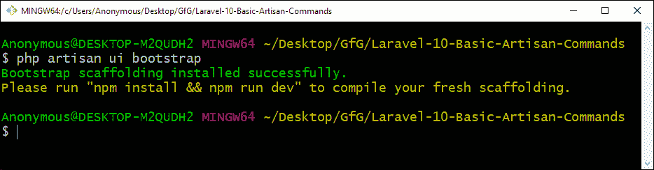

    以下命令将为 for Vue 创建前端支架:

    ```
    php artisan ui vue

    ```

    **输出:**
    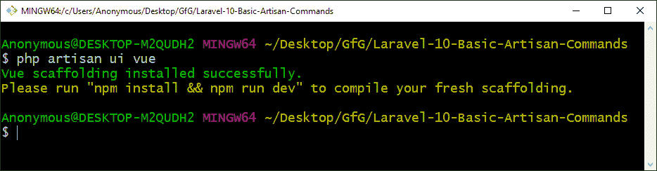

    以下命令将为“反应”创建前端支架:

    ```
    php artisan ui react

    ```

    **输出:**
    

    要拆除脚手架，请使用以下命令:

    ```
    php artisan preset none

    ```

    **输出:**
    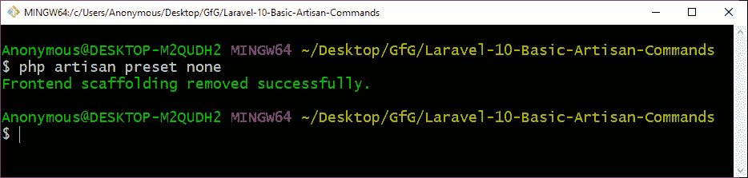

    **注意:**在使用上述命令之前，您需要运行“*composer require laravel/ui–dev*”来安装“ *laravel/ui* ”包。

8.  **For Authentication Configuration:** The following command will create a full authentication system:

    ```
    php artisan ui vue --auth

    ```

    **输出:**
    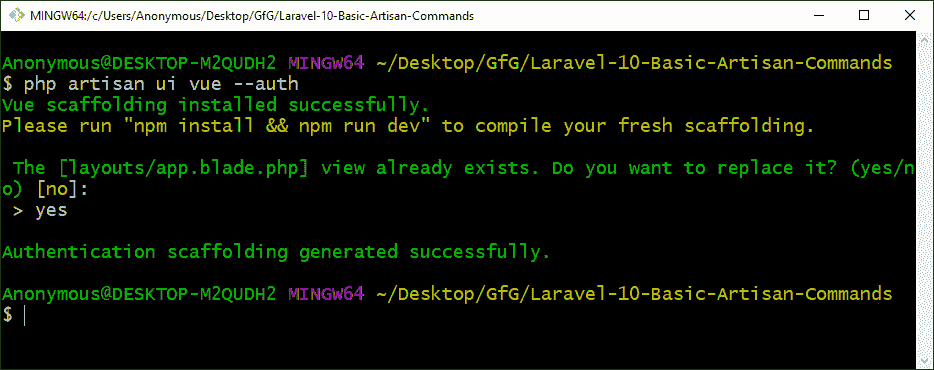

9.  **For Migration:** The following command will create a migration:

    ```
    php artisan make:migration create_articles_table

    ```

    **输出:**
    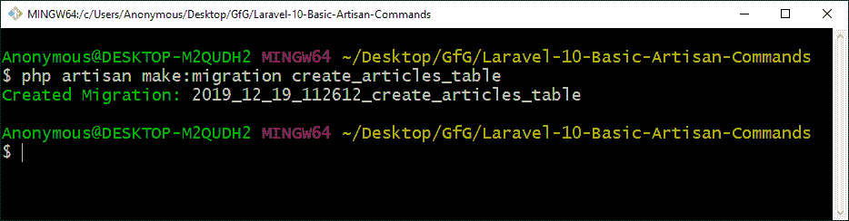

    要对所有表进行数据库迁移，请运行以下命令:

    ```
    php artisan migrate

    ```

    **输出:**
    

10.  **For Route:** The following command will display list of all the routes:

    ```
    php artisan route:list

    ```

    **输出:**
    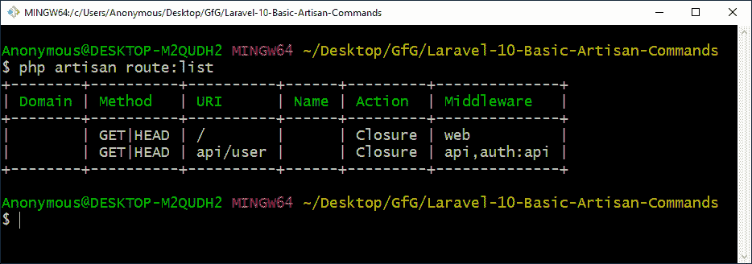

11.  **For Tinker:** The following command will start tinker:

    ```
    php artisan tinker

    ```

    **输出:**
    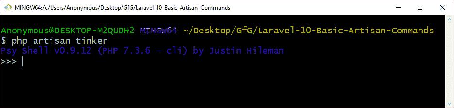

12.  **For Starting Development Server:** The following command will start the Laravel development server and provide a URL to visit the running Laravel application:

    ```
    php artisan serve

    ```

    **输出:**
    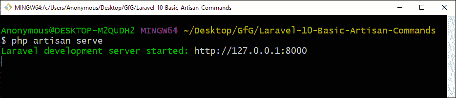

13.  **For Maintenance Mode:** The following command can be used to take the Laravel application in or out of the Maintenance Mode:

    **维护中:**

    ```
    php artisan down

    ```

    **输出:**
    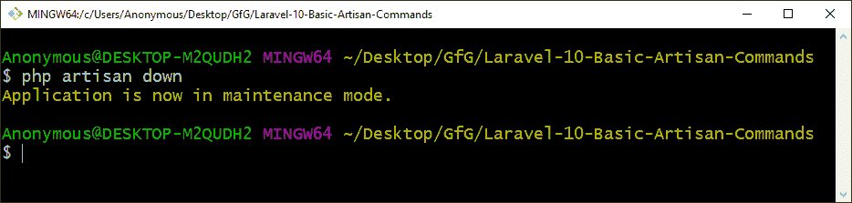

    **退出维护:**

    ```
    php artisan up

    ```

    **输出:**
    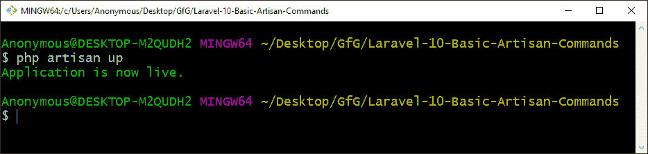

14.  **For Listing Commands:** The following command will display a list of all the command that are available:

    ```
    php artisan list

    ```

    **输出:**
    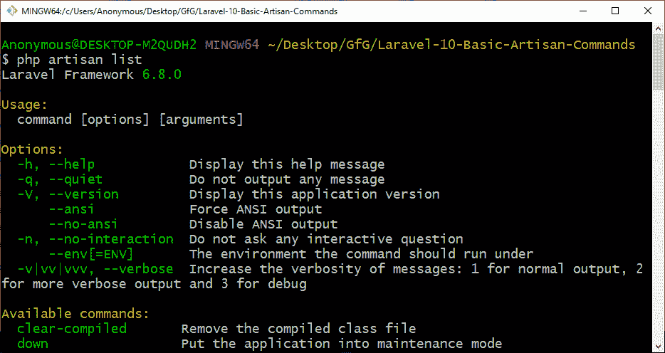

    你也可以写 juts‘**PHP artisan**’而不用‘**列表**’，同样会工作，列出所有的 artisan 命令。

**注意:**要了解任何命令的更多信息，请在命令末尾使用 **-h** 或**-help**。