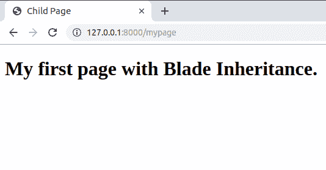

# Laravel |刀片模板继承

> 原文:[https://www . geesforgeks . org/laravel-blade-templates-inheritation/](https://www.geeksforgeeks.org/laravel-blade-templates-inheritance/)

模板引擎使编写前端代码变得更容易，并有助于重用代码。所有的刀片文件都有一个扩展名 **.blade.php* 。在 Laravel 中，大多数时间前端文件存储在*资源/视图*目录中。Blade 文件支持 PHP，并被编译成普通的 PHP，缓存在服务器中，这样当用户再次访问页面时，我们就不必再做额外的编译模板的工作，因此使用 Blade 就像在前端使用 PHP 文件本身一样高效。

**模板继承:**在大多数现代网页中，所有网页都遵循一个固定的主题。因此，能够重用您的代码是非常有效的，这样您就不必再次编写代码中的重复部分，Blade 极大地帮助您实现这一点。

*   **Defining a layout:** Let’s do that with an example and create a file called **layout.blade.php** in **resources/views** directory as shown below:

    ```php
    <!DOCTYPE html>
    <html lang="en">
    <head>
        <title>@yield('title')</title>
    </head>
    <body>
        <div>
            @yield('content')
        </div>
    </body>
    </html>
    ```

    现在，在上面给出的代码中，我们使用 **@yield** 指令告诉 blade，我们将在子 Blade 页面中进一步扩展这一部分。此外，请注意，每个 yield 指令都有一个类似于第一个指令的**标题**和第二个指令的**内容**的名称。这些名称将在以后的子页面中使用，以表明此部分在此扩展。

*   **Extending a layout:** Let’s do that too now and create a page at **resources/views** directory called *mypage.blade.php* as given below:

    ```php
    @extends('layout')

    @section('title')
        Child Page
    @endsection

    @section('content')
        <h1>My first page with Blade Inheritance.</h1>
    @endsection
    ```

    在这段代码中，我们首先使用 **@extends** 指令，该指令告诉我们从哪个刀片页面继承这个页面。在我们的例子中，它将是布局，因为我们将从我们之前创建的**layout.blade.php**继承这个页面。此外，我们使用**@节**指令来扩展父刀片文件的每个 **@yield** 指令。我们必须告诉每个 **@yield** 指令的名称，我们将在**@部分**指令中进行扩展，就像我们在上面的代码中所做的那样。确保在编写完代码后，您以 *@endsection* 结束指令。所有 **@yield** 部分将被替换为子刀片页面中的相应代码。完成这项工作的最后一件事是在您的 **routes/web.php** 中添加如下所示的路由。

    ```php
    Route::get('/mypage', function() {
        return view('mypage');
    });
    ```

    我们刚刚创建了一条通往 */mypage* 的路线，在回调函数中，我们为*mypage.blade.php*提供服务。请注意，Blade 会自动在*资源/视图*目录中查找文件。

*   **Output:**
    

    在输出中，您可以看到如何将 **@yield('标题')**替换为**子页面**， **@yield('内容')**替换为**我的第一个带有 Blade 继承的页面。**