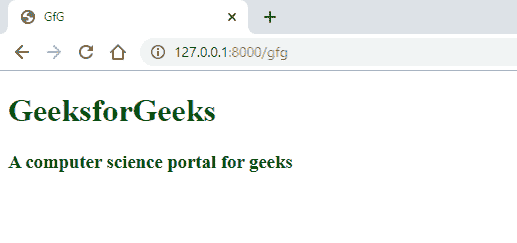

# Laravel |控制器基础知识

> 原文:[https://www.geeksforgeeks.org/laravel-controller-basics/](https://www.geeksforgeeks.org/laravel-controller-basics/)

Laravel 是一个基于 **MVC** 的 PHP 框架。在 MVC 架构中， **C** 代表**控制器**。控制器**是控制请求行为的控制器。它处理来自**路由**的请求。在 Laravel 中，控制器位于“ **app/Http/Controllers** ”目录中。所有要创建的控制器都应该在这个目录中。**

我们可以使用“**make:controller**”Artisan 命令创建一个控制器。

**语法:**

```php
php artisan make:controller UserController
```

您可以指定任何名称来代替“ **User** ”，但是根据 Laravel 的命名约定，您指定的任何名称都必须在末尾指定单词“ **Controller** ”。

**示例:**

1.  Let’s create a controller by running the following command:

    ```php

    php artisan make:controller GfGController

    ```

    这将在“ **app/Http/Controllers** ”目录下创建一个名为“**GfGController.php**的文件。在这个文件中还创建了一个同名的控制器类。

2.  现在我们已经创建了一个控制器，让我们定义一个名为“**索引**的公共函数，并指定我们的视图文件名(*我们将在下一步*中创建它)。

    ```php
    <?php

    namespace App\Http\Controllers;

    use Illuminate\Http\Request;

    class GfGController extends Controller
    {
        public function index() {
            return view('gfg');
        }
    }
    ```

3.  现在，我们必须为视图文件创建并编写代码，该文件是我们在“**GfGController.php**中指定的。我们将在“**资源/视图**目录中创建一个“**gfg.blade.php**”文件。

    ```php
    <!DOCTYPE html>
    <html>
    <head>
        <title>GfG</title>
        <style>
            h1 {
                color: green;
            }
        </style>
    </head>
    <body>
        <h1>GeeksforGeeks</h1>
        <h3>A computer science portal for geeks</h3>
    </body>
    </html>
    ```

4.  Now the last thing to do is to write the route in the ‘**web.php**’ file in ‘**routes**’ directory.

    ```php
    Route::get('gfg', 'GfGController@index');

    ```

    在这里，我们已经在第一个参数(*你可以根据你的需要指定任何东西*)中定义了路线“ **gfg** ，然后是上一步我们创建的控制器的名称。同样重要的是，在最后我们要指定我们在控制器类中定义的函数名，中间用“ **@** ”符号隔开。
    **注意:**要得到输出，我们必须在 URL 的末尾写“/gfg”。

**输出:**


**参考:**T2】https://laravel.com/docs/6.x/controllers