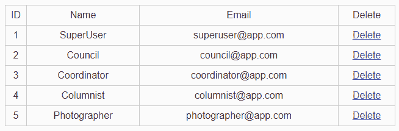
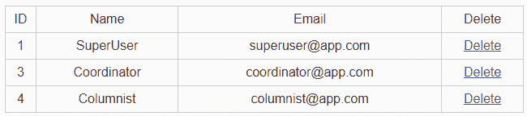

# Laravel |删除记录

> 原文:[https://www.geeksforgeeks.org/laravel-delete-records/](https://www.geeksforgeeks.org/laravel-delete-records/)

要删除记录，我们可以使用**删除方法**来使用**数据库**外观。为此，请逐一遵循以下步骤:

*   **Step 1:** Create Controller UserController by executing this command.

    ```php
    php artisan make:controller UserController
    ```

    

*   **Step 2:** We can delete records in two ways.

    **第一种方法:**第一种是使用数据库命令直接删除。在**应用程序中编写以下代码**

    ```php
    <?php
    namespace App\Http\Controllers;
    use Illuminate\Http\Request;
    use DB;
    class UserController extends Controller {
           public function index() 
           {
              $users = DB::select('SELECT * FROM users');
              return view('user', ['users'=>$users]);
           }
           public function destroy($id) 
           {
              DB::delete('DELETE FROM users WHERE id = ?', [$id]);
              echo ("User Record deleted successfully.");
              return redirect()->route('users.index');
           }
    }
    ```

    **第二种方法:**第二种方法是使用 Laravel 删除功能和用户模型(简单的一种)进行删除。

    ```php
    <?php
    namespace App\Http\Controllers;
    use Illuminate\Http\Request;
    use App\User;
    class UserController extends Controller {
           public function index() 
           {
              $users = User::All();
              return view('user', ['users'=>$users]);
           }
           public function destroy($id) 
           {
              $user = User::where('id', $id)->firstorfail()->delete();
              echo ("User Record deleted successfully.");
              return redirect()->route('users.index');
           }
    }
    ```

*   **第 3 步:**实现或驱动程序代码，并在 routes/web.php

    ```php
    <?php
    Route::get('/user', 'UserController@index')->name('users.index');
    Route::delete('/user/{id}', 'UserController@destroy')
        ->name('users.destroy');
    ?>
    ```

    中创建用于实现上述代码的网络路由
*   **第 4 步:**创建一个视图文件，我们在资源/视图目录名称**user.blade.php**中显示我们的用户。编写以下 HTML 代码。

    ```php
    <!DOCTYPE html>
    <html>

    <head>
        <title>Users Record</title>
        <style type="text/css">
            table {
                color: #333;
                font-family: sans-serif;
                width: 640px;
                border-collapse: collapse;
                border-spacing: 0;
            }

            td,
            th {
                border: 1px solid #CCC;
                height: 30px;
            }

            th {
                background: #F3F3F3;
                font-weight: bold;
            }

            td {
                background: #FAFAFA;
                text-align: center;
            }
        </style>
    </head>

    <body>
        <table>
            <tr>
                <td>ID</td>
                <td>Name</td>
                <td>Email</td>
                <td>Delete</td>
            </tr>
            @foreach ($users as $user)
            <tr>
                <td>{{ $user->id }}</td>
                <td>{{ $user->name }}</td>
                <td>{{ $user->email }}</td>
                <td><a href="{{ route('users.index') }}" 
                       onclick="event.preventDefault();
                        document.getElementById(
                          'delete-form-{{$user->id}}').submit();">
                     Delete 
                    </a>
                </td>
                <form id="delete-form-{{$user->id}}" 
                      + action="{{route('users.destroy', $user->id)}}"
                      method="post">
                    @csrf @method('DELETE')
                </form>
            </tr>
            @endforeach
        </table>
    </body>

    </html>
    ```

*   **第五步:**执行 PHP**artist:serve**命令启动服务器，转到**http://localhost:8000/user**，输出为:
*   **输出:**点击删除按钮，记录被删除。删除两条记录后输出的是: