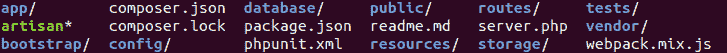

# Laravel |目录结构

> 原文:[https://www.geeksforgeeks.org/laravel-directory-structure/](https://www.geeksforgeeks.org/laravel-directory-structure/)

当你将[创建](https://www.geeksforgeeks.org/laravel-installation-and-configuration/)你的新鲜 Laravel 应用程序时，它将包含大量的文件夹，如下图所示:

这些文件夹中的每一个都完成了框架整体功能的特定任务。下面解释了每个文件夹的用途，但在此之前，让我们先看一下每个文件夹:

**目录结构:**

*   **app 目录**
*   **引导目录**
*   **配置目录**
*   **数据库目录**
*   **公共目录**
*   **资源目录**
*   **路线目录**
*   **存储目录**
*   **测试目录**
*   **供应商目录**

**每个目录的用途:**

**1。app 目录:**这个目录是框架的核心，后端开发人员大多在这个目录上工作。它包含我们的网络应用程序的所有后端代码，如控制器、广播、提供者、定制工匠命令、中间件等。该目录还包含许多子目录，如下图所示:

**App 目录:**

<figure class="table">

| catalogue | purpose |
| --- | --- |
| console | This directory contains all the Artisan commands we created. These commands can be generated by using the **PHP artisan make: command** command. |
| [Abnormal] | This directory contains the application's exception handling files. Here, you can create your own specific exception and throw it by our application. |
| 超文本传送协议（Hyper Text Transport Protocol 的缩写） | This directory contains our controller, middleware and form requests. Almost all back-ends that handle requests into our application will be placed here. |
| provider | This directory contains all service providers of the application. Service providers guide our applications by registering services. |
| broadcast | This directory is not there by default, but it can be created by using **PHP craftsman make: channel** command. It contains all broadcast channel classes that our application broadcasts your events. |
| event | The directory is not there by default, but it can be created by using the **PHP artist make: event** command. This directory contains event classes that can be used to signal other parts of the application and vice versa. |
| 乔布斯 | This directory does not exist by default, but it can be created by using the **PHP artisan make: job** command. This directory contains queue jobs for our application. |
| audiomonitor | This directory does not exist by default, but it can be created by using the command **PHP craftsman make: listener** . This directory contains classes that handle our events. |
| 邮件 | This directory is not there by default, but it can be created by using **PHP craftsman make: mail** command. This directory contains all the classes of e-mails that we send on behalf of the application. |
| notification | This directory does not exist by default, but it can be created by using the **PHP artist make: notification** command. This directory contains all "transactional" notifications sent by our application. |
| [Strategy] | This directory does not exist by default, but it can be created by using **PHP maker make: policy** command. This directory contains the authorization policy class, which is used to determine whether users can access or change specific data. |
| rule | This directory is not there by default, but it can be created by using **PHP craftsman make: rule** command. This directory contains self-created verification rule objects, which are used to encapsulate complex verification logic in a simple object. |

</figure>

**2。引导目录:**这个目录包含整个框架从哪里引导的 app.php。该目录还包含缓存目录，用于存储框架生成的文件以优化性能。

**3。配置目录:**该目录包含所有与数据库、邮件、会话、服务等相关的配置文件。

**4。数据库目录:**该目录包含数据库迁移、模型工厂和种子。

**5。公共目录:**该目录包含 index.php 文件，该文件是入口点，处理应用程序接收的所有请求，并配置自动加载。除此之外，该目录还包含应用程序中使用的资产，如图像、javaScript 和 CSS。

**6。资源目录:**这个目录包含应用程序的前端。构成应用程序前端的所有 HTML 代码都以 Blade 模板的形式呈现在这里，这是 Laravel 附带的模板引擎。

**7。路由目录:**该目录包含应用程序的所有路由定义。

**8。存储目录:**该目录包含编译后的 Blade 模板、基于文件的会话、文件缓存以及框架生成的其他文件。

**9。测试目录:**这个目录包含了我们所有的自动化测试，这些测试是确保应用程序是否按照预期运行所必需的。

**10。厂商目录:**这个目录包含了我们框架需要的所有通过 Composer 下载的依赖项。