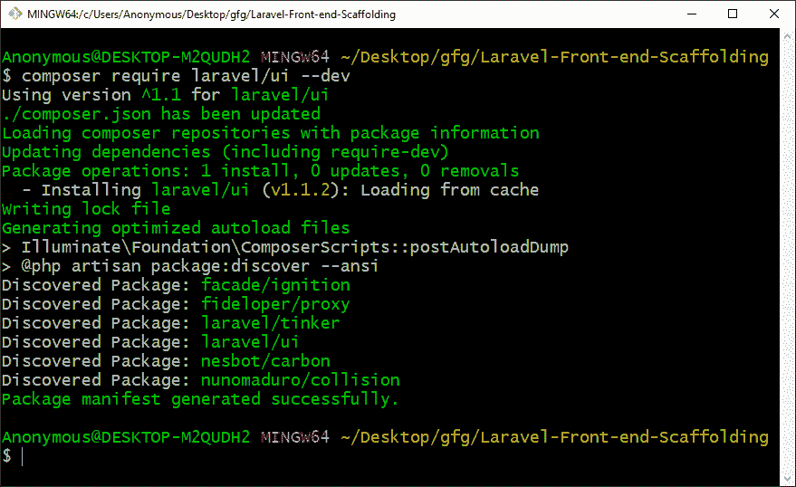
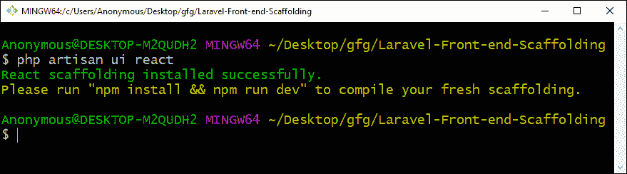
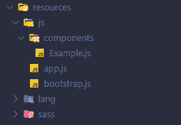
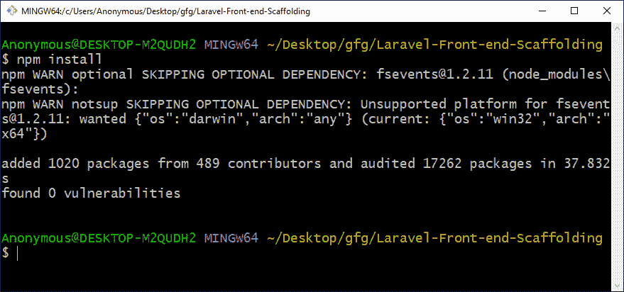
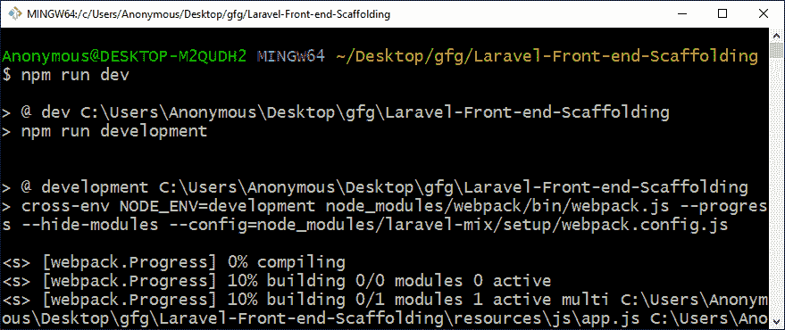
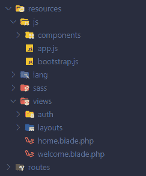
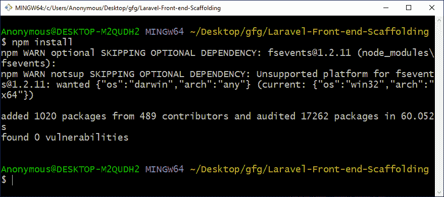
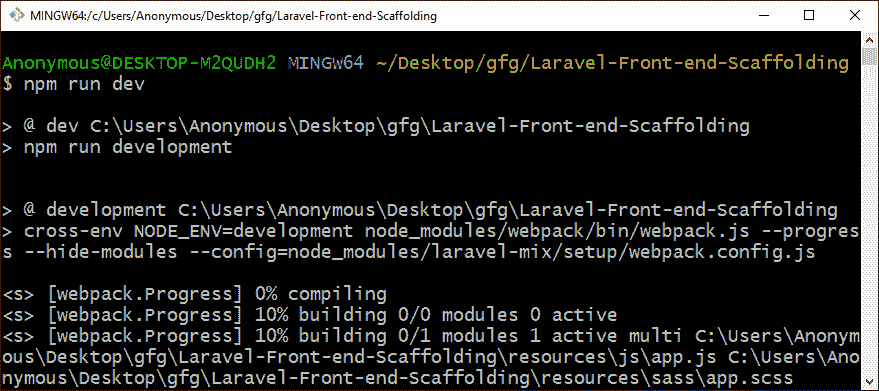
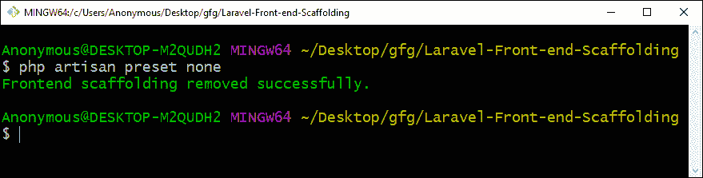

# Laravel |前端脚手架

> 原文:[https://www . geesforgeks . org/laravel-前端-脚手架/](https://www.geeksforgeeks.org/laravel-front-end-scaffolding/)

前端支架意味着为应用程序创建一个基本结构。Laravel 提供了一种非常简单的方法，可以使用任何其他可用的支架(如 **Bootstrap** 、 **Vue** 和 **React** )来更改前端预设/支架。

**生成脚手架:**

*   **Step 1:** To generate a scaffolding, we first need to install the **laravel/ui**, which is a **composer** package and to do that we have to run the following composer command.

    ```php
    composer require laravel/ui --dev
    ```

    

*   **Step 2:** After that, we can run the **ui** artisan command to generate a base scaffolding. As we discussed before, we can generate the scaffolding for Bootstrap, Vue or React and for that we will run the following artisan command.
    *   **自举**T0】
    *   **视图**

        ```php
        php artisan ui vue
        ```

    *   **反应过来**T0】

    

    这将在**资源/js** 目录中创建一个**组件**目录。

    

*   **Step 3:** After running any of the above preset commands, we will have to install the npm, if it is not installed, to install run the following command.

    ```php
    npm install
    ```

    

*   **Step 4:** Now we have to run the following **npm** command to compile the scaffolding.

    ```php
    npm run dev
    ```

    

**通过身份验证生成支架:**必须完成生成支架步骤 1，然后按照以下步骤操作。

*   **step 1:** To generate a scaffolding with view files for authentication like login and register, then we just have to add ‘**–auth**’ at the end of the commands that we saw previously, as follows:
    *   **自举**T0】
    *   **视图**

        ```php
        php artisan ui vue --auth
        ```

    *   **反应过来**T0】

    

    这将在**资源/js** 目录中创建**组件**目录，并在**资源/视图**目录中创建带有**home.blade.php**文件的**授权**和**布局**目录。

    

    *   **Step 2:** After running any of the above preset commands, we will have to install the npm if it is not installed, to install run the following command.

    ```php
    npm install
    ```

    

    *   **Step 3:** Now we have to run the following npm command to compile the scaffolding.

    ```php
    npm run dev
    ```

    

    **移除脚手架:**要移除生成的脚手架，我们将运行以下 artisan 命令。

    ```php
    php artisan preset none
    ```

    

    **注意:**这将删除**组件**目录，该目录已创建，但不会删除**资源/视图**目录中在**验证**支架期间创建的文件和目录。

    **参考:**T2】https://laravel.com/docs/6.x/frontend