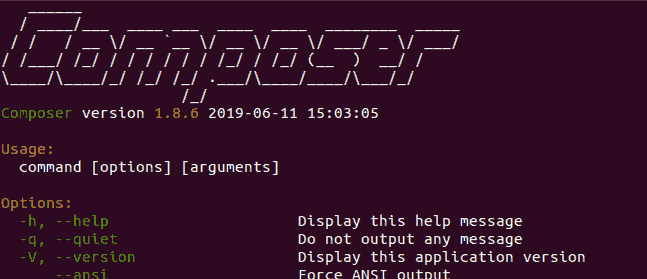
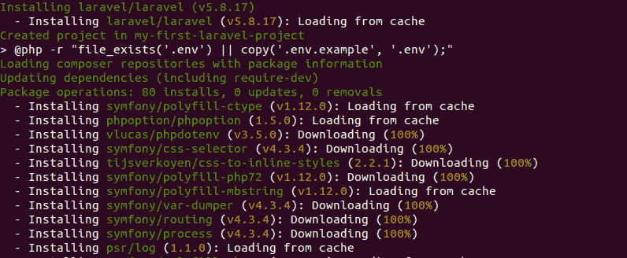
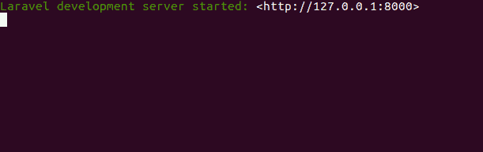
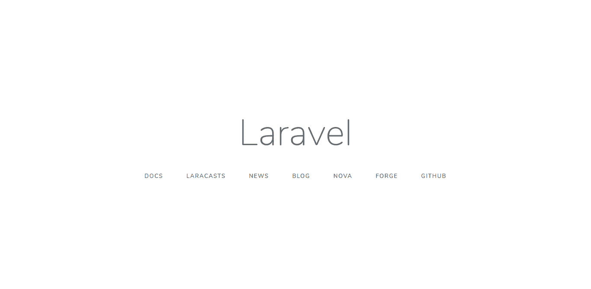

# Laravel |安装和配置

> 原文:[https://www . geesforgeks . org/laravel-安装和配置/](https://www.geeksforgeeks.org/laravel-installation-and-configuration/)

[Laravel](https://www.geeksforgeeks.org/laravel/) 是一个 PHP 框架，让构建复杂的 web 应用变得轻而易举。在本指南中，您将学习如何安装和配置 Laravel，并在您的计算机上运行您的第一个 Laravel 项目。

**先决条件:**

*   [PHP](https://www.geeksforgeeks.org/php/) 基础知识
*   PHP 安装
*   终端/命令提示符的基本知识

**安装 Laravel 的步骤:**

*   Laravel 实际上使用名为 [Composer](https://getcomposer.org/) 的依赖管理器工具来安装运行 Laravel 所需的所有库。因此，在我们继续之前，请确保您的系统中安装了 composer。您可以从[这里](https://getcomposer.org/download/)轻松安装 Composer。它有很好的文档记录，安装后，在您的终端/命令提示符下运行下面给出的命令:

```php
composer
```

如果它给出如下所示的输出，则意味着安装成功，我们可以进入下一步。



*   下一步是创建一个文件夹，我们将在其中创建我们的新的 Laravel 项目。移动到那个文件夹后，运行这个 composer 命令来创建一个新的 Laravel 项目。

```php
composer create-project --prefer-dist laravel/laravel my-first-laravel-project
```

在这里，create-project 是一个 composer 命令，它只是下载包并安装这个包进一步需要的所有依赖项，然后我们有这个–prefere-dist，这意味着如果可能的话，只喜欢稳定版本的版本，接下来我们提到包的名称是 laravel/laravel，我的第一个-laravel-project 实际上是项目文件夹的名称，您可以用任何您想要的名称替换它。这将开始安装所有依赖项，如下图所示。



如果一切顺利，那么这个脚本的结尾将是这样的:


*   现在你有了一个名为"我的第一个拉沃尔项目"的新文件夹，并移动到那个文件夹。你会注意到在这个文件夹里面已经有很多文件和文件夹了，这实际上是 Laravel 框架本身。在这个文件夹中，运行下面给出的命令来启动内置的 PHP 服务器。

```php
php artisan serve
```

这将给出如下所示的输出:



注意:链接真的要看你的系统，可以是 http://localhost:8000 也可以。

*   复制这个链接，在你的浏览器中打开，就可以看到你的 Laravel app 了(我这里是 **http://127.0.0.1:8000** )。它看起来像这样:

