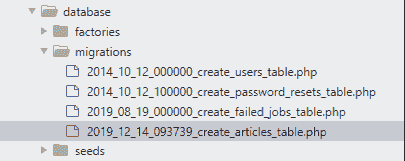
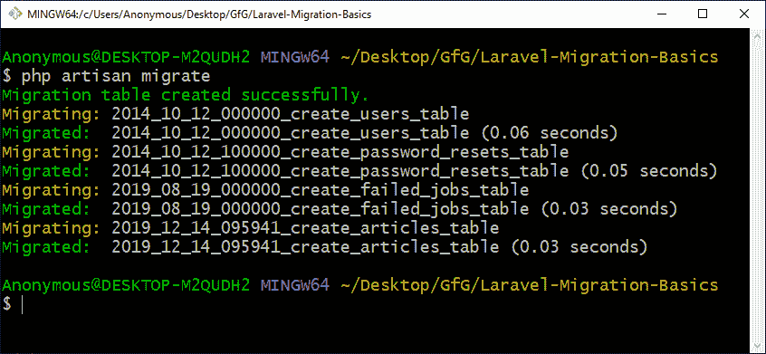
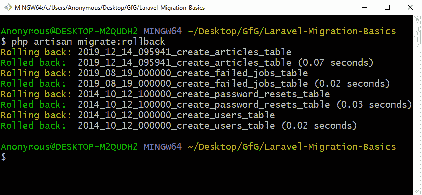

# Laravel |迁移基础知识

> 原文:[https://www.geeksforgeeks.org/laravel-migration-basics/](https://www.geeksforgeeks.org/laravel-migration-basics/)

在 Laravel 中，**迁移**提供了一种轻松共享数据库模式的方法。这也使得模式的修改变得更加容易。这就像一次创建一个模式，然后多次共享它。当您有多个表和列时，它非常有用，因为它可以减少手动创建表的工作量。

**创建迁移:**可以使用如下所示的 artisan 命令创建:

```
php artisan make:migration create_articles_table
```

在这里，**文章**将是表，代替它的是，您可以编写任何其他您想要创建的并且适合应用程序的表名，但是您看到的表名是复数形式。所以，写的是**篇**而不是**篇**。这是 Laravel 使用的命名方案，重要的是根据 Laravel 中一个迁移文件的命名方案，在开始指定**创建**，在结束指定**表**。

我们使用 artisan 命令创建的所有迁移文件都位于**数据库/迁移**目录中。因此，在我们运行上述命令后，它将生成一个 PHP 文件，该文件的名称是我们用当前日期和时间指定的。



该文件将使用一些预定义的类和函数创建，如下面的代码所示:

```
<?php

use Illuminate\Database\Migrations\Migration;
use Illuminate\Database\Schema\Blueprint;
use Illuminate\Support\Facades\Schema;

class CreateArticlesTable extends Migration
{
    public function up()
    {
        Schema::create('articles', function (Blueprint $table) {
            $table->bigIncrements('id');
            $table->timestamps();
        });
    }

    public function down()
    {
        Schema::dropIfExists('articles');
    }
}
```

如果您想要指定的表名不同于您指定的文件名，那么您可以使用如下命令选择**–创建**:

```
php artisan make:migration create_articles_table --create=gfg
```

有了这个命令， **create()** 方法中包含的表名将是 **gfg** 而不是**文章**，这是在文件名中指定的。

```
<?php

use Illuminate\Database\Migrations\Migration;
use Illuminate\Database\Schema\Blueprint;
use Illuminate\Support\Facades\Schema;

class CreateArticlesTable extends Migration
{
    public function up()
    {
        Schema::create('gfg', function (Blueprint $table) {
            $table->bigIncrements('id');
            $table->timestamps();
        });
    }
    public function down()
    {
        Schema::dropIfExists('gfg');
    }
}
```

**迁移的基本结构:**迁移文件包含一个类，该类具有创建迁移时指定的文件名，并扩展了**迁移**。因为我们有两个功能，第一个是**向上()**功能，第二个是**向下()**功能。当我们运行迁移以创建指定的表和列时，调用 **up()** ，当我们想要撤消创建“ **up()** 函数时，调用“ **down()** ”函数。

在 **up()** 函数中，我们有**Schema facade(Schema builder)**的 **create** 方法，正如我们之前所说，这个函数中的第一个参数是要创建的表的名称。第二个参数是一个以蓝图对象为参数的函数，用于定义表。

在 down()函数中，我们有一个模式构建器的 **dropIfExists** 方法，当调用该方法时，它将删除表。

**运行迁移:**在运行迁移之前，我们首先要创建一个 **MySQL 数据库**并**将其连接**。完成后，要运行迁移，我们可以使用 Artisan 命令，如下所示:

```
php artisan migrate
```



该命令将在迁移类文件中运行 **up()** 函数，并将创建具有所有指定列的表。
**注意:**此命令将运行 **up()** 功能，并为**数据库/迁移**目录中的所有迁移文件创建数据库中的所有表。

要回滚上一次完成的迁移，我们可以使用以下 Artisan 命令:

```
php artisan migrate:rollback
```



该命令将运行迁移类文件中的 **down()** 功能。

**参考:**T2】https://laravel.com/docs/6.x/migrations