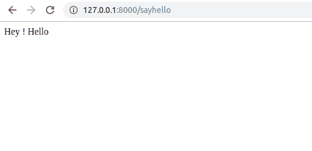
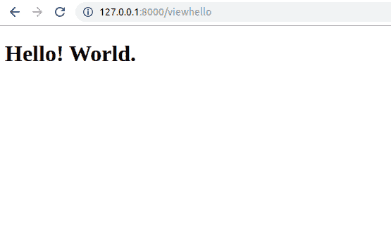
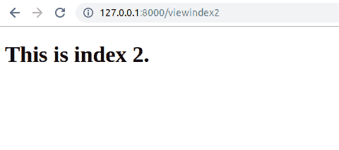

# Laravel |路由基础知识

> 原文:[https://www.geeksforgeeks.org/laravel-routing-basics/](https://www.geeksforgeeks.org/laravel-routing-basics/)

一旦你安装了Laravel，你的基本网络应用程序就可以运行了。让我们更深入地研究框架，看看我们如何处理路由。

**路由:**路由实际上是你可以在你的 web 应用中访问的 web URLs。例如*/家庭，/个人资料，/仪表板*等都是可以在 Laravel 应用程序中创建的不同路线。请记住，路线区分大小写，因此*/配置文件*不同于*/配置文件*。

**创建路线:**在 Laravel 中，我们所有的路线都将写入 *routes/web.php* 文件，因为该目录是我们所有与网络相关的路线的标准目录。打开这个文件，让我们用 Laravel 创建我们的第一条路线，写到这个文件的末尾。

*   **语法:**写路由如下:

    ```php
    // Syntax of a route
    Route::request_type('/url', 'function()');
    ```

*   **程序:**

    ```php
    // Creating a new route
    Route::get('/sayhello', function() {
        return 'Hey ! Hello';
    })
    ```

*   **输出:**
    

分解上面给出的代码 *Route::get* 意味着这是一条预期会有 get 请求的路由。 */sayhello* 是路线的名称，您可以创建任何名称的路线。此外，我们必须指定当我们在浏览器中访问该路线时要做什么，并且我们以回调函数的形式这样做，该函数返回一个字符串，表示*嘿！您好*。

**返回网页:**不仅仅是返回字符串，我们要在有人访问某条路线时返回网页。让我们看看如何做到这一点。首先在*资源/视图*中创建一个名为*index.blade.php*的文件。在 Laravel 中，我们有一个名为 Blade 的内置模板引擎，因此我们用 **.blade.php* 而不是 **编写所有网页。html* 。

*   **节目 1:**

    ```php
    <!DOCTYPE html>
    <html lang="en">
    <body>
        <h1>Hello! World.</h1>
    </body>
    </html>
    ```

*   **程序 2:** 现在给你的*web.php*添加以下代码。

    ```php
    // Creating a new route
    Route::get('/viewhello', function() {
        return view('index');
    });
    ```

*   **输出:**
    

上面给出的代码我们使用了 **/viewhello** 作为路由的名称，在回调函数中我们使用了一个 *view()* 方法，这是一个由 Laravel 提供的用于服务网页的内置方法，它自动从*资源/视图*文件夹中挑选匹配的文件。例如，通过*【索引】*将为*index.blade.php*服务。

**带控制器的路由:** Laravel 提供给我们的能量比仅仅写一个直接回调函数要多得多。我们实际上可以让我们的路线指向控制器内部的一个功能。为此，让我们首先手动创建我们的控制器，并将其称为*我的控制器*。只需转到 *app/Http/Controllers* 并创建一个名为*mycontroller.php*的文件。在此文件中编写以下代码:

*   **程序 1:** 下面写的代码是一个基本的控制器代码，我们只是使用控制器名称空间来增加使用它的能力，就像导入库一样。现在添加功能:

    ```php
    <?php

    namespace App\Http\Controllers;

    use Illuminate\Http\Request;

    class mycontroller extends Controller {
        // All the functions written here
        // can be used in routes
    }
    ```

*   **程序 2:** 这里我们创建了一个名为 *index()* 的函数，在里面我们使用 *view* 方法为*index2.blade.php*服务。现在让我们在*资源/视图*中创建这样的文件，并向其中添加以下代码:

    ```php
    <?php

    namespace App\Http\Controllers;

    use Illuminate\Http\Request;

    class mycontroller extends Controller {
        public function index() {
            return view('index2');
        }
    }
    ```

*   **程序 3:** 我们写了前端文件，写了控制器，现在最后一件事就是注册路线。

    ```php
    <!DOCTYPE html>
    <html lang="en">
    <body>
        <h1>This is index 2.</h1>
    </body>
    </html>
    ```

*   **Syntax:** For registering the routes

    ```php
    Route::request_type('/url', 'ControllerName@functionName');
    ```

    **注意:**这里 *ControllerName* 是控制器的名称， *functionName* 是用户访问该 URL 时要使用的函数的名称。让我们遵循以下语法，在文件末尾的 *routes/web.php* 中编写我们的路由:

*   **程序 4:** 在这里你可以看到我已经写了*我的控制器*作为我的控制器和*索引*作为要附加到这个 url 的函数的名称。现在让我们访问/viewindex2 并查看输出。

    ```php
    Route::get('/viewindex2', 'mycontroller@index');
    ```

*   **输出:**
    