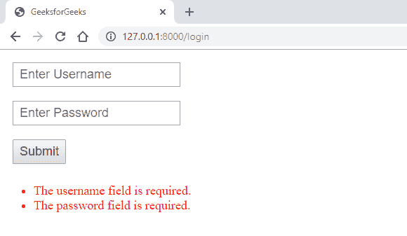
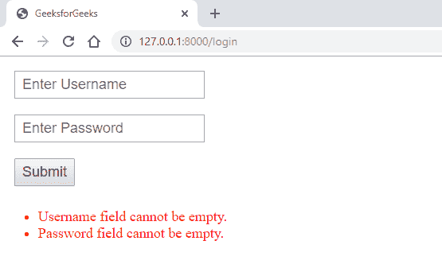

# Laravel |验证规则

> 原文:[https://www.geeksforgeeks.org/laravel-validation-rules/](https://www.geeksforgeeks.org/laravel-validation-rules/)

验证来自用户端的数据非常重要，因为它可以帮助用户填写正确的数据，并防止他们提交任何不正确或恶意的请求。

在 Laravel 中，有**验证规则**，它们是预定义的规则，当在 Laravel 应用程序中使用时。有一个规则列表可用于验证用户提交的数据。

**带有验证规则和默认错误消息的保存表单**

*   **语法 1:** 基本验证规则

    ```php
    $request->validate([
      'password' => 'required|min:8|max:255',
    ]);

    ```

*   **语法 2:** 也可以用数组的形式指定规则，如下图所示。

```php
$request->validate([
  'password' => ['required', 'min:8', 'max:255'],
]);

```

*   **语法 3:** 您可以指定多个验证字段。

    ```php
    $request->validate([
      'password' => 'required|min:8|max:255',
    ],
    [
      'name' => ['required', 'min:5', 'max:255'],
    ]);

    ```

    *   **示例:**
    1.  Create a view file in ‘**resources/views**’ directory with the name ‘**login.blade.php**’ and write the below code in that file.

        ```php
        <!DOCTYPE html>
        <html>

        <head>
            <title>GeeksforGeeks</title>
            <style>
                input {
                    font-size: 18px;
                    padding: 5px 8px;
                    margin: 10px;
                }

                .error {
                    color: red;
                    font-size: 18px;
                }
            </style>
        </head>

        <body>
            <form method="post" action="/login">
                @csrf
                <input type="text" name="username" 
                       placeholder="Enter Username">
                <br>
                <input type="password" name="password" 
                       placeholder="Enter Password">
                <br>
                <input type="submit" name="submit" 
                       value="Submit">
            </form>
            <ul class="error">
                @foreach($errors->all() as $error)
                <li>{{ $error }}</li>
                @endforeach
            </ul>
        </body>

        </html>
        ```

        这里，我们使用“ **@foreach** ”指令循环遍历变量“ **$errors** ”中的所有验证错误消息。

    2.  Create a controller in ‘**app/Http/Controllers**’ directory with the name ‘**LoginController.php**’. Use command ‘**php artisan make:controller LoginController**’ to create this controller. Write the below validation code to validate the data submitted by the form.

        ```php
        <?php

        namespace App\Http\Controllers;

        use Illuminate\Http\Request;

        class LoginController extends Controller {
            public function getValidate() {
                return view('login');
            }

            public function postValidate(Request $request) {
                $request->validate([
                    'username' => 'required',
                    'password' => 'required|min:8|max:255',
                ]);
            }
        }
        ```

        这里，**必选的**是当用户将字段留空时给用户一个错误。“ **min** 代表最少字符，而“ **max** 代表可输入的最大字符数。

    3.  Write the below code in ‘**web.php**’ file in ‘**routes**’ directory.

        ```php
        Route::get('login', 'LoginController@getValidate');
        Route::post('login', 'LoginController@postValidate');

        ```

        在这里，我们指定了显示我们的登录页面视图的“ **get** ”方法和验证用户通过 HTML 表单提交的输入数据的“ **post** ”方法。

        *   **Output:**
    

    当我们点击表单中的提交按钮时，我们得到如上所示的输出。它给出了空输入字段的这两行错误，因为我们已经使用**步骤 2** 中的**后置验证**功能中的“**必需的**验证规则将这两个字段设置为必需的。

    这些是 Laravel 显示的**默认错误信息**。

    **带有验证规则和自定义错误消息的保存表单**

    *   **语法:**

        ```php
        $validateData = $request->validate([
            ‘password’ => ‘required|min:8|max:255’
        ], [
            ‘password.required’ => ‘The password field is required.’,
            ‘password.min’ => ‘The password must have at list 8 characters.’,
            ‘password.max’ => ‘The password cannot exceed 255 characters.’,
        ]);

        ```

    *   **示例:**
        1.  Create a view file in ‘**resources/views**’ directory with the name ‘**login.blade.php**’ and write the below code in that file.

            ```php
            <!DOCTYPE html>
            <html>

            <head>
                <title>GeeksforGeeks</title>
                <style>
                    input {
                        font-size: 18px;
                        padding: 5px 8px;
                        margin: 10px;
                    }

                    .error {
                        color: red;
                        font-size: 18px;
                    }
                </style>
            </head>

            <body>
                <form method="post" action="/login">
                    @csrf
                    <input type="text" name="username"
                           placeholder="Enter Username">
                    <br>
                    <input type="password" name="password" 
                           placeholder="Enter Password">
                    <br>
                    <input type="submit" name="submit" 
                           value="Submit">
                </form>
                <ul class="error">
                    @foreach($errors->all() as $error)
                    <li>{{ $error }}</li>
                    @endforeach
                </ul>
            </body>

            </html>
            ```

            这里，我们使用“ **@foreach** ”指令循环遍历变量“ **$errors** ”中的所有验证错误消息。

        2.  Create a controller in ‘**app/Http/Controllers**’ directory with the name ‘**LoginController.php**’. Use command ‘**php artisan make:controller LoginController**’ to create this controller. Write the below validation code to validate the data submitted by the form.

            ```php
            <?php

            namespace App\Http\Controllers;

            use Illuminate\Http\Request;

            class LoginController extends Controller {
                public function getValidate() {
                    return view('login');
                }

                public function postValidate(Request $request) {
                    $request->validate([
                        'username' => 'required',
                        'password' => 'required|min:8|max:255',
                    ], [
                        'username.required' => 'Username field cannot be empty.',
                        'password.required' => 'Password field cannot be empty.',
                        'password.min' => 
                          'Password must contain at least 8 characters or more.',
                        'password.max' => 
                                      'Password must not exceed 255 characters.',
                    ]);
                }
            }
            ```

            在第一个数组中，**必选的**是当用户将字段留空时给用户一个错误。“ **min** 代表最少字符，而“ **max** 代表可输入的最大字符数。

            在第二个数组中，我们指定了当验证规则被检查并被发现为真时要显示的错误消息。这意味着当**用户名**字段留空时，将显示“**用户名.必需的**的错误信息，其他所有的都是一样的。因此，我们必须为我们指定的所有验证规则指定自定义错误消息。

            如您在上面的代码中所见，我们指定了 **4 个验证规则**，这就是为什么我们在第二个数组中指定了 **4 个错误消息**。

        3.  Write the below code in ‘**web.php**’ file in ‘**routes**’ directory.

            ```php
            Route::get('login', 'LoginController@getValidate');
            Route::post('login', 'LoginController@postValidate');

            ```

            在这里，我们指定了显示我们的登录页面视图的“ **get** ”方法和验证用户通过 HTML 表单提交的输入数据的“ **post** ”方法。

            *   **Output:**
    

    当我们点击表单中的提交按钮时，我们得到如上所示的输出。它给出了空输入字段的这两行错误，因为我们已经使用**步骤 2** 中的**后置验证**功能中的“**必需的**验证规则将这两个字段设置为必需的。

    这些是我们在“**后置验证**中的**步骤 2** 中设置的**自定义错误信息**。

**参考:**T2】https://laravel.com/docs/6.x/validation