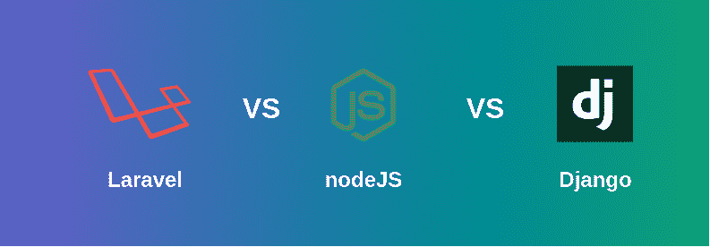

# 【Laravel、Node.js、Django 哪个是需求最大的后端 Web 框架？

> 原文:[https://www . geesforgeks . org/哪一个需求最大-后端-web-framework-介于-laravel-node-js-and-django/](https://www.geeksforgeeks.org/which-one-is-most-demanding-back-end-web-framework-between-laravel-node-js-and-django/)

两个后端 web 框架，即 **Laravel** 、 **Django** ，以及运行时环境 **NodeJS** 有助于开发活动。所有人最终都获得了相同的目标，那就是开发一个网络应用程序。导致比较的是:

*   [**Laravel:**](https://www.geeksforgeeks.org/laravel/) 它是一个 PHP 框架，免费且开源，使开发人员能够在开发需求中使用 MVC 的模式。
*   [**NodeJS**](https://www.geeksforgeeks.org/nodejs-tutorials/) **:** 是一个用于跨平台开发需求的 JavaScript 运行时环境。
*   [**Django:**](https://www.geeksforgeeks.org/django-tutorial/) 它是一个基于 Python 的框架，允许开发人员使用系统的方法进行 Web 开发过程。

所以你可能想知道 Django 和 Laravel 以及运行时环境 Node.js 中哪个是最好的后端框架？这是一个艰难的选择。所以，让我来给你深入比较一下 Django、Node.js 和 Laravel。他们三个有着不同的意识形态，为了获得某种类型的结果而努力，在什么方面值得做比较。因此，总结一下哪三个最符合你的愿望。

**Laravel:** 它是在 Django 开发多年后发布的，由 Taylor 和 Otwell 创建，为了使用 Laravel，开发人员掌握 PHP 基础知识很重要。Laravel 具有内置的特性，使开发过程变得容易，从而减少了开发时间，并且内容管理系统下的大多数应用程序都使用 Laravel。如果你正在从头开始开发一个新的网站，那么 Laravel 是一个强大的功能，可以在网站开发的所有阶段帮助你。

**优势:**

*   对于 PHP 来说，这是一个很好的框架选择。
*   它基于 MVC，所以不需要编写 HTML 代码。
*   它使用刀片模板引擎在网站内提供了简单的逻辑集成。
*   它有内置的授权和认证系统，也很容易与邮件系统集成。
*   提供测试工作的平稳自动化。

**缺点:**

*   它没有内置工具，需要第三方集成来开发定制网站。
*   它非常慢，开发人员在使用 Laravel 之前需要熟练掌握 PHP。

**NodeJS:** 说起 NodeJS，它不是框架，也是服务器。基于 JS，它嵌入了上述所有特性，这意味着不再有多线程，也不适合初学者。因此，NodeJS 是 JS 服务器的基本概念，主要充当服务器端浏览。它是开源的，并且简化了跨平台 web 应用程序的开发。开发人员喜欢在 Node JS 上工作的主要原因是它在单线程上工作。整个服务器都是基于事件的，并在接收回调时引发。这使服务器能够在每次被调用时返回，并防止它处于暂停或睡眠状态。

**优势:**

*   使用 NodeJS 开发的应用程序的性能比其他应用程序更高。
*   它有一个优秀的包装经理。
*   node.js 以库的形式扩展了支持
*   当您需要构建 API 时，效果最好。
*   它为用户并发请求提供了快速简单的处理。

**缺点:**

*   事实上，node.js 涉及异步编程，并不是所有的开发人员都觉得它容易理解，也很难使用。
*   回调导致大量嵌套回调。

**Django:** 在 2005 年之前，还没有人想到我们可以有一个基于 python 的 web 开发框架。现在，Django 是许多开发者的核心和灵魂。Instagram、Mozilla、Bitbucket，你会看到 Django 用于 Web 应用程序的开发，框架是轻量级的，它确实有很多特性需要开发并部署在 Web 应用程序上。

**优势:**

*   它有一个简单的学习曲线。
*   与关系数据库的无缝协作。
*   它得到了用户群体的大力支持。
*   它具有很高的可扩展性。
*   它是详细而清晰的文档。

**缺点:**

*   它表面上是单片的，这意味着它是一个单层的软件应用程序。
*   它不适用于小规模应用程序。
*   极客应该在实现这种语言之前具备这方面的专业知识。

**现场对比:**

*   **可伸缩性&性能:** Node.js 在性能上排名靠前，Django 有它自己的可伸缩性，Laravel 有一套功能可以让你的网站在市场上领先一步。
*   **架构:** Django 有一个 MVT 架构，其中 Laravel 遵循 MVC 模式。另一方面，节点是事件驱动的。
*   **安全性:**接下来和 Laravel 一起谈安全性，Django 是最好的。然而，尽管该节点相当有名，但它可能会有漏洞，并在更长的时间内保持不被注意。
*   **可定制性:**由 JavaScript 支持，node.js 拥有最大的定制选项，而当需要定制时，Django 需要更多的复杂性。相反，Laravel 需要第三方工具来添加和个性化网站。
*   **判定:**我们已经分别看到了这三个，并结合在一起。现在，你应该选择哪一个取决于你的具体要求，因为我们有这两种技术的开发人员，毕竟这取决于你的项目要求。请记住，一个可能比另一个更好，但必须决定哪一个最符合您的需求。