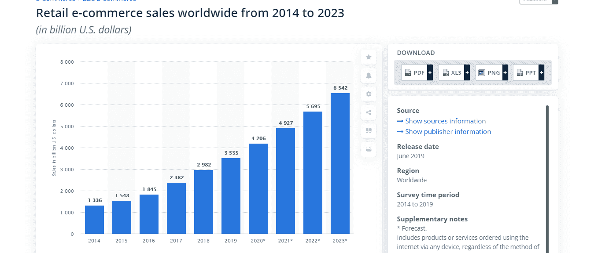
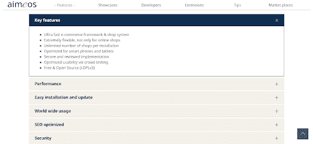
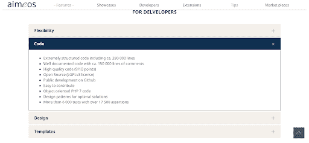
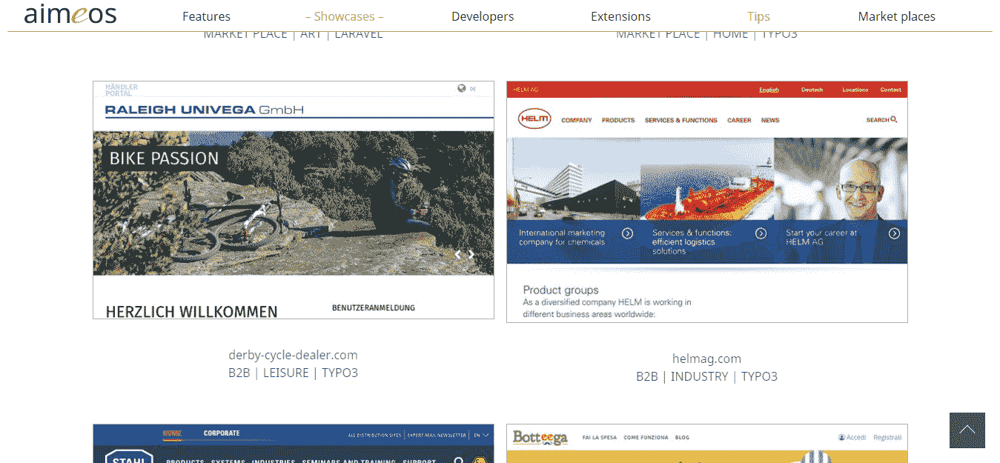
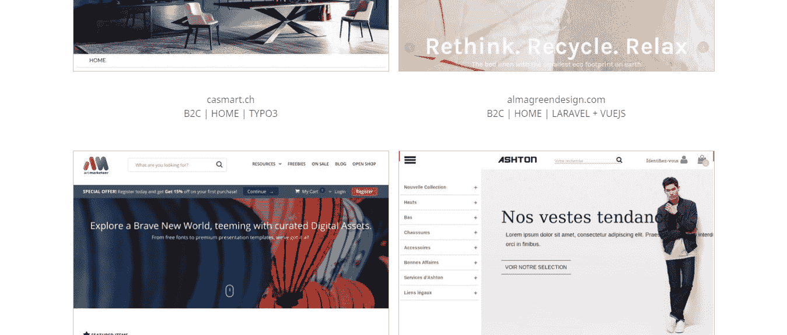

# 为什么 Laravel Aimeos 是建设网店的好选择？

> 原文:[https://www . geeksforgeeks . org/why-laravel-aimeos-是建设网上商店的好选择/](https://www.geeksforgeeks.org/why-laravel-aimeos-is-a-good-choice-for-building-an-online-store/)

Laravel 是对网站开发要求最高的 PHP 框架之一。高扩展性、良好的性能和效率是 PHP Laravel 框架成功的首要原因。

如今，传统购物已经完全向网购转变。来自世界各地的人们更喜欢在智能手机、平板电脑等上购物。不仅仅是普通人，各种规模的企业都非常依赖在线销售和购买他们的产品或服务。

因此，目前企业对各种电子商务解决方案的需求非常大。因此，Laravel Aimeos 应运而生，这是开发在线商店的绝佳选择。事实证明，它是一个成功的电子商务解决方案，适用于不同行业垂直领域的各种企业。

从那以后，整个购物的概念发生了变化，对网上商店有了巨大的需求。许多初创公司和企业现在正在寻找使用顶级电子商务平台的可靠软件开发公司开发经济高效的电子商务解决方案。

根据统计数据，2021 年电子商务全球零售销售和服务的图表将增长 17.5%。此外，电子零售收入预计将增长至约。据统计，2022 年为 6.54 万亿美元。

Img Src:静态

上述数据自动让企业拥有一个可靠的在线商店，该商店由像 Laravel Aimeos 这样受欢迎的电子商务平台构建，如果他们成功运营业务并希望在竞争中领先的话。

**在这里，我们将讨论使用 Laravel Aimeos 构建在线商店的各种重要功能和好处:**为了构建一个伟大的&可扩展的电子商店，从 Magento 到 Shopify，电子商务市场上有许多框架可以使用，这将让您从头开始开发商店。Laravel 本身就有最好的电子商务包。但是，选择 Laravel Aimeos 对所有企业主来说都是一个明智的决定。这不仅是因为 laravel 是 PHP 中最好的框架之一，而且它可以让您受益匪浅。

**Laravel Aimeos 功能–**

1.  **将您的产品转换为定期支付订阅—** Laravel Aimeos 通过支持的支付提供商自动存储支付状态。因此，你可以在任意的时间间隔内出售你的产品。
2.  **开箱即用功能:多租户—** 它能够提供多供应商、多渠道和多仓库来构建市场和复杂的 B2B 应用程序和附属系统，以及站点扩展。
3.  **打造 SaaS 电商解决方案—** 无需额外成本，商家就能管理库存，因为它拥有大量使用 SaaS 的快速网店。
4.  **开发 1，000，000，000+项渲染 20 毫秒的电商商店—** 与亚马逊相比，Laravel Aimeos 是一个大型电商平台，具有 elastic search&gigacommerce extension 等功能。它可以在 20 毫秒内渲染一个 100000000+物品的商店。
5.  **提供 100+支付网关—** 凭借其 Omnipay PHP 库，可以通过主要支付服务提供商捕获全球范围内的支付。
6.  **使用 JSON REST API 构建定制电子商店—** 通过使用基于 jsonapi.org 标准的 JSON REST API，开发者可以构建定制的渐进式网络应用、原生移动应用&交互前端。
7.  **在单个电子商店中包含多种产品—** 使用 Laravel Aimeos 构建的电子商店包含所有类型的产品，包括捆绑包、优惠券&以及您可以购买的多种产品。

**针对开发者**

**了解在您的电子商店中使用 Laravel Aimeos 的商业优势–**

*   **在搜索引擎上排名更好:** Laravel Aimeos 是开发者和企业中评价最高的&使用最多的 Laravel 电商套餐之一。它有很多功能，可以帮助网络开发人员构建一个成熟的购物购物车。它还包括一些先进的功能，使其在搜索引擎中排名更好、更靠前。
*   **平稳运营在线商店:** Laravel Aimeos 提供完全定制的选项，满足您的特定业务需求。使用该平台，您可以添加产品的详细视图，可以搜索所需的产品，还可以实现简单的结账过程。它可以快速流畅地运行您的在线电子商务商店。
*   **安全&对搜索引擎优化友好的电子商店:** Laravel Aimeos 有助于建立完全对搜索引擎优化友好的网络商店，配备高安全性，同时也避免任何类型的 SQL 注入或 XSS。
*   **轻松集成:**这是一个开源的 Laravel 电商包，开发者可以使用它创建一个功能齐全的电商网站。能够向客户展示&管理 100000+产品的网站或网络应用。此外，正是这个电子商务包的代码结构帮助网络开发人员将其与任何 PHP 网络应用程序集成在一起。
*   **惊人的特性:TYPO3 分布:** Laravel Aimeos 由一个最有前途的特性组成，即 TYPO3 分布。它用于帮助在线商家，以便他们可以通过提供 40 毫秒渲染的图像合成轻松地向人们介绍他们各自的在线商店。利用这一点，他们还可以每天管理 10000 多个在线订单

**LARAVEL AIMEOS SHOWCASES–**

  

**如何为自己的企业选择一家可靠的 Laravel 开发公司？**

现在，当你决定选择 Laravel Aimeos 作为你的在线 eStore 平台时，是时候找到最好的开发人员来开发一个电子商务网站了。

**雇佣 Laravel 开发公司前需要考虑的一些要点–**

*   该公司必须致力于最新的电子商务技术。
*   该公司一直保持着良好的电子商务应用组合。
*   总业务年限经验和客户评价。
*   公司的支付政策和电子商务服务
*   应该有一个平稳的发展和沟通过程

> 很难专注于最好的友好的 Laravel 开发公司。但人们总是建议选择一家专注于为客户提供他们一直在寻找的满意度，并且随时可以与谁交流的开发公司。