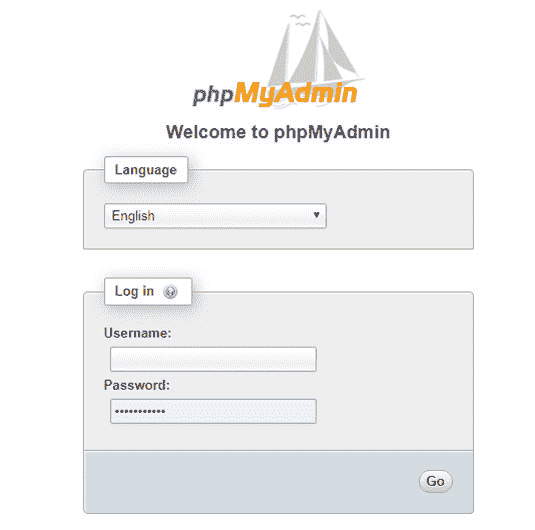
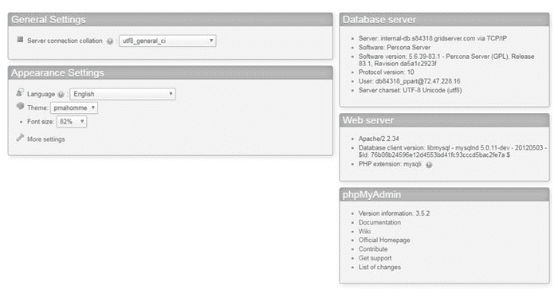
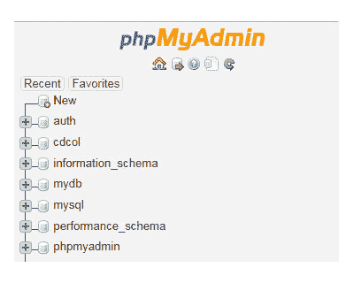
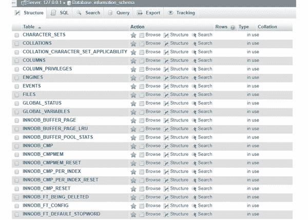
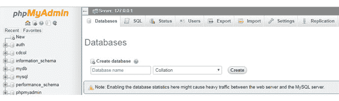
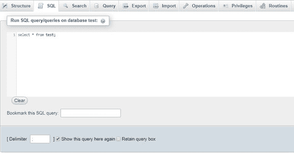
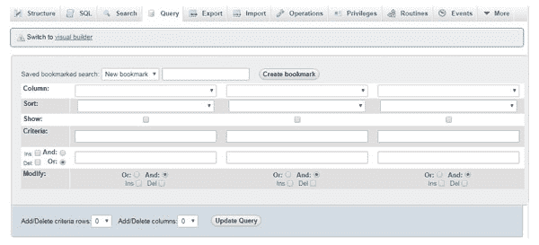
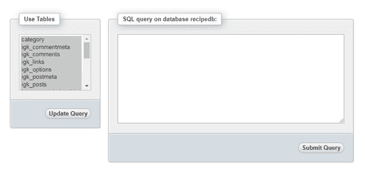
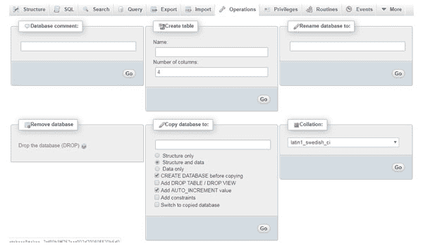

# phpMyAdmin 基础知识

> 原文:[https://www.geeksforgeeks.org/basics-of-phpmyadmin/](https://www.geeksforgeeks.org/basics-of-phpmyadmin/)

众所周知，任何简单的网站或应用程序都需要与数据或数据管理交互，因此它使用数据库 **phpMyAdmin** 已经成为网络世界中流行的、免费的、开源的管理 **MySQL** 和 **MariaDB** 数据的软件平台之一。这个工具主要是用 PHP 编写的，用于网络托管和相关服务。

该图形用户界面工具管理数据库中的许多数据相关操作，如创建、修改、删除数据、改变表的结构。它可以同时管理多个数据库。它还执行其他操作，如浏览数据、执行 SQL 查询以及管理索引、用户和权限。这还提供了一些功能，如进行备份、执行搜索操作、导入和导出不同格式的数据，如 SQL、CSV、XML、Excel 工作表。

**phpMyAdmin** 是最受信任和用户友好的数据库管理器，主要用于基于 web 的应用程序或程序。在下一篇文章中，我们将学习 phpMyAdmin 工具在网络世界中的重要性。

**phpMyAdmin |先决条件:**要安装 phpMyAdmin 软件，您需要一个服务器运行平台，如 **Windows** 或 **Linux** 支持操作系统。

*   **网页浏览器:**你需要一个网页浏览器界面来运行工具。
*   **PHP 脚本语言:**你需要一个服务器端语言。
*   **Apache Web 服务器:**你需要一个 Web 服务器来存储 phpMyAdmin 文件。
*   **MySQL 或 MariaDB 数据库:**你需要一个数据库来管理应用数据。

**注意:** XAMPP 包安装是获取 phpMyAdmin 工具最简单的方法。

**phpMyAdmin |特性:**现在让我们来看看 phpMyAdmin 工具的一些特性。

*   管理所有用户级权限。
*   执行 SQL 查询、批处理查询、触发器、事件、存储过程和函数来显示相关的数据结果。
*   它执行所有与数据相关的操作，如创建、读取、编辑、删除、浏览、更改结构、模式和搜索。
*   它还提供了导入、导出和加载文本文件数据的方法。
*   它以各种格式导出数据，如 CSV、XML、PDF、Word 文档、Latex、电子表格、Excel 文件等。
*   它支持复杂的查询和 SQL 查询的书签。
*   它还可以优化、修复、更改表和视图。
*   它还支持 InnoDB、外键和 MySQLi。
*   它提供了用户友好的图形界面来访问网站相关数据。
*   它可以提供数据库的 PDF 图形布局。
*   它在不同的操作系统下非常灵活。
*   它可以通过示例使用查询来处理复杂的查询。
*   它提供多服务器管理。
*   它可以同时控制几台服务器。

**phpMyAdmin |优点:**现在让我们来简单了解一下 phpMyAdmin 工具的一些优点。

*   设置工具非常简单。
*   对于开发人员和用户来说，图形用户界面非常方便和容易理解。
*   由于它是一个基于网络的工具，可以从任何计算机系统访问它。
*   这是一个直观的基于网络的界面，可以在任何服务器上运行。
*   它比控制台更有优势，因为它的图形用户界面使许多任务(如剪切、复制和运行查询)变得非常容易。
*   它提供了 MySQL 自动备份功能。
*   它不需要网络连接，因为它安装在已经有 MySQL 服务器的计算机上。
*   它为其客户端提供最高级别的数据安全性和效率。
*   它得到了多语言社区的支持。

**phpMyAdmin |配置:**

*   下载最新版本的 [phpMyAdmin](https://www.phpmyadmin.net/) 。
    T3】
*   一旦文件在下载过程中被提取，它们就被存储在位置 **C:\xampp\phpMyAdmin** 中
*   可以在位于上述位置的**config.inc.php**文件中更改配置设置。文件中的其他系统设置也可以更改。
*   管理员拥有创建新用户、删除用户和修改旧用户权限的完全权限。
*   对于特定的数据库，您可以定义任何用户的权限并管理用户组的帐户。

**注意:**配置设置用于自定义网页界面。

**phpMyAdmin |登录:**每当用户使用用户名和密码登录到 phpMyAdmin 服务器时，这些值会直接传递到 MySQL 服务器。要登录，您需要 MySQL 用户的有效凭据。

*   数据库服务器
*   数据库用户名
*   数据库密码

正确输入所有凭据后，您可以在浏览器中看到 phpMyAdmin 主页。在 phpMyAdmin 页面，中间部分是默认的**常规设置**和**外观设置**，在右侧可以看到**数据库服务器**和 **Web 服务器**信息。

您可以在**外观设置**部分调整语言、主题、字体大小。您也可以根据需要更改**数据库服务器**信息。

所有数据库的列表都可以在屏幕的左侧看到。您可以从列表中选择要使用的数据库。展开后，可以查看选定数据库中的所有表。

phpMyAdmin 工具允许您通过访问**状态**选项卡来检查 MySQL 服务器状态。为了检查状态，请记住不要选择任何特定的数据库。
T3】

在这里，您可以找到在 MySQL 服务器运行期间，您的服务器接收的所有流量的信息。它还显示了**最大并发连接数**和**失败尝试。**如果你使用的是共享托管计划，很可能你的数字没有多大意义。所有这些信息都有助于确定消耗的带宽量，因为您不是唯一使用服务器的人。

**phpMyAdmin |数据库信息的访问:**可以在屏幕左侧看到**信息 _schema** 数据库。它是存储所有其他数据库的所有信息的数据库，如数据库名、表名、列数据类型、访问权限等。它是一个内置数据库，创建的目的是提供关于整个数据库系统的信息。在**信息模式**中，表格由 MySQL 数据库服务器自动填充。

**phpMyAdmin |创建数据库:**用户可以在 phpMyAdmin 服务器中创建数据库。只需点击**数据库**选项卡，您就有了**创建数据库**输入选项。在输入框中给出数据库的相关名称，然后点击**创建**按钮。phpMyAdmin 将创建表，这些表将被添加到新创建的数据库中。

通过使用**创建表格**部分，然后选择任何表格所需的列数，可以在一个特定的选定数据库中添加任意数量的表格。
T3】

phpMyAdmin 将提供一个选项来上传一个 SQL 文件到你的服务器。点击顶部屏幕的**导入**标签，它将允许你从任何位置选择一个文件。这有助于创建导入文件中编写的数据库或表。
T3】

**注意:**同样的，也可以使用**导出**选项卡将任意表或数据库导出为文件。

**phpMyAdmin |执行一个 SQL 查询:**让我们看看在选定的数据库上执行一个 SQL 查询的步骤。

*   在屏幕左侧，选择要使用的数据库。选择后可以看到数据库的**结构**。
*   单击顶部栏中的 **SQL** 选项卡，打开编辑器，您可以在其中编写查询。
*   将查询写入到 SQL 编辑器中。
*   也可以编写多个查询，用分号(；)分隔不同的查询。
*   点击**转到**按钮执行查询。如果查询成功执行，您将获得一条成功消息。

在数据库中运行 SQL 查询的另一种方法是使用**查询**选项卡。使用它，您可以给出许多搜索条件，查询多个表，还可以对结果进行排序。您甚至可以使用**列**下拉菜单和**显示**复选框轻松选择 MySQL 查询所需的所有列。

要按升序或降序对查询中的结果集进行排序，可以使用**排序**下拉列表。您也可以输入搜索查询的条件。提供 **Ins** 和 **Del** 复选框或**添加/删除条件行**选项来添加或删除任何搜索条件的文本行。逻辑运算符**和**或**或**也可用于定义**修改**部分中字段之间的关系。输入所有相关条件后，需要点击**更新查询**按钮进行 SQL 操作。下一步是从查询中使用的**使用表格**部分选择所有表格，然后点击**提交查询。**

**phpMyAdmin | Operations:** 在 phpMyAdmin 工具中，可以对数据库或单独的表执行不同的操作。选择要执行任何操作的数据库，然后单击**操作**选项卡。允许使用**创建表格**部分在所选数据库下创建新表格。您也可以使用**将数据库重命名为**部分来重命名选定的数据库。同样的你也有**删除数据库**删除数据库和**复制数据库到**的部分，可以根据需要用于任何 SQL 操作。

**phpMyAdmin |生成搜索查询:**我们也可以使用 phpMyAdmin GUI 生成一个搜索查询，而不是手动为选定的表编写搜索查询。这可以通过点击屏幕顶部菜单中的**搜索**标签来完成。

**phpMyAdmin |插入查询:**我们也可以使用 phpMyAdmin GUI 插入查询，而不是手工编写。选择将对其执行插入查询的表。然后单击屏幕顶部菜单中的**插入**选项卡。输入相关值后，新记录将被插入到表中。使用所选表格名称下的**浏览**选项卡，可以查看新插入的记录。