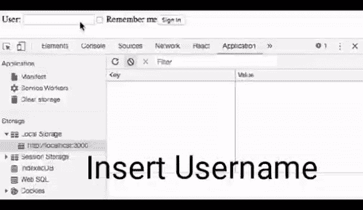

# 使用 PHP“保持我登录”的最佳方法

> 原文:[https://www . geeksforgeeks . org/保持我登录的最佳方法-使用-php/](https://www.geeksforgeeks.org/best-approach-for-keep-me-logged-in-using-php/)

我们都注意到了我们登录的大多数网站中的“保持我登录”复选框。通过代码实现这一点有不同的方式和方法。

其中最好的方法是将用户信息作为 cookies 保存在用户浏览器中。基本上，我们必须将**用户名**和**密码**作为 cookies 存储在用户的浏览器中。那么每次页面加载时，会话变量都会被设置。因此，用户无需再次输入**用户名**和**密码**就可以登录，直到该 cookie 过期。下面给出的示例代码是如何通过 PHP 记住密码复选框的工作方式。

**例**

```php
<?php
session_start();
if (isset($_SESSION["name"]))
{
    header("location:home.php");
}
$connect = mysqli_connect("localhost", "root", "", "testing");
if (isset($_POST["login"]))
{
    if (!empty($_POST["user_name"]) && !empty($_POST["user_password"]))
    {
        $name = mysqli_real_escape_string($connect, $_POST["user_name"]);
        $password = md5(mysqli_real_escape_string($connect,
                                               $_POST["user_password"]));
        $sql = "Select * from login where name = '" . $name . "
                                   ' and password = '" . $password . "'";
        $result = mysqli_query($connect, $sql);
        $user = mysqli_fetch_array($result);
        if ($user)
        {
            // Saving the username and password as cookies
            if (!empty($_POST["rememberme"]))
            {

                // Username is stored as cookie for 10 years as
                // 10years * 365days * 24hrs * 60mins * 60secs
                setcookie("user_login", $name, time() +
                                    (10 * 365 * 24 * 60 * 60));

                // Password is stored as cookie for 10 years as 
                // 10years * 365days * 24hrs * 60mins * 60secs
                setcookie("user_password", $password, time() +
                                    (10 * 365 * 24 * 60 * 60));

                // After setting cookies the session variable will be set
                $_SESSION["name"] = $name;

            }
            else
            {
                if (isset($_COOKIE["user_login"]))
                {
                    setcookie("user_login", "");
                }
                if (isset($_COOKIE["user_password"]))
                {
                    setcookie("user_password", "");
                }
            }
            header("location:home.php");
        }
        else
        {
            $message = "Invalid Login Credentials";
        }
    }
    else
    {
        $message = "Both are Required Fields. Please fill both the fields";
    }
}
?>
```

**输出**通过阅读注释和解释理解上述代码，您必须能够在服务器上执行 PHP 代码，并将**用户名**和**密码**作为 cookies 存储在用户浏览器中。所以这样记住密码的任务就可以实现了。