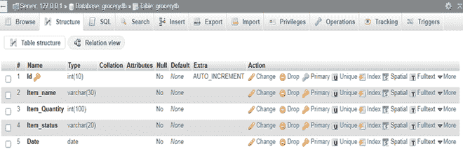
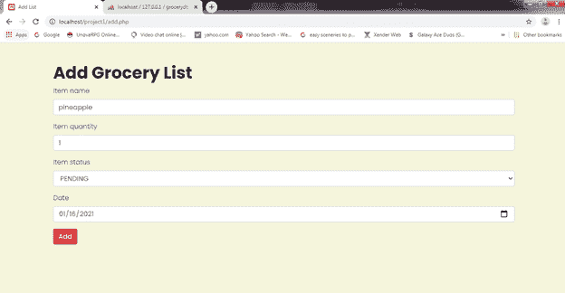
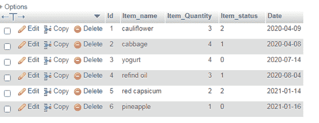
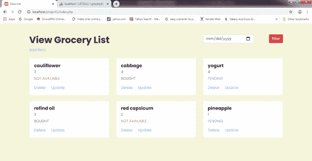
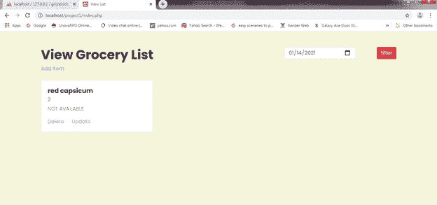
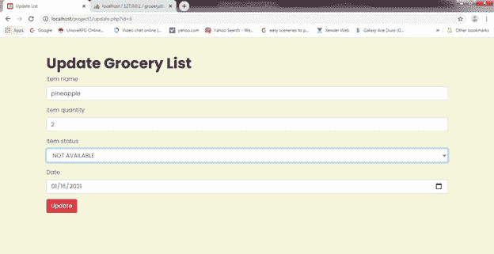
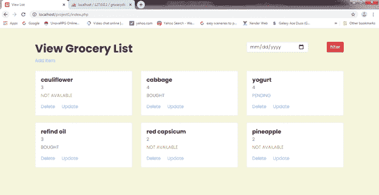
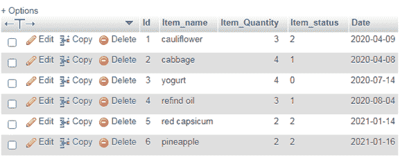
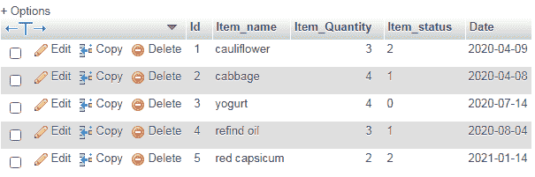

# 使用 PHP 和 MySQL 构建一个杂货店网络应用

> 原文:[https://www . geesforgeks . org/build-a-杂货店-web-app-using-PHP-with-MySQL/](https://www.geeksforgeeks.org/build-a-grocery-store-web-app-using-php-with-mysql/)

在本文中，我们将使用 PHP 和 MySQL 构建一个杂货店网络应用程序。在这个应用程序中，我们可以通过名称、数量、状态(待定、已购买、不可用)和日期来添加杂货项目。我们可以查看、删除和更新这些项目。将有一个日期过滤功能，我们可以根据日期查看杂货项目。

**先决条件:** [XAMPP 服务器](https://www.geeksforgeeks.org/how-to-install-xampp-on-windows/)[HTML](https://www.geeksforgeeks.org/html-tutorials/)[CSS](https://www.geeksforgeeks.org/css-tutorials/)[Bootstrap](https://www.geeksforgeeks.org/bootstrap-tutorials/)[PHP](https://www.geeksforgeeks.org/php-tutorials/)[MySQL](https://www.geeksforgeeks.org/sql-tutorial/#mysql)

我们将按照以下步骤来构建这个应用程序。

**步骤-1:** 打开 XAMPP 控制面板，启动 Apache 和 MySQL 服务。在 XAMPP 文件夹中，转到 htdocs 文件夹，创建一个名为**项目 1** 的文件夹。我们会将所有文件保存在**项目 1** 文件夹中。这个文件夹里面会有五个文件(**add.php**、**connect.php**、**delete.php**、**index.php**、**update.php**)和一个名为 css 的文件夹，里面会有一个名为 **style.css** 的文件。

**步骤 2:** 转到 localhost/phpMyAdmin，创建一个名为 **grocerydb** 的数据库。在此之下，制作一个名为 **grocerytb** 的 5 列表格。这些列是标识(主键)、项目名称、项目数量、项目状态和日期。对于“标识”列，自动递增模式应该打开。最后，表结构应该如给定图像所示。



**第三步:**打开你选择的编辑器。制作一个名为**connect.php**的文件，并编写以下代码。

## connect.php

```phphtml
<?php
  $con=mysqli_connect("localhost","root","","grocerydb");
  if(!$con)
  {
    die("cannot connect to server");
  }    
?>
```

这个页面是用来连接我们的 PHP 页面和数据库“grocerydb”的。连接到该数据库后，连接对象返回到$con 变量。如果未建立连接，将显示“无法连接到服务器”消息。

**步骤-4:** 创建另一个名为**add.php**的文件，并对以下行进行编码。

## add.php

```phphtml
<html>

<head>
    <meta http-equiv="Content-Type" 
        content="text/html; charset=UTF-8">

    <title>Add List</title>

    <link rel="stylesheet" href=
"https://maxcdn.bootstrapcdn.com/bootstrap/4.4.1/css/bootstrap.min.css">
    <link rel="stylesheet" href="css/style.css">
</head>

<body>
    <div class="container mt-5">
        <h1>Add Grocery List</h1>
        <form action="add.php" method="POST">
            <div class="form-group">
                <label>Item name</label>
                <input type="text" 
                    class="form-control" 
                    placeholder="Item name" 
                    name="iname" />
            </div>

            <div class="form-group">
                <label>Item quantity</label>
                <input type="text" 
                    class="form-control" 
                    placeholder="Item quantity" 
                    name="iqty" />
            </div>

            <div class="form-group">
                <label>Item status</label>
                <select class="form-control" 
                    name="istatus">
                    <option value="0">
                        PENDING
                    </option>
                    <option value="1">
                        BOUGHT
                    </option>
                    <option value="2">
                        NOT AVAILABLE
                    </option>
                </select>
            </div>
            <div class="form-group">
                <label>Date</label>
                <input type="date" 
                    class="form-control" 
                    placeholder="Date" 
                    name="idate">
            </div>
            <div class="form-group">
                <input type="submit" 
                    value="Add" 
                    class="btn btn-danger" 
                    name="btn">
            </div>
        </form>
    </div>

    <?php
        if(isset($_POST["btn"])) {
            include("connect.php");
            $item_name=$_POST['iname'];
            $item_qty=$_POST['iqty'];
            $item_status=$_POST['istatus'];
            $date=$_POST['idate'];

            $q="insert into grocerytb(Item_name,
            Item_Quantity,Item_status,Date)
            values('$item_name',$item_qty,
            '$item_status','$date')";

            mysqli_query($con,$q);
            header("location:index.php");
        }

        // if(!mysqli_query($con,$q))
        // {
            // echo "Value Not Inserted";
        // }
        // else
        // {
            // echo "Value Inserted";
        // }
    ?>
</body>

</html>
```

此页面用于将 HTML 表单中的杂货项目数据插入“grocerydb”数据库中的“grocerytb”表。html 表单包含用户要输入的项目名称、项目数量、项目状态和日期值。我们已经为“待定”、“已购买”和“不可用”(对于项目状态)分别设置了选项值 0、1 和 2。当点击一个按钮时，我们包含文件“connect.php”来连接页面和数据库。然后，我们获取用户输入的所有数据，并将它们插入到“grocerytb”表中。如果在表中成功输入了值，页面将移动到“index.php”，这将使用户能够查看到目前为止输入的项目(或者到目前为止表中的项目)。在 css 文件夹中创建一个“style.css”文件，并编写以下代码。

## style.css

```phphtml
@import url(
'https://fonts.googleapis.com/css2?family=Poppins:wght@300;400;700&display=swap');

body {
    font-family: 'Poppins', sans-serif;
       font-weight: 300;
       background-color: beige;
}

h1, h2, h3, h4, h5 {
       font-family: 'Poppins', sans-serif;
       font-weight: 700;
}
```

“add.php”文件应该如给定图像所示。



**步骤-5:** 制作另一个名为**index.php**的文件，并编码如下行。

## index.php

```phphtml
<?php
    include("connect.php");

    if (isset($_POST['btn'])) {
        $date=$_POST['idate'];
        $q="select * from grocerytb where Date='$date'";
        $query=mysqli_query($con,$q);
    } 
    else {
        $q= "select * from grocerytb";
        $query=mysqli_query($con,$q);
    }
?>

<html>

<head>
    <meta http-equiv="Content-Type" 
        content="text/html; charset=UTF-8">

    <title>View List</title>

    <link rel="stylesheet" href=
"https://maxcdn.bootstrapcdn.com/bootstrap/4.4.1/css/bootstrap.min.css">

    <link rel="stylesheet" 
        href="css/style.css">
</head>

<body>
    <div class="container mt-5">

        <!-- top -->
        <div class="row">
            <div class="col-lg-8">
                <h1>View Grocery List</h1>
                <a href="add.php">Add Item</a>
            </div>
            <div class="col-lg-4">
                <div class="row">
                    <div class="col-lg-8">

                        <!-- Date Filtering-->
                        <form method="post" action="">
                            <input type="date" 
                                class="form-control" 
                                name="idate">

                            <div class="col-lg-4" 
                                method="post">
                                <input type="submit" 
                                class="btn btn-danger float-right" 
                                name="btn" value="filter">
                            </div>
                        </form>
                    </div>
                </div>
            </div>
        </div>

        <!-- Grocery Cards -->
        <div class="row mt-4">
            <?php
                while ($qq=mysqli_fetch_array($query)) 
                {
            ?>

            <div class="col-lg-4">
                <div class="card">
                    <div class="card-body">
                        <h5 class="card-title">
                            <?php echo $qq['Item_name']; ?>
                        </h5>
                        <h6 class="card-subtitle mb-2 text-muted">
                            <?php echo 
                            $qq['Item_Quantity']; ?>
                        </h6>
                        <?php
                        if($qq['Item_status'] == 0) {
                        ?>
                        <p class="text-info">PENDING</p>

                        <?php
                        } else if($qq['Item_status'] == 1) {
                        ?>
                        <p class="text-success">BOUGHT</p>

                        <?php } else { ?>
                        <p class="text-danger">NOT AVAILABLE</p>

                        <?php } ?>
                        <a href=
                        "delete.php?id=<?php echo $qq['Id']; ?>" 
                            class="card-link">
                            Delete
                        </a>
                        <a href=
                        "update.php?id=<?php echo $qq['Id']; ?>" 
                            class="card-link">
                            Update
                        </a>
                    </div>
                </div><br>
            </div>
            <?php
            }
            ?>
        </div>
    </div>
</body>

</html>
```

我们再次包含“connect.php”来连接页面和数据库。然后，我们使用一个名为 mysqli _ fetch _ array()的函数从表中获取所有数据，并将它们显示在页面上。每个项目都有一个删除和更新链接。使用顶部的添加项目链接，页面将再次移动到“add.php”，用户可以再次从这里向数据库添加杂货项目。我们还在此页面上添加了日期过滤功能。当用户输入日期并点击过滤器按钮时，所有的杂货项目数据将根据输入的日期显示。目前，我们的“grocerytb”表看起来像给定图像中所示。



移动到“index.php”文件后，页面看起来将如给定图像所示。



输入日期 01/14/2021 后，页面将如给定图像所示。



**步骤-6:** 制作另一个名为 update.php 的文件，并对以下行进行编码。

## update.php

```phphtml
<?php
    include("connect.php");
    if(isset($_POST['btn']))
    {
        $item_name=$_POST['iname'];
        $item_qty=$_POST['iqty'];
        $istatus=$_POST['istatus'];
        $date=$_POST['idate'];
        $id = $_GET['id'];
        $q= "update grocerytb set Item_name='$item_name', Item_Quantity='$item_qty', 
        Item_status='$istatus', Date='$date' where Id=$id";
        $query=mysqli_query($con,$q);
        header('location:index.php');
    } 
    else if(isset($_GET['id'])) 
    {
        $q = "SELECT * FROM grocerytb WHERE Id='".$_GET['id']."'";
        $query=mysqli_query($con,$q);
        $res= mysqli_fetch_array($query);
    }
?>
<html>

<head>
    <meta http-equiv="Content-Type" 
        content="text/html; charset=UTF-8">

    <title>Update List</title>

    <link rel="stylesheet" href=
"https://maxcdn.bootstrapcdn.com/bootstrap/4.4.1/css/bootstrap.min.css">
    <link rel="stylesheet" href="css/style.css">
</head>

<body>
    <div class="container mt-5">
        <h1>Update Grocery List</h1>
        <form method="post">
            <div class="form-group">
                <label>Item name</label>
                <input type="text" 
                    class="form-control" 
                    name="iname" 
                    placeholder="Item name" 
                    value=
        "<?php echo $res['Item_name'];?>" />
            </div>

            <div class="form-group">
                <label>Item quantity</label>
                <input type="text" 
                    class="form-control" 
                    name="iqty" 
                    placeholder="Item quantity" 
value="<?php echo $res['Item_Quantity'];?>" />
            </div>

            <div class="form-group">
                <label>Item status</label>
                <select class="form-control" 
                    name="istatus">
                    <?php
                        if($res['Item_status'] == 0) {
                    ?>
                    <option value="0" selected>PENDING</option>
                    <option value="1">BOUGHT</option>
                    <option value="2">NOT AVAILABLE</option>
                    <?php } else if($res['Item_status'] == 1) { ?>
                    <option value="0">PENDING</option>
                    <option value="1" selected>BOUGHT</option>
                    <option value="2">NOT AVAILABLE</option>
                    <?php } else if($res['Item_status'] == 2) { ?>
                    <option value="0">PENDING</option>
                    <option value="1">BOUGHT</option>
                    <option value="2" selected>NOT AVAILABLE</option>
                    <?php
                        }
                    ?>
                </select>
            </div>

            <div class="form-group">
                <label>Date</label>
                <input type="date" class="form-control" 
                    name="idate" placeholder="Date" 
                    value="<?php echo $res['Date']?>">
            </div>

            <div class="form-group">
                <input type="submit" value="Update" 
                    name="btn" class="btn btn-danger">
            </div>
        </form>
    </div>
</body>

</html>
```

在“index.php”中，我们获取了每个项目的 Id。在“update.php”中，用户可以编辑任何数据。对于那个项目，我们正在获取 id 和更新项目的数据。然后，我们运行一个更新查询，通过它来更新项目。项目更新后，页面将移动到“index.php”。在这里，我们正在更新名为菠萝，Id 为 6 的 Item_name 的值。我们正在将其物料数量从 1 更新为 2，并将物料状态从待定更新为不可用。之后，页面看起来将如给定图像所示。



更新后，index.php 会是这个样子。



更新后的表格将如下所示。



**步骤-7:** 制作另一个名为 delete.php 的文件，并对以下行进行编码。

## delete.php

```phphtml
<?php
    include("connect.php");
    $id = $_GET['id'];
    $q = "delete from grocerytb where Id = $id ";
    mysqli_query($con,$q);    
?>
```

在“index.php”中，我们获取了每个项目的 Id，这样我们就可以删除任何数据。对于要删除的项目，我们在“delete.php”中获取 id。然后，我们运行一个删除查询，通过该查询，所选项目的记录将被删除。我们正在删除 Id 为 6、项目名为菠萝的项目。删除后，页面看起来将如给定图像所示。


这张桌子会是这样的。



**源代码链接**–https://github.com/anshu37/grocery-php-project