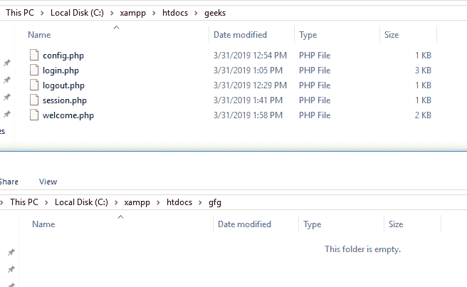
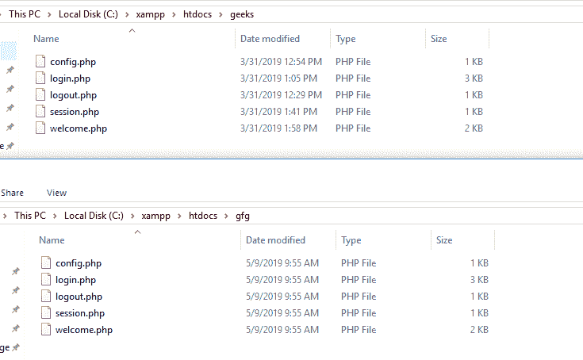

# 在 PHP 中将一个目录的全部内容复制到另一个目录

> 原文:[https://www . geesforgeks . org/将目录的全部内容复制到另一个 php 目录/](https://www.geeksforgeeks.org/copy-the-entire-contents-of-a-directory-to-another-directory-in-php/)

给定一个目录，任务是使用 PHP 函数将目录的内容复制到另一个目录。有许多功能用于将一个目录的内容复制到另一个目录。

**使用的功能:**

*   **[copy() Function](https://www.geeksforgeeks.org/php-copy-function/):** The copy() function is used to make a copy of a specified file. It makes a copy of the source file to the destination file and if the destination file already exists, it gets overwritten. The copy() function returns true on success and false on failure.

    **语法:**

    ```php
    *bool* copy($source, $dest)
    ```

*   **[opendir() Function](https://www.geeksforgeeks.org/php-opendir-function/):** The opendir() function is used to open a directory handle. The path of the directory to be opened is sent as a parameter to the opendir() function and it returns a directory handle resource on success, or FALSE on failure.

    **语法:**

    ```php
    opendir($path, $context)
    ```

*   **[is_dir() Function](https://www.geeksforgeeks.org/php-is_dir-function/):** The is_dir() function is used to check whether the specified file is a directory or not. The name of the file is sent as a parameter to the is_dir() function and it returns True if the file is a directory else returns False.

    **语法:**

    ```php
    is_dir($file)
    ```

*   **[scandir( ) Function](https://www.geeksforgeeks.org/php-scandir-function/):** The scandir() function is used to return an array of files and directories of the specified directory. The scandir() function lists the files and directories which are present inside a specified path. The directory, stream behavior and sorting_order of the files and directories are passed as a parameter to the scandir() function and it returns an array of filenames on success, or False on failure.

    **语法:**

    ```php
    scandir(directory, sorting_order, context)
    ```

*   **[readdir() Function:](https://www.geeksforgeeks.org/php-readdir-function/)** The readdir() function is used to return the name of the next entry in a directory. This method returns the filenames in the order as they are stored in the filenamesystem. The directory handle is sent as a parameter to the readdir() function and it returns the entry name/filename on success or False on failure.

    **语法:**

    ```php
    readdir(dir_handle)
    ```

**示例 1:** 本示例使用 readdir()函数从源目录读取文件。

```php
<?php

function custom_copy($src, $dst) { 

    // open the source directory
    $dir = opendir($src); 

    // Make the destination directory if not exist
    @mkdir($dst); 

    // Loop through the files in source directory
    while( $file = readdir($dir) ) { 

        if (( $file != '.' ) && ( $file != '..' )) { 
            if ( is_dir($src . '/' . $file) ) 
            { 

                // Recursively calling custom copy function
                // for sub directory 
                custom_copy($src . '/' . $file, $dst . '/' . $file); 

            } 
            else { 
                copy($src . '/' . $file, $dst . '/' . $file); 
            } 
        } 
    } 

    closedir($dir);
} 

$src = "C:/xampp/htdocs/geeks";

$dst = "C:/xampp/htdocs/gfg";

custom_copy($src, $dst);

?>
```

**输出:**

*   **在本地主机上运行程序前:**
    
*   **在本地主机上运行程序后:**
    

**示例 2:** 本示例使用 scandir()函数从源目录读取文件。

```php
<?php

function custom_copy($src, $dst) { 

    // open the source directory
    $dir = opendir($src); 

    // Make the destination directory if not exist
    @mkdir($dst); 

    // Loop through the files in source directory
    foreach (scandir($src) as $file) { 

        if (( $file != '.' ) && ( $file != '..' )) { 
            if ( is_dir($src . '/' . $file) ) 
            { 

                // Recursively calling custom copy function
                // for sub directory 
                custom_copy($src . '/' . $file, $dst . '/' . $file); 

            } 
            else { 
                copy($src . '/' . $file, $dst . '/' . $file); 
            } 
        } 
    } 

    closedir($dir);
}  

$src = "C:/xampp/htdocs/geeks";

$dst = "C:/xampp/htdocs/gfg";

custom_copy($src, $dst);

?>
```

**输出:**

*   **在本地主机上运行程序前:**
    
*   **在本地主机上运行程序后:**
    