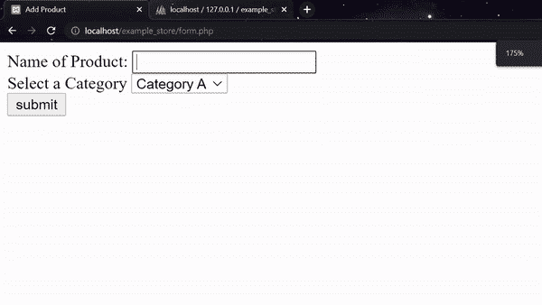
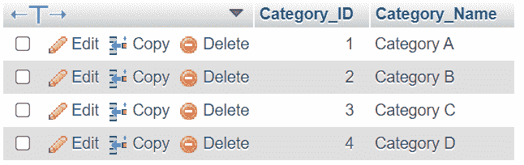
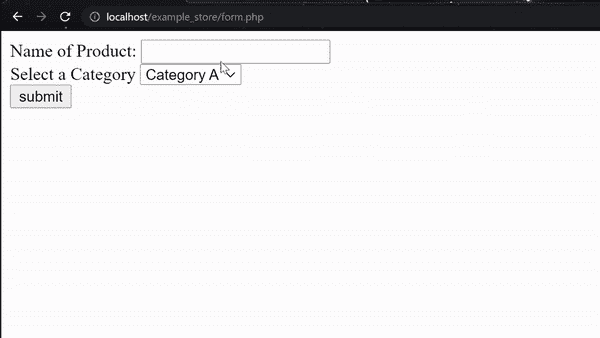
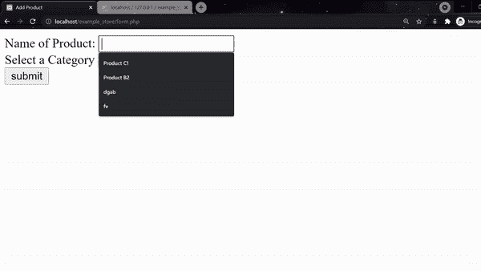
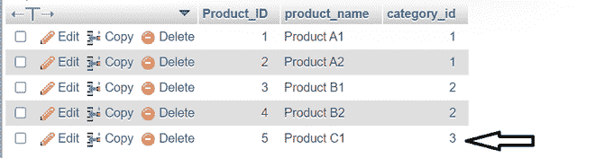

# 创建一个下拉列表，显示从 PHP 的 MySQL 数据库中获取的选项

> 原文:[https://www . geesforgeks . org/create-a-下拉列表-选项-从-a-mysql-database-in-php/](https://www.geeksforgeeks.org/create-a-drop-down-list-that-options-fetched-from-a-mysql-database-in-php/)

在许多场景中，我们可能需要创建一个下拉输入，它可以显示与数据库当前状态一致的所有选项。这种形式的输入在现实生活中被多次使用，下面的例子可能有助于理解这一点。

1.  一组有唯一注册号的学生。
2.  一组分支名称及其分支 id。
3.  特定产品必须属于的类别列表。

在本文中，我们将创建一个下拉列表，其中包含特定产品必须属于的类别列表。

**方法:**在每个例子中，如果我们使用从数据库中获取数据的下拉菜单，用户将能够更准确地输入数据，并且用户界面将更加友好。

我们需要以下内容

*   一个数据库，包含一个类别表和另一个产品表，产品表的外键指向特定产品所属的类别标识。
*   接受数据的 HTML 表单。

**步骤:**

**数据库创建:**

*   从 XAMPP 控制面板打开 Apache 和 MySQL。


点击“开始”按钮

*   点击*新建*按钮，创建数据库“示例 _ 存储”。


点击“新建”按钮创建一个新的数据库

*   输入数据库名称，然后单击“创建”。


创建一个名为“示例存储”的新数据库

*   单击“SQL”选项卡，粘贴以下代码，然后单击“执行”。


运行 SQL 并准备数据库

**MySQL 查询:**

```html
-- Table structure for table `category`
CREATE TABLE `category` (

 `Category_ID` int(11) NOT NULL,

 `Category_Name` varchar(255) NOT NULL

) ENGINE=InnoDB DEFAULT CHARSET=utf8mb4;

-- Dumping data for table `category`
INSERT INTO `category` (`Category_ID`, `Category_Name`) VALUES

(1, 'Category A '),

(2, 'Category B');

-- Table structure for table `product`
CREATE TABLE `product` (

 `Product_ID` int(11) NOT NULL,

 `product_name` varchar(255) NOT NULL,

 `category_id` int(11) NOT NULL

) ENGINE=InnoDB DEFAULT CHARSET=utf8mb4;

-- Dumping data for table `product`
INSERT INTO `product` (`Product_ID`, `product_name`, `category_id`) VALUES

(1, 'Product A1', 1),

(2, 'Product A2', 1),

(3, 'Product B1', 2);

-- Primary Key Constraints
ALTER TABLE `category`

 ADD PRIMARY KEY (`Category_ID`);

ALTER TABLE `product`

 ADD PRIMARY KEY (`Product_ID`),

 ADD KEY `Category_constraint` (`category_id`);

-- AUTO_INCREMENT for table `category`
ALTER TABLE `category`

 MODIFY `Category_ID` int(11) NOT NULL AUTO_INCREMENT, AUTO_INCREMENT=3;

-- AUTO_INCREMENT for table `product`

ALTER TABLE `product`

 MODIFY `Product_ID` int(11) NOT NULL AUTO_INCREMENT, AUTO_INCREMENT=4;

-- Foreign Key Constraints

ALTER TABLE `product`

 ADD CONSTRAINT `Category_constraint` FOREIGN KEY (`category_id`) 
 REFERENCES `category` (`Category_ID`) ON DELETE 
 CASCADE ON UPDATE CASCADE;
```

**示例:**我们在 *htdocs* 中一个名为“example_store”的文件夹中创建一个 PHP 文件，并创建以下*form.php*网页，可在“localhost/Example _ store/form . PHP”的浏览器中访问。

## 服务器端编程语言（Professional Hypertext Preprocessor 的缩写）

```html
<?php

    // Connect to database 
    $con = mysqli_connect("localhost","root","","example_store");

    // mysqli_connect("servername","username","password","database_name")

    // Get all the categories from category table
    $sql = "SELECT * FROM `category`";
    $all_categories = mysqli_query($con,$sql);

    // The following code checks if the submit button is clicked 
    // and inserts the data in the database accordingly
    if(isset($_POST['submit']))
    {
        // Store the Product name in a "name" variable
        $name = mysqli_real_escape_string($con,$_POST['Product_name']);

        // Store the Category ID in a "id" variable
        $id = mysqli_real_escape_string($con,$_POST['Category']); 

        // Creating an insert query using SQL syntax and
        // storing it in a variable.
        $sql_insert = 
        "INSERT INTO `product`(`product_name`, `category_id`)
            VALUES ('$name','$id')";

          // The following code attempts to execute the SQL query
          // if the query executes with no errors 
          // a javascript alert message is displayed
          // which says the data is inserted successfully
          if(mysqli_query($con,$sql_insert))
        {
            echo '<script>alert("Product added successfully")</script>';
        }
    }
?>

<!DOCTYPE html>
<html lang="en">
<head>
    <meta charset="UTF-8">
    <meta http-equiv="X-UA-Compatible" content="IE=edge">
    <meta name="viewport"
          content="width=device-width, initial-scale=1.0">    
</head>
<body>
    <form method="POST">
        <label>Name of Product:</label>
        <input type="text" name="Product_name" required><br>
        <label>Select a Category</label>
        <select name="Category">
            <?php 
                // use a while loop to fetch data 
                // from the $all_categories variable 
                // and individually display as an option
                while ($category = mysqli_fetch_array(
                        $all_categories,MYSQLI_ASSOC)):; 
            ?>
                <option value="<?php echo $category["Category_ID"];
                    // The value we usually set is the primary key
                ?>">
                    <?php echo $category["Category_Name"];
                        // To show the category name to the user
                    ?>
                </option>
            <?php 
                endwhile; 
                // While loop must be terminated
            ?>
        </select>
        <br>
        <input type="submit" value="submit" name="submit">
    </form>
    <br>
</body>
</html>
```

**输出:**



*   下拉列表目前只显示类别 A 和类别 B。如果我们在数据库中再添加几个类别，它们就会显示在下拉列表中。在表类别中插入更多值后。



关于插入丙类和丁类

*   重新加载网页时



重新加载网页

*   **插入新产品**:我们可以通过以下方式插入产品 C1。



插入新产品

*   我们会收到一条警告消息，并且表格产品会更新



提交表单后