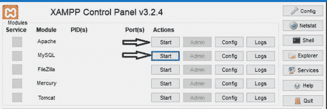
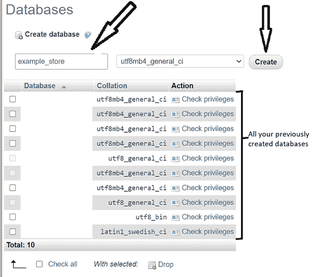
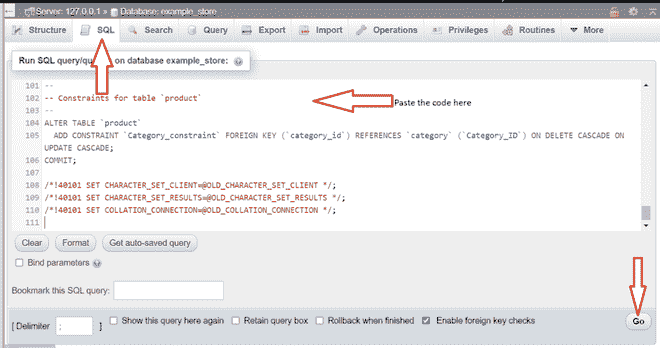
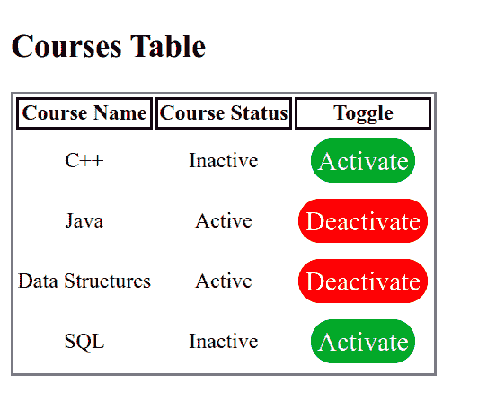
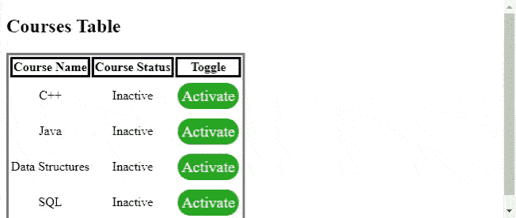

# 使用 PHP 和 MySQL 创建激活/停用按钮

> 原文:[https://www . geesforgeks . org/creating-an-activate-deactivate-button-using-PHP-and-MySQL/](https://www.geeksforgeeks.org/creating-an-activate-deactivate-button-using-php-and-mysql/)

在本文中，我们将讨论如何使用 PHP 创建一个激活/停用按钮。当设置了特定的状态时，数据库中的状态也会更新。

**方法:**为了举例说明，假设有几门课程可以设置为活动或非活动，并且需要为其设置适当的彩色按钮。实现是使用 HTML、PHP 和 CSS 完成的。

**要求:**

1.  MySQL 数据库，其表至少包含课程名称和布尔状态值。
2.  PHP 和 HTML 文件。
3.  XAMPP(或任何替代方案)

**数据库创建:**

*   打开 XAMPP 控制面板，启动 Apache 和 MySQL 模块。
    

    点击开始按钮

*   在浏览器中打开“localhost/phpmyadmin”，点击新建按钮创建一个新的数据库。
    
*   为数据库命名，然后单击创建。
    
*   在“SQL”选项卡中，输入以下 SQL 代码，然后单击“执行”。
    

为了达到预期的结果，让我们创建一个名为“课程”的数据库，并使用下面的 SQL 代码设置几门课程。

```html
Table structure for table `courses`
Course_name String and status boolean fields

CREATE TABLE `courses` (
  `Course_name` varchar(50) NOT NULL,
  `status` tinyint(1) NOT NULL
) ENGINE=InnoDB DEFAULT CHARSET=utf8mb4;

Sample data for table `courses`

INSERT INTO `courses` (`Course_name`, `status`) VALUES
('C++', 0),
('Java', 1),
('Data Structures', 1),
('SQL', 0);

ALTER TABLE `courses` ADD `id` INT NOT NULL AUTO_INCREMENT
    FIRST, ADD PRIMARY KEY (`id`);
```

在这个表中，我们必须知道状态是一个整数，表示非活动状态为 0，活动状态为 1。

**网页创建:**在 *htdocs* 中创建一个名为*课程*的文件夹，并将以下文件存储为“课程页面. php **”。**

## course-page.php

```html
<?php

    // Connect to database 
    $con = mysqli_connect("localhost","root","","courses");

    // Get all the courses from courses table
    // execute the query 
    // Store the result
    $sql = "SELECT * FROM `courses`";
    $Sql_query = mysqli_query($con,$sql);
    $All_courses = mysqli_fetch_all($Sql_query,MYSQLI_ASSOC);
?>

<!DOCTYPE html>
<html lang="en">
<head>
    <meta charset="UTF-8">
    <meta http-equiv="X-UA-Compatible" content="IE=edge">
    <meta name="viewport"
           content="width=device-width, initial-scale=1.0">

    <!-- Using internal/embedded css -->
    <style>
        .btn{
            background-color: red;
            border: none;
            color: white;
            padding: 5px 5px;
            text-align: center;
            text-decoration: none;
            display: inline-block;
            font-size: 20px;
            margin: 4px 2px;
            cursor: pointer;
            border-radius: 20px;
        }
        .green{
            background-color: #199319;
        }
        .red{
            background-color: red;
        }
        table,th{
            border-style : solid;
            border-width : 1;
            text-align :center;
        }
        td{
            text-align :center;
        }
    </style>    
</head>

<body>
    <h2>Courses Table</h2>
    <table>
        <!-- TABLE TOP ROW HEADINGS-->
        <tr>
            <th>Course Name</th>
            <th>Course Status</th>
            <th>Toggle</th>
        </tr>
        <?php

            // Use foreach to access all the courses data
            foreach ($All_courses as $course) { ?>
            <tr>
                <td><?php echo $course['Course_name']; ?></td>
                <td><?php 
                        // Usage of if-else statement to translate the 
                        // tinyint status value into some common terms
                        // 0-Inactive
                        // 1-Active
                        if($course['status']=="1") 
                            echo "Active";
                        else 
                            echo "Inactive";
                    ?>                          
                </td>
                <td>
                    <?php 
                    if($course['status']=="1") 

                        // if a course is active i.e. status is 1 
                        // the toggle button must be able to deactivate 
                        // we echo the hyperlink to the page "deactivate.php"
                        // in order to make it look like a button
                        // we use the appropriate css
                        // red-deactivate
                        // green- activate
                        echo 
"<a href=deactivate.php?id=".$course['id']." class='btn red'>Deactivate</a>";
                    else 
                        echo 
"<a href=activate.php?id=".$course['id']." class='btn green'>Activate</a>";
                    ?>
            </tr>
           <?php
                }
                // End the foreach loop 
           ?>
    </table>
</body>

</html>
```

**输出:**



一张好看的桌子被创造出来

我们实际上没有使用按钮，而是使用链接到 PHP 文件的超链接，这些文件执行表“课程”的状态变量的切换。所以我们也需要创建这些文件。

## activate.php

```html
<?php

    // Connect to database 
    $con=mysqli_connect("localhost","root","","courses");

    // Check if id is set or not if true toggle,
    // else simply go back to the page
    if (isset($_GET['id'])){

        // Store the value from get to a 
        // local variable "course_id"
        $course_id=$_GET['id'];

        // SQL query that sets the status
        // to 1 to indicate activation.
        $sql="UPDATE `courses` SET 
             `status`=1 WHERE id='$course_id'";

        // Execute the query
        mysqli_query($con,$sql);
    }

    // Go back to course-page.php
    header('location: course-page.php');
?>
```

## deactivate.php

```html
<?php

    // Connect to database 
    $con=mysqli_connect("localhost","root","","courses");

    // Check if id is set or not, if true,
    // toggle else simply go back to the page
    if (isset($_GET['id'])){

        // Store the value from get to 
        // a local variable "course_id"
        $course_id=$_GET['id'];

        // SQL query that sets the status to
        // 0 to indicate deactivation.
        $sql="UPDATE `courses` SET 
            `status`=0 WHERE id='$course_id'";

        // Execute the query
        mysqli_query($con,$sql);
    }

    // Go back to course-page.php
    header('location: course-page.php');
?>
```

**输出:**我们已经创建了一个带有可点击按钮的页面，当我们点击按钮时，数据库中的状态会发生变化。



激活和停用