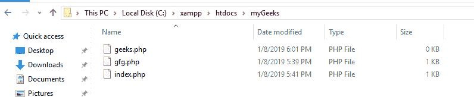
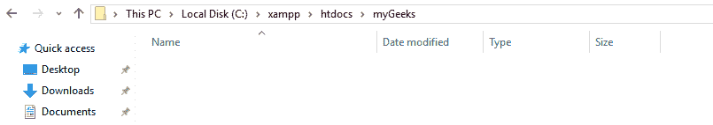

# 使用 PHP 删除文件夹中的所有文件

> 原文:[https://www . geesforgeks . org/从文件夹中删除所有文件-使用-php/](https://www.geeksforgeeks.org/deleting-all-files-from-a-folder-using-php/)

在 PHP 中，可以使用各种方法和内置方法删除文件夹中的文件，例如取消链接、目录生成器和目录光标迭代器。
下面解释其中一些方法:

**方法 1:**

*   使用 *glob()* 方法生成文件列表
*   遍历文件列表。
*   检查文件名是否有效。
*   使用 [unlink()](https://www.geeksforgeeks.org/php-unlink-function/) 方法删除文件。

**示例:**

```php
<?php
// PHP program to delete all
// file from a folder

// Folder path to be flushed
$folder_path = "myGeeks";

// List of name of files inside
// specified folder
$files = glob($folder_path.'/*'); 

// Deleting all the files in the list
foreach($files as $file) {

    if(is_file($file)) 

        // Delete the given file
        unlink($file); 
}
?>
```

**输出:**
**运行代码前:**

**运行代码后:**

**注意:**通过添加以下代码，隐藏文件可以包含在文件移除操作中:

```php
$hidden_files = glob($folder_path.'/{, .}*', GLOB_BRACE);
```

**方法 2:**

*   使用 *glob()* 方法生成文件列表。
*   使用 [array_filter()](https://www.geeksforgeeks.org/php-array_filter-function/) 或 [array_merge()](https://www.geeksforgeeks.org/php-merging-two-arrays-using-array_merge/) 方法过滤列表。
*   使用 [array_map()](https://www.geeksforgeeks.org/php-array_map-function/) 方法将列表映射到 [unlink()](https://www.geeksforgeeks.org/php-unlink-function/) 方法。

**示例:**

```php
<?php
// PHP program to delete all files from a folder

// Deleting all the files inside the given folder
array_map('unlink', array_filter(
            (array) array_merge(glob("myGeeks/*"))));

?>
```

**进场 3:**

*   使用目录生成器生成文件列表。
*   遍历文件列表。
*   验证文件，同时检查文件目录是否有圆点。
*   使用 getPathName 方法引用，使用 [unlink()](https://www.geeksforgeeks.org/php-unlink-function/) 方法删除文件。

**示例:**

```php
<?php
// PHP program to delete all files
// from a folder

// Folder path to be flushed
$folder_path = 'myGeeks/';

// Assigning files inside the directory
$dir = new DirectoryIterator(dirname($folder_path));

// Deleting all the files in the list
foreach ($dir as $fileinfo) {

    if (!$fileinfo->isDot()) {

        // Delete the given file
        unlink($fileinfo->getPathname());
    }
}
?>
```

**进场 4:**

*   使用*递归目录生成器*

    ```php
    $dir = new RecursiveDirectoryIterator($dir, FilesystemIterator::SKIP_DOTS);
    $dir = new RecursiveIteratorIterator($dir, RecursiveIteratorIterator::CHILD_FIRST);
    ```

    生成给定文件夹目录内所有目录层次结构的列表
*   *文件系统发送器::SKIP_DOTS* 用于生成文件列表时忽略点。
*   *recursiveiteratorator::CHILD _ FIRST*用于选择根目录下存在的文件。
*   迭代文件列表，并根据规范删除文件夹和文件。

**示例:**

```php
<?php
// PHP program to delete all FilesystemIterator
// from a folder

// Folder path to be flushed
$dir = "myGeeks/";

// Assigning files inside the directory
$dir = new RecursiveDirectoryIterator(
    $dir, FilesystemIterator::SKIP_DOTS);

// Reducing file search to given root
// directory only
$dir = new RecursiveIteratorIterator(
    $dir,RecursiveIteratorIterator::CHILD_FIRST);

// Removing directories and files inside
// the specified folder
foreach ( $dir as $file ) { 
    $file->isDir() ?  rmdir($file) : unlink($file);
}
?>
```