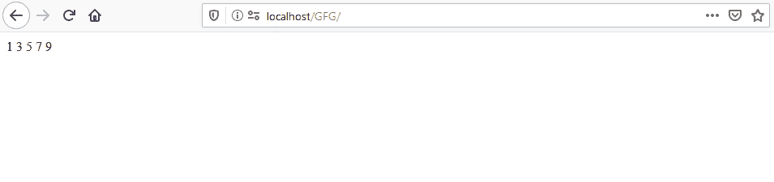
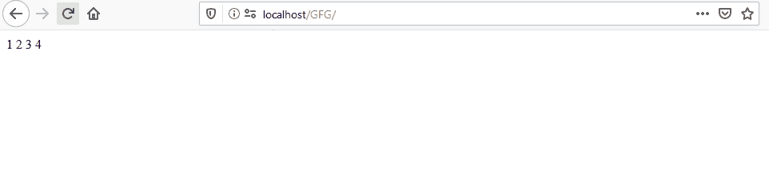
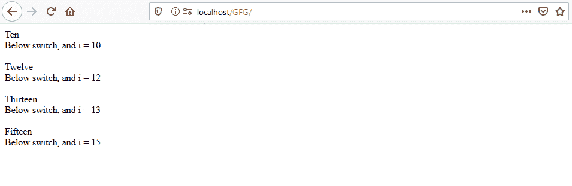

# PHP 中中断和继续的区别

> 原文:[https://www . geesforgeks . org/PHP 中中断和继续的区别/](https://www.geeksforgeeks.org/difference-between-break-and-continue-in-php/)

**中断**和**继续**都用于跳过循环的迭代。这些关键词有助于控制程序的流程。

**中断和继续的区别:**

1.  **break** 语句终止一个循环的整个迭代，而 **continue** 跳过当前迭代。
2.  **break** 语句提前终止整个循环，而 **continue** 提前进行下一次迭代。
3.  在开关的循环中， **break** 仅作为 case 的终止符，而 **continue 2** 作为 case 的终止符并跳过循环的当前迭代。

**程序 1:** 这个程序说明了循环内部的 continue 语句。

```
<?php
for ($i = 1; $i < 10; $i++) {
    if ($i % 2 == 0) {
        continue;
    }
    echo $i . " ";
}
?>
```

**输出:**


**程序 2:** 这个程序说明了循环内部的 break 语句。

```
<?php
for ($i = 1; $i < 10; $i++) {
    if ($i == 5) {
        break;
    }
    echo $i . " ";
}
?>
```

**输出:**


**程序 3:** 在一个回路中使用开关，在开关的情况下继续 2。

```
<?php
for ($i = 10; $i <= 15; $i++) {
    switch ($i) {
        case 10:
            echo "Ten";
            break;

        case 11:
            continue 2;

        case 12:
            echo "Twelve";
            break;

        case 13:
            echo "Thirteen";
            break;

        case 14:
            continue 2;

        case 15:
            echo "Fifteen";
            break;
    }

    echo "<br> Below switch, and i = " . $i . ' <br><br> ';
}
?>
```

**输出:**
