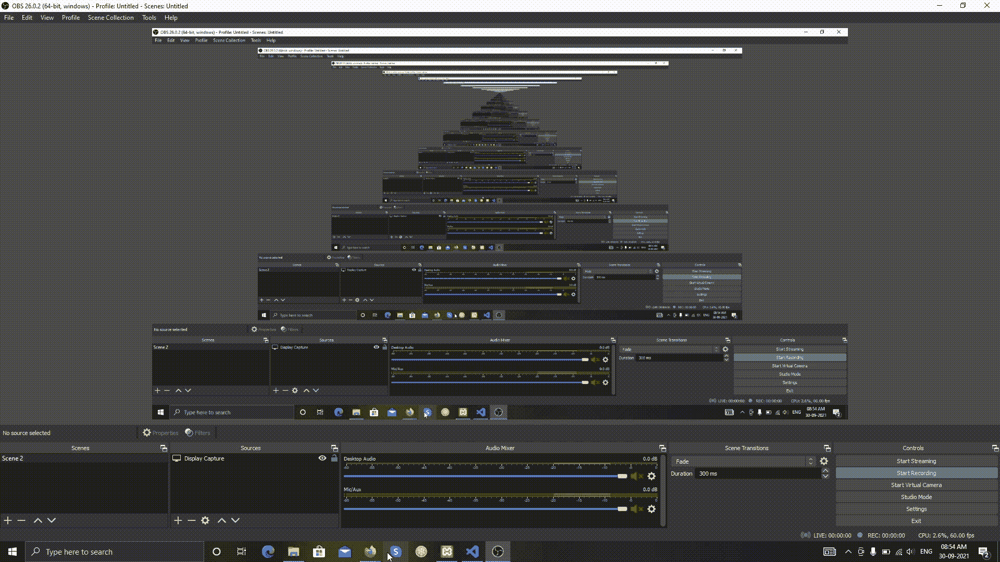

# PHP 中 require()和 include()的区别

> 原文:[https://www . geesforgeks . org/require-and-include-in-PHP 之间的差异/](https://www.geeksforgeeks.org/difference-between-require-and-include-in-php/)

[**PHP require()函数**](https://www.geeksforgeeks.org/php-inclusion/)**:**PHP 中的 **require()** 函数基本上是用来将一个 PHP 文件的内容/代码/数据包含到另一个 PHP 文件中。在这个过程中，如果有任何类型的错误，那么这个 **require()** 函数将弹出一个警告和一个致命错误，它将立即停止脚本的执行。为了使用这个 **require()** 函数，我们首先需要创建两个 PHP 文件。使用 **include()** 功能**，**将一个 PHP 文件包含到另一个文件中。之后，您将看到两个 PHP 文件合并成一个 HTML 文件。

**例 1:**

## 超文本标记语言

```php
<html>
<body>
  <h1>Welcome to geeks for geeks!</h1>
  <p>Myself, Gaurav Gandal</p>
  <p>Thank you</p>
  <?php require 'GFG.php'; ?>
</body>
</html>
```

## GFG.php

```php
<?php
    echo "
<p>visit Again-" . date("Y") . " geeks for geeks.com</p>
";
?>
```

**输出:**


[**PHP include()函数:**](https://www.geeksforgeeks.org/php-inclusion/)**PHP 中的 **include()** 函数基本上是用来将一个 PHP 文件的内容/代码/数据包含到另一个 PHP 文件中。在此过程中，如果出现任何类型的错误，则此 **require()** 函数将弹出警告，但与 **require()** 函数不同，它不会停止脚本的执行，而是脚本将继续其过程。为了使用这个 **include()** 函数，我们首先需要创建两个 PHP 文件。使用 **include()** 功能，将一个 PHP 文件包含到另一个文件中。之后，您将看到两个 PHP 文件合并成一个 HTML 文件。**

****例 2** :**

## **超文本标记语言**

```php
<html>
<body>
  <h1>Welcome to geeks for geeks!</h1>
  <p>Myself, Gaurav Gandal</p>

  <p>Thank you</p>

  <?php include 'GFG.php'; ?>
</body>
</html>
```

## **GFG.php**

```php
<?php
   echo "
<p>Visit Again; " . date("Y") . " Geeks for geeks.com</p>
";
?>
```

****输出:****

****

****require()和 include()的区别:****

<figure class="table">

| **包括()** | **要求()** |
| **include()** The function will not stop the execution of the script even if there is any error. | The **require ()** function will stop the execution of the script when there is an error. |
| **including ()** function will not give a fatal error. | The **require ()** function gives a fatal error. |
| **Include ()** The function is mainly used when the file is not needed. When the file is not found, the application should continue to execute its process. | **require ()** function is mostly used when the file is mandatory for application. |
| **T0】 include()** function will only generate a warning [(E_WARNING)](https://www.geeksforgeeks.org/php-types-of-errors/) , and the script will continue to execute. | **Require ()** will generate a fatal error (E_COMPILE_ERROR) with a warning. |

</figure>