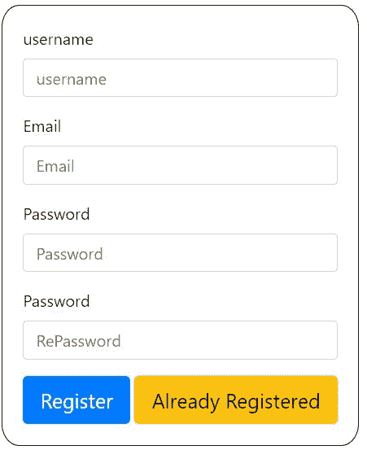
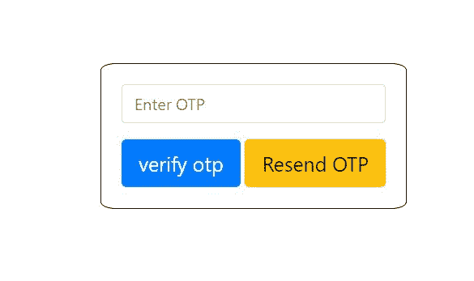
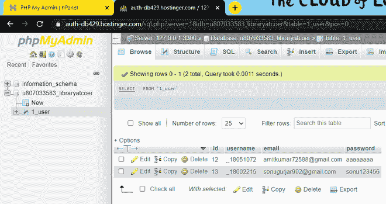
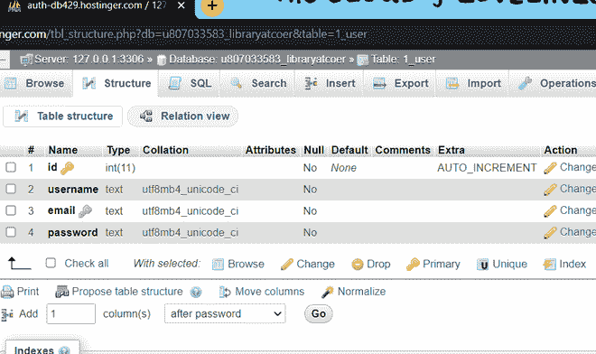
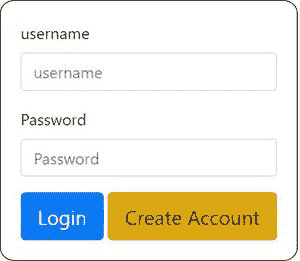
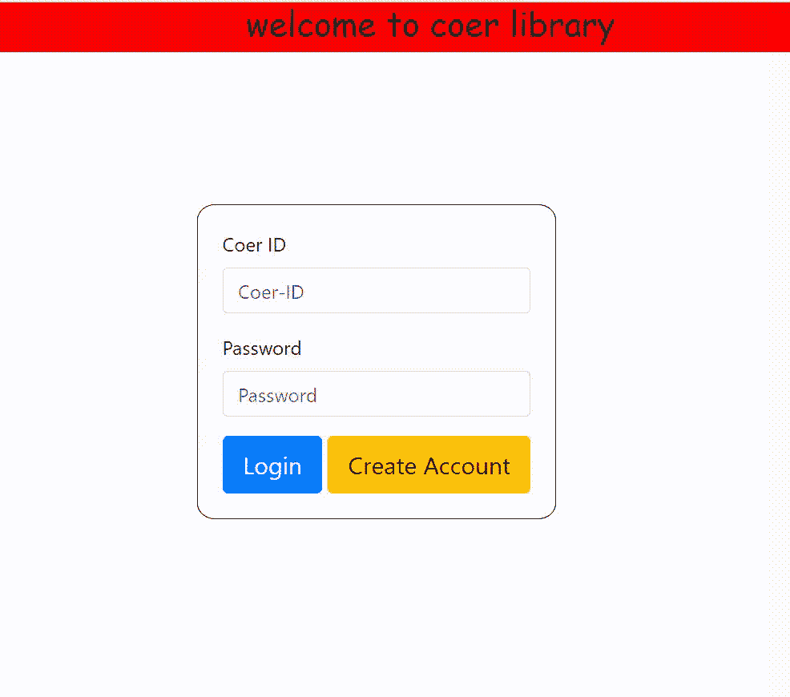

# 在直播服务器中使用 PHP 进行邮件 OTP 验证

> 原文:[https://www . geesforgeks . org/emil-OTP-verification-use-PHP-in-live-server/](https://www.geeksforgeeks.org/emil-otp-verification-using-php-in-live-server/)

任务是创建和设计一个注册和登录表单。在注册表单中，用户将使用自定义用户名和密码以及有效的电子邮件进行注册，然后用户将通过电子邮件收到一个动态口令，并且在成功验证动态口令后，将创建用户帐户并将数据存储在 MySQL 数据库中，然后用户将被重定向到主页。在登录表单中，用户可以使用创建新帐户时输入的用户名和密码登录。

**注意:**我们将在一个直播服务器中实现这整件事，任何人都可以像 XAMPP 一样在自己的本地服务器上实现，但是邮件验证部分不会在本地服务器上工作。

**报名方式:**

*   第一个任务是根据我们的要求创建一个 MySQL 服务器数据库和一个表。
*   我们使用 PHP mysqli _ connect()函数连接我们的 MySQL 服务器数据库，该函数接受四个参数，即我们的“服务器名”、“用户名”、“密码”和“数据库”。
*   输入用户的所有详细信息后，我们将使用 PHP rand()函数生成一个 6 位数的随机数，并将其存储到本地会话变量中，然后使用 PHP mailer 函数将其发送到用户电子邮件中。
*   当用户输入动态口令时，我们将使用会话中存储的动态口令进行验证，如果匹配，则存储会将用户重定向到主页。
*   使用用户提供的用户名创建一个新表，以存储该用户的电子邮件和密码。

**登录方式:**

*   如上所述连接到数据库，然后检查用户提供的凭据，如果它们与数据库中存储的数据匹配，则重定向用户到主页，否则显示相关错误。

**登记表 PHP 代码:register.php**

## 服务器端编程语言（Professional Hypertext Preprocessor 的缩写）

```php
<!DOCTYPE html>
<html lang="en">

<?php
    session_start();
    $otp=$_SESSION["OTP"];
    if(isset($_SESSION["logged-in"])){
        header("Location:profile.php");
    }
    $username="sign up";
    $login_btn="Login";
    if(isset($_SESSION["username"])){
        $username=$_SESSION["username"];
        $login_btn="Logout";
    }
    if($_SERVER["REQUEST_METHOD"]=="POST"){
        $con=mysqli_connect('localhost',
            'database_username',
            'database_pass','database_name');

        if(!$con)
            echo ("failed to connect to database");
        $username1=$_POST['username'];
        $prefix="_";
        $username=$prefix.$username1;
        $password=$_POST['Password'];
        $repassword=$_POST['RePassword'];
        $email1=$_POST['Email'];
        $email=strval($email1);
        if($password!=$repassword){
            echo("<script>alert('password not matches')</script>");
        }
        else{
            if(strlen($password)<8){
                echo(
    "<script>alert('password length must be atleast 8')</script>");
            }
            else{
                $query="insert into 1_user(username,email,password)
                        values('$username','$email','$password')";

                $sql = "SELECT id,username, password FROM 1_user";
                $result = $con->query($sql);
                $username_already_exist=false;
                $email_already_exist=false;

                // Checking if user already exist
                if(($result->num_rows)> 0){
                    while($row = $result->fetch_assoc()) {

                        // echo "<br> id: " . $row["id"] .
                            " - username= " . $row["username"] .
                            " password= " . $row["password"] . "<br>";

                        if($row["username"]==$username){   
                            $username_already_exist=true;
                            break;
                        }
                        if($row["email"]==$email){   
                            $email_already_exist=true;
                            break;
                        }
                    }
                }

                // echo($ok);
                if($username_already_exist==false){

                    // This is my hosting mail
                    $from ="support@libraryatcoer.tk";
                    $to=$email;
                    $subject="verify-account-otp";

                    // Generating otp with php rand variable
                    $otp=rand(100000,999999);
                    $message=strval($otp);
                    $headers="From:" .$from;
                    if(mail($to,$subject,$message,$headers)){
                        $_SESSION["username"]=$username;
                        $_SESSION["OTP"]=$otp;
                        $_SESSION["Email"]=$email;
                        $_SESSION["Password"]=$password;
                        $_SESSION["registration-going-on"]="1";
                        header("Location:verify-otp.php");
                    }
                    else
                        echo("mail send faild");
                }
                else{
                    echo(
            "<script>alert('username  already taken')</script>");
                }
            }
        }
    }
?>

<head>
    <meta charset="UTF-8">
    <meta http-equiv="X-UA-Compatible" content="IE=edge">
    <meta name="viewport" content=
        "width=device-width, initial-scale=1.0">
    <title>Document</title>
    <link rel="stylesheet" type="text/css"
        href="css/style.css" media="screen" />
    <!--  adding bootstrap  -->
    <link rel="stylesheet" href=
"https://maxcdn.bootstrapcdn.com/bootstrap/4.0.0/css/bootstrap.min.css"
        integrity=
"sha384-Gn5384xqQ1aoWXA+058RXPxPg6fy4IWvTNh0E263XmFcJlSAwiGgFAW/dAiS6JXm"
        crossorigin="anonymous">
    <script src="https://code.jquery.com/jquery-3.2.1.slim.min.js"
        integrity=
"sha384-KJ3o2DKtIkvYIK3UENzmM7KCkRr/rE9/Qpg6aAZGJwFDMVNA/GpGFF93hXpG5KkN"
        crossorigin="anonymous">
    </script>

    <script src=
"https://cdnjs.cloudflare.com/ajax/libs/popper.js/1.12.9/umd/popper.min.js"
        integrity=
"sha384-ApNbgh9B+Y1QKtv3Rn7W3mgPxhU9K/ScQsAP7hUibX39j7fakFPskvXusvfa0b4Q"
        crossorigin="anonymous">
    </script>

    <script src=
"https://maxcdn.bootstrapcdn.com/bootstrap/4.0.0/js/bootstrap.min.js"
        integrity=
"sha384-JZR6Spejh4U02d8jOt6vLEHfe/JQGiRRSQQxSfFWpi1MquVdAyjUar5+76PVCmYl"
        crossorigin="anonymous">
    </script>

    <div class="nav-bar">
        <div class="title">
            <h3>welcome to my website</h3>
        </div>
    </div>
</head>

<body>
    <form class="form-register"
        action="register.php" method="POST">
        <div class="form-group">
            <label>username</label>
            <input type="text" class="form-control"
                name="username" id="username"
                aria-describedby="emailHelp"
                placeholder="username" required>
        </div>
        <div class="form-group">
            <label>Email</label>
            <input type="email" class="form-control"
                name="Email" id="Email"
                placeholder="Email" required>
        </div>
        <div class="form-group">
            <label>Password</label>
            <input type="password" class="form-control"
                name="Password" id="Password"
                placeholder="Password" required>
        </div>
        <div class="form-group">
            <label>Password</label>
            <input type="password"
                class="form-control" name="RePassword"
                id="RePassword" placeholder="RePassword"
                required>
        </div>

        <button type="submit"
            class="btn btn-primary btn-lg">
            Register
        </button>

        <button type="button"
            class="btn btn-warning btn-lg"
            id="login-button">
            Already Registered
        </button>
    </form>

    <script>
        $("#login-button").click(function () {
            window.location.replace("index.php");
        });
    </script>
</body>

</html>
```



**发送和验证 OTP 的 PHP 代码:verify-otp.php**

## 服务器端编程语言（Professional Hypertext Preprocessor 的缩写）

```php
<!DOCTYPE html>
<html lang="en">
    <?php
        session_start();

        // Retrieving otp with session variable
        $otp=$_SESSION["OTP"];
    ?>

<head>
    <meta charset="UTF-8">
    <meta http-equiv="X-UA-Compatible" content="IE=edge">
    <meta name="viewport" content=
        "width=device-width, initial-scale=1.0">
    <title>Document</title>
    <link rel="stylesheet" type="text/css"
        href="css/style.css" media="screen" />

    <!--  Adding bootstrap  -->
    <link rel="stylesheet" href=
"https://maxcdn.bootstrapcdn.com/bootstrap/4.0.0/css/bootstrap.min.css"
        integrity=
"sha384-Gn5384xqQ1aoWXA+058RXPxPg6fy4IWvTNh0E263XmFcJlSAwiGgFAW/dAiS6JXm"
        crossorigin="anonymous">

    <script src="https://code.jquery.com/jquery-3.2.1.slim.min.js"
        integrity=
"sha384-KJ3o2DKtIkvYIK3UENzmM7KCkRr/rE9/Qpg6aAZGJwFDMVNA/GpGFF93hXpG5KkN"
        crossorigin="anonymous">
    </script>

    <script src=
"https://cdnjs.cloudflare.com/ajax/libs/popper.js/1.12.9/umd/popper.min.js"
        integrity=
"sha384-ApNbgh9B+Y1QKtv3Rn7W3mgPxhU9K/ScQsAP7hUibX39j7fakFPskvXusvfa0b4Q"
        crossorigin="anonymous">
    </script>

    <script src=
"https://maxcdn.bootstrapcdn.com/bootstrap/4.0.0/js/bootstrap.min.js"
        integrity=
"sha384-JZR6Spejh4U02d8jOt6vLEHfe/JQGiRRSQQxSfFWpi1MquVdAyjUar5+76PVCmYl"
        crossorigin="anonymous">
    </script>

    <div class="nav-bar">
        <div class="title">
            <h3>welcome to my website</h3>
        </div>
    </div>
</head>

<body>
    <form class="form-login">
        <div class="form-group">
            <input type="text" class="form-control"
                name="otp" id="OTP"
                aria-describedby="emailHelp"
                placeholder="Enter OTP" required>
        </div>

        <button type="button"
            class="btn btn-primary btn-lg"
            id="verify-otp">
            verify otp
        </button>
    </form>

    <script>
        $("#resend-otp").click(function () {
            window.location.replace("resend-otp.php");
        });
        $("#verify-otp").click(function () {

            // window.location.replace("index.php");
            var otp1 = document.getElementById("OTP").value;

            // alert(otp1);
            var otp2 = ("<?php echo($otp)?>");

            // alert(otp2);
            if (otp1 == otp2) {
                window.location.replace("logged-in.php");
            }
            else {
                alert("otp not matches")
            }
        });
    </script>
</body>

</html>
```



**未收到动态口令时重新发送动态口令的 PHP 代码:resend-otp.php**

## 服务器端编程语言（Professional Hypertext Preprocessor 的缩写）

```php
<!DOCTYPE html>
<html lang="en">

<?php

    session_start();

    // ini_set('dispaly_errors',1);
    // error_reporting(E_ALL);
    $from ="support@libraryatcoer.tk";
    $to=$_SESSION["Email"];
    $subject="verify-account-otp";
    $otp=rand(100000,999999);
    $message=strval($otp);
    $headers="From:" .$from;

    if(mail($to,$subject,$message,$headers)){
        $_SESSION["OTP"]=$otp;
        header("Location:verify-otp.php");
    }
    else
        echo("mail send faild");
?>

<head>
    <meta charset="UTF-8">
    <meta http-equiv="X-UA-Compatible" content="IE=edge">
    <meta name="viewport" content=
        "width=device-width, initial-scale=1.0">
    <title>Document</title>
    <link rel="stylesheet" type="text/css"
        href="css/style.css" media="screen" />

    <!--  Adding bootstrap  -->
    <link rel="stylesheet" href=
"https://maxcdn.bootstrapcdn.com/bootstrap/4.0.0/css/bootstrap.min.css"
        integrity=
"sha384-Gn5384xqQ1aoWXA+058RXPxPg6fy4IWvTNh0E263XmFcJlSAwiGgFAW/dAiS6JXm"
        crossorigin="anonymous">

    <script src="https://code.jquery.com/jquery-3.2.1.slim.min.js"
        integrity=
"sha384-KJ3o2DKtIkvYIK3UENzmM7KCkRr/rE9/Qpg6aAZGJwFDMVNA/GpGFF93hXpG5KkN"
        crossorigin="anonymous">
    </script>

    <script src=
"https://cdnjs.cloudflare.com/ajax/libs/popper.js/1.12.9/umd/popper.min.js"
        integrity=
"sha384-ApNbgh9B+Y1QKtv3Rn7W3mgPxhU9K/ScQsAP7hUibX39j7fakFPskvXusvfa0b4Q"
        crossorigin="anonymous">
    </script>

    <script src=
"https://maxcdn.bootstrapcdn.com/bootstrap/4.0.0/js/bootstrap.min.js"
        integrity=
"sha384-JZR6Spejh4U02d8jOt6vLEHfe/JQGiRRSQQxSfFWpi1MquVdAyjUar5+76PVCmYl"
        crossorigin="anonymous">
    </script>

    <div class="nav-bar">
        <div class="title">
            <h3>welcome to coer library</h3>
        </div>
    </div>
</head>

<body>
    <div class="form">
        <form action="register.php" method="POST">
            <label><b>Register To MY website</b></label>
            <hr class="first">
            <label><b>Coer-ID</b></label>
            <input type="text" name="Coer-ID"
                placeholder="Coer-ID" required id="Coer-ID"
                class="float-left1">
            <br><br>

            <label><b>Email</b></label>
            <input type="email" name="Email"
                placeholder="Email" required id="Eamil"
                class="float-left1">
            <br><br>

            <label><b>Password </b> </label>
            <input type="Password" name="Password"
                placeholder="Password" required id="Password"
                class="float-left1">
            <br><br>

            <label><b>RePassword </b> </label>
            <input type="Password" name="RePassword"
                placeholder=" Re Type Password"
                required id="Repassword"
                class="float-left1">
            <br><br>

            <button type="submit" name="login"
                value="login" id="register-button">
                create account
            </button>
            <br><br>
        </form>
    </div>
</body>

</html>
```

**OTP 验证成功后将用户数据插入表 1_user:**

**表模式，每行有这 4 列:**

**id** *(int 数据类型为主键)*

**用户名** *(文字数据类型)*

**邮箱** *(文字数据类型)*

**密码** *(文字数据类型)*

 

**PHP 代码为登录表单也默认页面:index.php**

## 服务器端编程语言（Professional Hypertext Preprocessor 的缩写）

```php
<!DOCTYPE html>
<html lang="en">
<?php
    $message=
    "logged in succesfully...redirecting to home page";

    session_start();
    if(isset($_SESSION["logged_in"])){
        header("Location:profile.php");
    }

    if($_SERVER["REQUEST_METHOD"]=="POST"){
        $con=mysqli_connect('localhost',
            'database_username',
            'database_pass','database_name');

        if($con);
        else
            echo "failed to connect to database";
        $username1=$_POST['username'];
        $prefix="_";
        $username=$prefix.$username1;
        $password=$_POST['Password'];

        $sql = "SELECT id,username, password FROM 1_user";
        $result = $con->query($sql);

        if ($result->num_rows > 0) {
            $fnd=0;
            while($row = $result->fetch_assoc()) {

                /* echo "<br> id: ". $row["id"].
                " - username= ". $row["username"].
                " password= " . $row["password"] . "<br>"; */

                if($row["username"]==$username and
                    $row["password"]==$password) {   

                    $_SESSION["username"] = $username;
                    $_SESSION["registration-going-on"]="0";
                    $fnd=1;
                    $_SESSION["logged_in"]="1";
                    echo '<div class="alert alert-success"
                        role="alert">'.$message.'</div>';

                    echo
"<script>setTimeout(\"location.href = 'profile.php';\",3000);</script>";
                }
            }
            if($fnd==0)
                echo(
"<script>alert('username password not matches')</script>");

        }
        else {
            echo(
"<script>alert('username password not matches')</script>");
        }
        $con->close();
    }
?>

<head>
    <meta charset="UTF-8">
    <meta http-equiv="X-UA-Compatible" content="IE=edge">
    <meta name="viewport" content=
        "width=device-width, initial-scale=1.0">
    <title>Document</title>

    <link rel="stylesheet" type="text/css"
        href="css/style.css" media="screen" />

    <!--  Adding bootstrap  -->
    <link rel="stylesheet" href=
"https://maxcdn.bootstrapcdn.com/bootstrap/4.0.0/css/bootstrap.min.css"
        integrity=
"sha384-Gn5384xqQ1aoWXA+058RXPxPg6fy4IWvTNh0E263XmFcJlSAwiGgFAW/dAiS6JXm"
        crossorigin="anonymous">

    <script src="https://code.jquery.com/jquery-3.2.1.slim.min.js"
        integrity=
"sha384-KJ3o2DKtIkvYIK3UENzmM7KCkRr/rE9/Qpg6aAZGJwFDMVNA/GpGFF93hXpG5KkN"
        crossorigin="anonymous">
    </script>

    <script src=
"https://cdnjs.cloudflare.com/ajax/libs/popper.js/1.12.9/umd/popper.min.js"
        integrity=
"sha384-ApNbgh9B+Y1QKtv3Rn7W3mgPxhU9K/ScQsAP7hUibX39j7fakFPskvXusvfa0b4Q"
        crossorigin="anonymous">
    </script>

    <script src=
"https://maxcdn.bootstrapcdn.com/bootstrap/4.0.0/js/bootstrap.min.js"
        integrity=
"sha384-JZR6Spejh4U02d8jOt6vLEHfe/JQGiRRSQQxSfFWpi1MquVdAyjUar5+76PVCmYl"
        crossorigin="anonymous">
    </script>

    <div class="nav-bar">
        <div class="title">
            <h3>welcome to my website</h3>
        </div>
    </div>
</head>

<body>
    <form class="form-login" action="index.php" method="POST">
        <div class="form-group">
            <label>username</label>
            <input type="text" class="form-control"
                name="username" id="username"
                aria-describedby="emailHelp"
                placeholder="username" required>
        </div>

        <div class="form-group">
            <label>Password</label>
            <input type="password" class="form-control"
                name="Password" id="Password"
                placeholder="Password" required>
        </div>

        <button type="submit"
            class="btn btn-primary btn-lg">Login
        </button>

        <button type="button"
            class="btn btn-warning btn-lg"
            id="register-button">
            Create Account
        </button>
    </form>

    <script>
            $("#register-button").click(function () {
                window.location.replace("register.php");
            });
    </script>
</body>

</html>
```



**个人资料页面 PHP 代码:profile.php**

## 服务器端编程语言（Professional Hypertext Preprocessor 的缩写）

```php
<!DOCTYPE html>
<html lang="en">
<?php
    session_start();
?>

<head>
    <meta charset="UTF-8">
    <meta http-equiv="X-UA-Compatible" content="IE=edge">
    <meta name="viewport" content=
        "width=device-width, initial-scale=1.0">
    <title>Document</title>
    <link rel="stylesheet" type="text/css"
        href="css/style.css" media="screen" />

    <!--  Adding bootstrap  -->
    <link rel="stylesheet" href=
"https://maxcdn.bootstrapcdn.com/bootstrap/4.0.0/css/bootstrap.min.css"
        integrity=
"sha384-Gn5384xqQ1aoWXA+058RXPxPg6fy4IWvTNh0E263XmFcJlSAwiGgFAW/dAiS6JXm"
        crossorigin="anonymous">
    <script src="https://code.jquery.com/jquery-3.2.1.slim.min.js"
        integrity=
"sha384-KJ3o2DKtIkvYIK3UENzmM7KCkRr/rE9/Qpg6aAZGJwFDMVNA/GpGFF93hXpG5KkN"
        crossorigin="anonymous">
    </script>

    <script src=
"https://cdnjs.cloudflare.com/ajax/libs/popper.js/1.12.9/umd/popper.min.js"
        integrity=
"sha384-ApNbgh9B+Y1QKtv3Rn7W3mgPxhU9K/ScQsAP7hUibX39j7fakFPskvXusvfa0b4Q"
        crossorigin="anonymous">
    </script>

    <script src=
"https://maxcdn.bootstrapcdn.com/bootstrap/4.0.0/js/bootstrap.min.js"
        integrity=
"sha384-JZR6Spejh4U02d8jOt6vLEHfe/JQGiRRSQQxSfFWpi1MquVdAyjUar5+76PVCmYl"
        crossorigin="anonymous">
    </script>

    <div class="nav-bar">
        <div class="title">
            <h3>welcome to my website</h3>
        </div>
    </div>
</head>

<body>
    <h1>welcome you are loggend in succesfully</h1>
</body>

</html>
```

**输出:**

