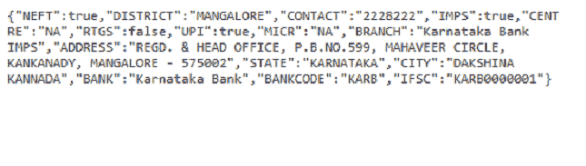
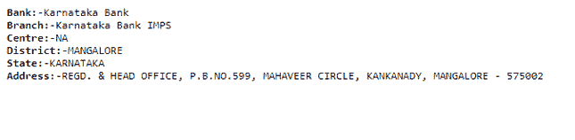

# 使用 PHP 从 IFSC 代码获取银行详细信息

> 原文:[https://www . geesforgeks . org/get-bank-details-from-ifsc-code-using-PHP/](https://www.geeksforgeeks.org/get-bank-details-from-ifsc-code-using-php/)

**印度金融系统代码** (IFSC)是一个 11 位字母数字代码，由中央银行用于对国家电子资金转账(NEFT)网络内的银行分支机构进行唯一分类。

在本文中，我们将编写 PHP 代码，从给定的 IFSC 代码中获取银行的详细信息。为此，我们将使用 Razorpay 的 IFSC API，这是一个为 Razorpay 的 IFSC API 提供服务的 API 服务器。API 的链接是[https://ifsc.razorpay.com/](https://ifsc.razorpay.com/)。在“/”之后，我们必须给出银行的 IFSC 代码。它将以 JSON 格式给出所有细节。

**例:** *KARB0000001* 是卡纳塔克邦银行的 IFSC 代码。当我们输入网址[https://ifsc.razorpay.com/KARB0000001](https://ifsc.razorpay.com/KARB0000001)时，它会以 JSON 格式返回该特定银行的详细信息。



详细信息包括银行名称、分行、地址、联系人等。

**HTML 代码:**下面演示了使用 HTML 和 PHP 代码进行上述讨论的实现。我们用一个输入控件和一个提交按钮制作了一个简单的 HTML 表单。在输入控件中，我们必须输入银行的 IFSC 代码并提交表单。提交表格后，我们将获得银行的详细信息。

## 超文本标记语言

```html
<!DOCTYPE html>
<html>

<body>
    <form method="post" action="index.php" id="theForm">
        <b>Enter IFSC Code:</b>
        <input type="text" name='ifsc'>
        <input type="submit" id="formSubmit">
    </form>
</body>

</html>
```

**PHP 代码:**当用户提交表单时，我们使用 PHP **$_POST** 将 IFSC 代码存储在一个变量中。PHP $_POST 是一个超全局变量，用于在用*方法=“POST”*提交 HTML 表单后收集表单数据。之后我们使用*[file _ get _ contents()](https://www.geeksforgeeks.org/php-file_get_contents-function/)*方法读取存储在变量中的文件的内容。当我们得到 JSON 格式的数据时，我们首先将它转换成一个数组。为此，我们使用**[JSON _ decode()](https://www.geeksforgeeks.org/php-json_decode-function/)**函数。**[json _ decode()](https://www.geeksforgeeks.org/php-json_decode-function/)**函数用于将一个 JSON 对象解码或转换为一个 PHP 对象。现在，我们可以使用数组运算符轻松解析数组对象，并向用户显示细节。

假设用户输入了不正确的 IFSC 代码，那么将显示一些用户无法理解的错误消息。对于这个问题，我们使用 *if()* 条件检查是否得到一些数据。我们可以传递数组中存在的 *if()* 条件中的任何参数。例如，如果我们使用“分支”，在解析“分支”后，我们得到一些值，这意味着 IFSC 代码是正确的，否则它是不正确的。除了“分行”，我们还可以使用“银行”或“地址”等。如果 IFSC 代码正确，屏幕上将显示详细信息，否则将显示“无效 IFSC 代码”消息。

## 服务器端编程语言（Professional Hypertext Preprocessor 的缩写）

```html
<?php
if(isset($_POST['ifsc'])) {
    $ifsc = $_POST['ifsc'];
    $json = @file_get_contents(
        "https://ifsc.razorpay.com/".$ifsc);
    $arr = json_decode($json);

    if(isset($arr->BRANCH)) {
        echo '<pre>';
        echo "<b>Bank:-</b>".$arr->BANK;
        echo "<br/>";
        echo "<b>Branch:-</b>".$arr->BRANCH;
        echo "<br/>";
        echo "<b>Centre:-</b>".$arr->CENTRE;
        echo "<br/>";
        echo "<b>District:-</b>".$arr->DISTRICT;
        echo "<br/>";
        echo "<b>State:-</b>".$arr->STATE;
        echo "<br/>";
        echo "<b/>Address:-</b>".$arr->ADDRESS;
        echo "<br/>";
    }
    else {
        echo "Invalid IFSC Code";
    }
}
?>
```

**输出:**


