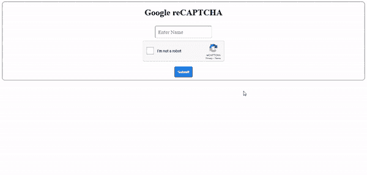

# PHP 中谷歌 reCAPTCHA 集成

> 原文:[https://www . geesforgeks . org/Google-recaptcha-integration-in-PHP/](https://www.geeksforgeeks.org/google-recaptcha-integration-in-php/)

在本文中，我们将讨论如何在 PHP 中集成 Google reCAPTCHA v2。

**进场:**

*   在谷歌注册你的网站
*   提交 HTML 表单
*   在服务器端获取响应密钥
*   重新验证密钥并向用户终端给出响应。

**第一步:在 Google reCAPTCHA 注册您的网站—** 在 Google reCAPTCHA 平台注册您的网站以获取密钥，即编码 HTML 表单所需的站点密钥和秘密密钥。

点击这里进入谷歌 reCAPTCHA 网站。


谷歌注册网站演示

**第二步:用 HTML 创建 Google reCAPTCHA 表单—** 在这里，我们将创建一个简单的 HTML 表单，其中包含 action.php 动作、一个输入字段和一个按钮。同时，我们需要在我们的 HTML 文档中添加 Google reCAPTCHA CDN 链接，并在表单中添加 div 标签，以在 HTML 文档中获取 reCAPTCHA。

> CDN 链接:
> 
> Div 标签:

**注意:**你需要用你的站点密钥替换“你的站点密钥”。

**示例:**

## index.html

```php
<!DOCTYPE html>
<html lang="en">

<head>
    <meta charset="UTF-8">
    <meta http-equiv="X-UA-Compatible" content="IE=edge">
    <meta name="viewport" content=
        "width=device-width, initial-scale=1.0">

    <!-- CSS file -->
    <link rel="stylesheet" href="style.css">

    <!-- Google reCAPTCHA CDN -->
    <script src=
        "https://www.google.com/recaptcha/api.js" async defer>
    </script>
</head>

<body>
    <div class="container">
        <h1>Google reCAPTCHA</h1>

        <!-- HTML Form -->
        <form action="action.php" method="post">
            <input type="text" name="name" id="name" 
                placeholder="Enter Name" required>
            <br>

            <!-- div to show reCAPTCHA -->
            <div class="g-recaptcha" 
                data-sitekey="your_site_key">
            </div>
            <br>

            <button type="submit" name="submit_btn">
                Submit
            </button>
        </form>
    </div>
</body>

</html>
```

## style.css

```php
.container {
    border: 1px solid rgb(73, 72, 72);
    border-radius: 10px;
    margin: auto;
    padding: 10px;
    text-align: center;
}

h1 {
    margin-top: 10px;
}

input[type="text"] {
    padding: 10px;
    border-radius: 5px;
    margin: 10px;
    font-family: "Times New Roman", Times, serif;
    font-size: larger;
}

button {
    border-radius: 5px;
    padding: 10px;
    color: #fff;
    background-color: #167deb;
    border-color: #0062cc;
    font-weight: bolder;
    cursor: pointer;
}

button:hover {
    text-decoration: none;
    background-color: #0069d9;
    border-color: #0062cc;
}

.g-recaptcha {
    margin-left: 513px;
}
```

**第三步:PHP 后端—** 我们已经成功提交了 HTML 表单，现在是时候对 PHP 后端进行编码了。提交表单后，在服务器端，我们使用“isset()”函数检查是否提交了有效表单。验证之后，我们在$name 变量中获取名称，在$recaptcha 变量中获取 Google recaptcha 响应。

**代码片段:**

## 服务器端编程语言（Professional Hypertext Preprocessor 的缩写）

```php
<?php

// Checking valid form is submit or not
if (isset($_POST['submit_btn'])) {

    // Storing name in $name variable
    $name = $_POST['name'];

    // Storing google recaptcha response
    // in $recaptcha variable
    $recaptcha = $_POST['g-recaptcha-response'];
}
?>
```

**第四步:验证验证码–**为了验证验证码，我们需要对下面的 URL 进行一个 post 请求。

*   **URL:**https://www.google.com/recaptcha/api/siteverify?secret=<秘钥>T4【响应= <响应 _ 密钥>
*   **secret_key:** 这个密钥你会从谷歌控制台获得，即 Secret Key。
*   **response_key:** 该键来自用户提交表单时的客户端。
*   g-recaptcha-response 是浏览器将在表单提交时生成的响应密钥的名称。如果它的空白或 null 表示用户没有选择验证码，那么返回错误。
*   您需要将“您的密钥”替换为您的密钥。

## action.php

```php
<?php

// Checking valid form is submitted or not
if (isset($_POST['submit_btn'])) {

    // Storing name in $name variable
    $name = $_POST['name'];

    // Storing google recaptcha response
    // in $recaptcha variable
    $recaptcha = $_POST['g-recaptcha-response'];

    // Put secret key here, which we get
    // from google console
    $secret_key = 'your_secret_key';

    // Hitting request to the URL, Google will
    // respond with success or error scenario
    $url = 'https://www.google.com/recaptcha/api/siteverify?secret='
          . $secret_key . '&response=' . $recaptcha;

    // Making request to verify captcha
    $response = file_get_contents($url);

    // Response return by google is in
    // JSON format, so we have to parse
    // that json
    $response = json_decode($response);

    // Checking, if response is true or not
    if ($response->success = true) {
        echo '<script>alert("Google reCAPTACHA verified")</script>';
    } else {
        echo '<script>alert("Error in Google reCAPTACHA")</script>';
    }
}

?>
```

**输出:**

