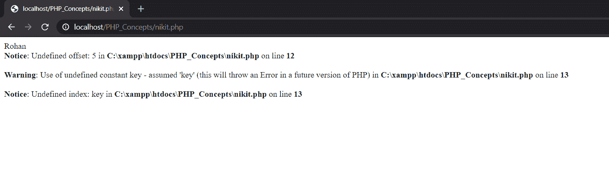
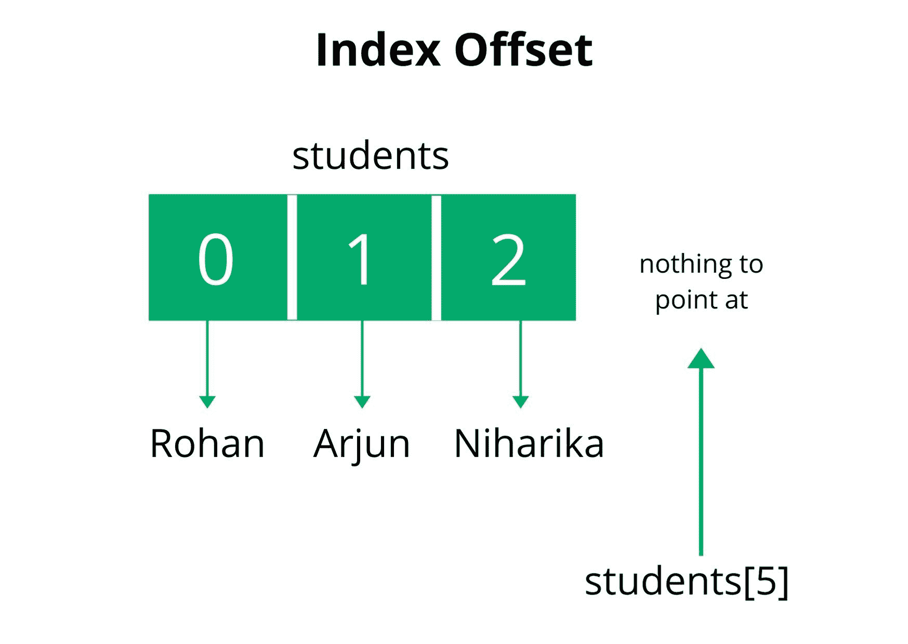

# PHP 中如何避免未定义的偏移量错误？

> 原文:[https://www . geesforgeks . org/如何避免-undefined-offset-error-in-PHP/](https://www.geeksforgeeks.org/how-to-avoid-undefined-offset-error-in-php/)

数组中不存在的偏移量称为未定义的偏移量。未定义的偏移量错误类似于 Java 中的 ArrayOutOfBoundException。如果我们访问一个不存在的索引或一个空的偏移量，将导致一个未定义的偏移量错误。
**示例:**下面的 PHP 代码解释了我们如何访问数组元素。如果被访问的索引不存在，那么它给出一个未定义的偏移误差。

## 服务器端编程语言（Professional Hypertext Preprocessor 的缩写）

```php
<?php 

// Declare and initialize an array
// $students = ['Rohan', 'Arjun', 'Niharika']
$students = array(
    0 => 'Rohan',
    1 => 'Arjun',
    2 => 'Niharika'
);

// Rohan 
echo $students[0];

// ERROR: Undefined offset: 5
echo $students[5];

// ERROR: Undefined index: key
echo $students[key];

?>
```

**输出:**





下面讨论一些避免未定义偏移误差的方法:

*   [**isset()函数**](https://www.geeksforgeeks.org/php-isset-function/) **:** 该函数检查变量是否置位且不等于空。它还检查数组或数组键是否有空值。
    **例:**

## 服务器端编程语言（Professional Hypertext Preprocessor 的缩写）

```php
<?php 

// Declare and initialize an array
// $students = ['Rohan', 'Arjun', 'Niharika']
$students = array(
    0 => 'Rohan',
    1 => 'Arjun',
    2 => 'Niharika'
);

if(isset($students[5])) {
    echo $students[5];
}
else {
    echo "Index not present";
}

?>
```

**Output:**

```php
Index not present
```

*   [**【空】()函数**](https://www.geeksforgeeks.org/php-empty-function/) **:** 该函数检查数组中的变量或索引值是否为空。

## 服务器端编程语言（Professional Hypertext Preprocessor 的缩写）

```php
<?php 

// Declare and initialize an array
// $students = ['Rohan', 'Arjun', 'Niharika']
$students = array(
    0 => 'Rohan',
    1 => 'Arjun',
    2 => 'Niharika'
);

if(!empty($students[5])) {
    echo $students[5];
}
else {
    echo "Index not present";
}

?>
```

**Output:**

```php
Index not present
```

*   [**array_key_exists() function**](https://www.geeksforgeeks.org/php-array_key_exists-function/) **for associative arrays:** Associative array stores data in the form of key-value pair and for every key there exists a value. The array_key_exists() function checks whether the specified key is present in the array or not.
    **Example:**

    ## 服务器端编程语言（Professional Hypertext Preprocessor 的缩写）

    ```php
    <?php 
    // PHP program to illustrate the use 
    // of array_key_exists() function

    function Exists($index, $array) { 
        if (array_key_exists($index, $array)) { 
            echo "Key Found"; 
        } 
        else{ 
            echo "Key not Found"; 
        } 
    } 

    $array = array(
        "ram" => 25, 
        "krishna" => 10, 
        "aakash" => 20
    ); 

    $index = "aakash"; 

    print_r(Exists($index, $array)); 
    ?>
    ```

    **Output:**

    ```php
    Key Found
    ```

    PHP 是一种专门为 web 开发设计的服务器端脚本语言。您可以通过以下 [PHP 教程](https://www.geeksforgeeks.org/php-tutorials/)和 [PHP 示例](https://www.geeksforgeeks.org/php-examples/)从头开始学习 PHP。