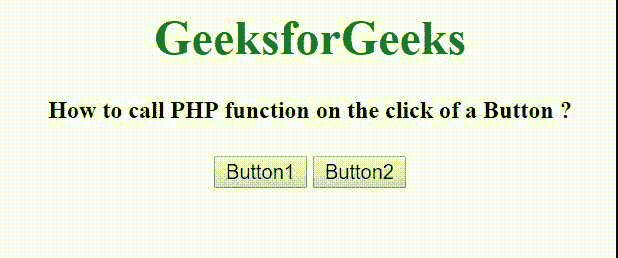

# 如何一键调用 PHP 函数？

> 原文:[https://www . geesforgeks . org/how-call-PHP-点击按钮函数/](https://www.geeksforgeeks.org/how-to-call-php-function-on-the-click-of-a-button/)

给定一个包含 HTML 和 PHP 代码的文档，任务是点击按钮后调用 PHP 函数。解决这个问题有各种方法。此外，除了通过点击按钮来实现这一点之外，还可以使用 Ajax、JavaScript 和 JQuery 来调用 PHP 函数。但是本文主要关注的是调用 PHP 函数的面向按钮的方法。

**使用 HTML 按钮调用 PHP 函数:**创建包含 HTML 按钮的 HTML 表单文档。单击按钮时，会调用开机自检方法。POST 方法描述了如何向服务器发送数据。点击按钮后，调用 [array_key_exists()函数](https://www.geeksforgeeks.org/php-array_key_exists-function/)。

**程序 1:**

```php
<!DOCTYPE html>
<html>

<head>
    <title>
        How to call PHP function
        on the click of a Button ?
    </title>
</head>

<body style="text-align:center;">

    <h1 style="color:green;">
        GeeksforGeeks
    </h1>

    <h4>
        How to call PHP function
        on the click of a Button ?
    </h4>

    <?php
        if(array_key_exists('button1', $_POST)) {
            button1();
        }
        else if(array_key_exists('button2', $_POST)) {
            button2();
        }
        function button1() {
            echo "This is Button1 that is selected";
        }
        function button2() {
            echo "This is Button2 that is selected";
        }
    ?>

    <form method="post">
        <input type="submit" name="button1"
                class="button" value="Button1" />

        <input type="submit" name="button2"
                class="button" value="Button2" />
    </form>
</head>

</html>
```

**输出:**


让我们看一下 GET 或 POST 方法，由于隐私问题，大多数开发人员都使用 POST 方法，下面的示例仅基于 POST 方法:

**程序二:**这个程序使用 isset()函数调用 PHP 函数。

```php
<!DOCTYPE html>
<html>

<head>
    <title>
        How to call PHP function
        on the click of a Button ?
    </title>
</head>

<body style="text-align:center;">

    <h1 style="color:green;">
        GeeksforGeeks
    </h1>

    <h4>
        How to call PHP function
        on the click of a Button ?
    </h4>

    <?php

        if(isset($_POST['button1'])) {
            echo "This is Button1 that is selected";
        }
        if(isset($_POST['button2'])) {
            echo "This is Button2 that is selected";
        }
    ?>

    <form method="post">
        <input type="submit" name="button1"
                value="Button1"/>

        <input type="submit" name="button2"
                value="Button2"/>
    </form>
</head>

</html>
```

**输出:**
