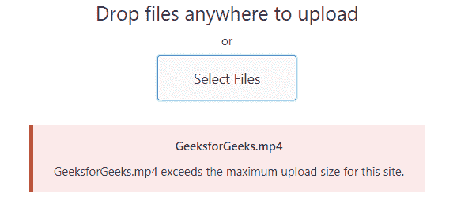

# 如何在 PHP 中更改最大上传文件大小？

> 原文:[https://www . geesforgeks . org/如何更改最大上传文件大小 php/](https://www.geeksforgeeks.org/how-to-change-the-maximum-upload-file-size-in-php/)

用 PHP 编写的网站上可以上传的任何文件的最大大小都是由服务器的 php.ini 文件中提到的可以发布或上传的 max_size 的值决定的。在托管服务器的情况下，需要联系托管服务器的管理员，但是 XAMPP 有用 PHP 和 Perl 编写的脚本的解释器。它有助于为开发人员创建本地 http 服务器，并为他们提供对本地服务器的完全物理和管理访问。因此，它是使用最广泛的服务器，在这个服务器上很容易将上传文件的限制增加到所需的值。

错误一般抛出如下:

**更改文件上传大小的步骤:**如果是本地服务器

*   以管理权限打开 c 盘，然后打开 xampp 文件夹。
    
*   点击文件夹 *php* 并在编辑器模式下打开 *php.ini* 文件(如记事本或写字板)。
    
    
*   在 php.ini 文件中，搜索关键字 *upload_max_filesize* ，并将其值更新为最大大小的单个附件的所需文件大小。默认情况下，其值设置为最大 2 MB。
    T3】
*   然后搜索 *post_max_size* 关键字，将其值更新为最大需要值，即帖子中包含的全部内容和附件的大小。
    T3】
*   保存所做的更改并重新启动服务器(XAMPP)。

**注意:**upload _ max _ size 限制单个附件的大小，post_max_size 是帖子所有内容的限制。