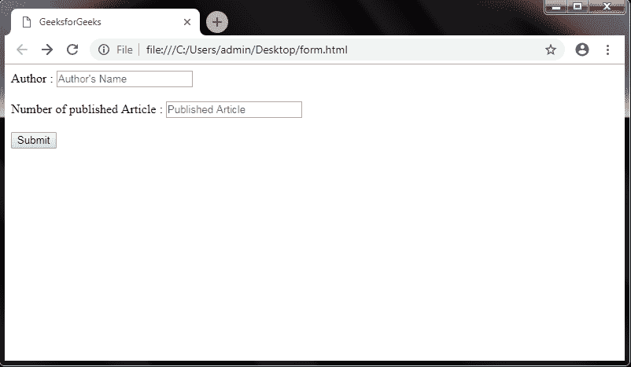
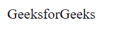

# PHP 中如何检查表单提交？

> 原文:[https://www . geesforgeks . org/how-check-form-submission-in-PHP/](https://www.geeksforgeeks.org/how-to-check-form-submission-in-php/)

给定一个表单，任务是检查表单是否提交成功。使用后端的 PHP 程序检查表单提交，并使用 HTML 和 CSS 作为前端创建表单。

**语法:**

```
if (!empty($_POST))
if (isset($_POST['submit']))
```

使用这两个语句检查表单是否提交成功。

**注意:**要运行此程序，请使用本地主机服务器，如 WAMP 或 XAMPP。

**方法-1:**
**步骤 1:** 使用 HTML 和 CSS 创建一个简单的表单。

在这一步中，首先制作一个 html 表单，检查它是否被正确提交。所以用*表单*标签做表单只是基础编程。使用 action 属性将请求发送到另一个 PHP 文件。该方法用于获取信息或发布表单中输入的信息。

```
<!DOCTYPE html>
<html>
    <head>
        <title>Form</title>
    </head>

    <body>
        <form action = "get-method.php" method = "post">

            Author : <input type = "text" name = "author" 
              placeholder = "Author's Name" />

            <br><br>

            Number of published Article : <input type = "number"
              name = "num_article" placeholder = "Published Article" />

            <br><br>

            <input type = "submit" name = "submit" value = "Submit">
        </form>
    </body>
</html>                    
```

**输出:**


**第二步:**为 POST 方法创建 PHP 文件

使用 PHP 中的 *isset()* 方法测试表单提交成功与否。在代码中，使用 isset()函数检查 *$_POST['提交']* 方法。记住定义提交按钮的名称来代替提交。点击提交按钮后，此操作将作为开机自检方法。

```
<?php

if (isset($_POST['submit'])) {
    echo "GeeksforGeeks";
}
?>
```

**本地主机上的最终输出:**


**方法 2:**
**没有使用单独的 PHP 文件:**没有使用单独的文件，编写了一个 HTML 代码，其中指定了脚本标签中 PHP 动作的代码，就像我们在这个演示中所做的那样。这两个代码显示相同的输出，但是它们的实现不同。

**示例:**

```
<!DOCTYPE html>
<html>
    <head>
        <title>Form</title>
    </head>

    <body>

        <!-- form tag to create form -->
        <form action = "get-method.php" method = "post">

            Author : <input type = "text" name = "author"
                placeholder = "Author's Name" />

            <br><br>

            Number of published Article : <input type = "number" 
                name="num_article" placeholder="Published Article"/>

            <br><br>

            <input type = "submit" name = "submit" value = "Submit">
        </form>

        <!-- script to check form submission -->
        <script>
            if (isset($_POST['submit'])) {
                echo "GeeksforGeeks";
            }
        </script>
    </body>
</html>
```

**本地主机上的输出:**


PHP 是一种专门为 web 开发设计的服务器端脚本语言。您可以通过以下 [PHP 教程](https://www.geeksforgeeks.org/php-tutorials/)和 [PHP 示例](https://www.geeksforgeeks.org/php-examples/)从头开始学习 PHP。