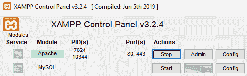
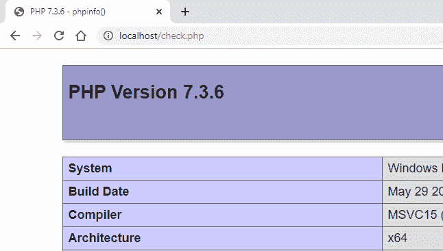
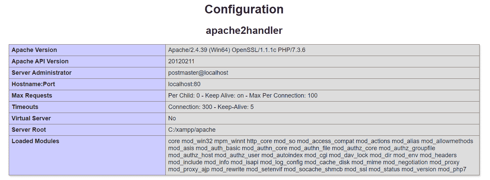

# 如何检查 PHP 中是否启用了 mod _ rewrite？

> 原文:[https://www . geesforgeks . org/how-check-if-mod _ rewrite-is-enabled-in-PHP/](https://www.geeksforgeeks.org/how-to-check-if-mod_rewrite-is-enabled-in-php/)

在 PHP 中，有一个内置函数叫做“ **phpinfo** ”。通过使用该功能，我们可以输出所有**加载模块**，并查看 **mod_rewrite** 是否启用。

**语法:**

```
phpinfo();

```

下面是检查“ **mod_rewrite** ”加载模块是否启用的过程。

**注意:**这里使用的本地服务器是 XAMPP。

1.  在“ **c:/xampp/htdocs** ”目录下创建一个“**check.php**”文件，并在该文件中写入以下代码并保存。

    ```
    <?php
      phpinfo();
    ?>
    ```

2.  现在，从 XAMPP 控制面板启动 Apache 服务器。
    
3.  Open any web browser browser and type following the URL, ‘**localhost/check.php**’. It will display the **PHP version** details and **Apache Configuration**.

    

    

4.  在 Apache 配置中，搜索**加载模块**部分，您会发现所有已启用的模块。
    T3】
5.  如果启用，它将显示在列表中，如上面的截图所示。