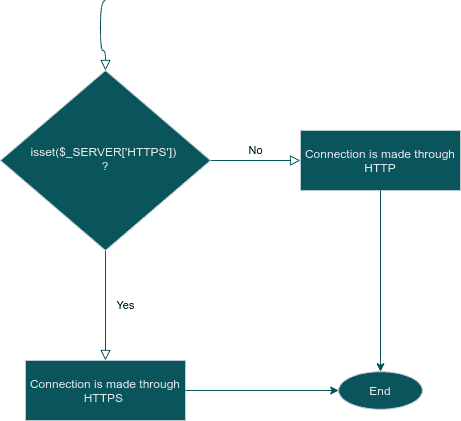
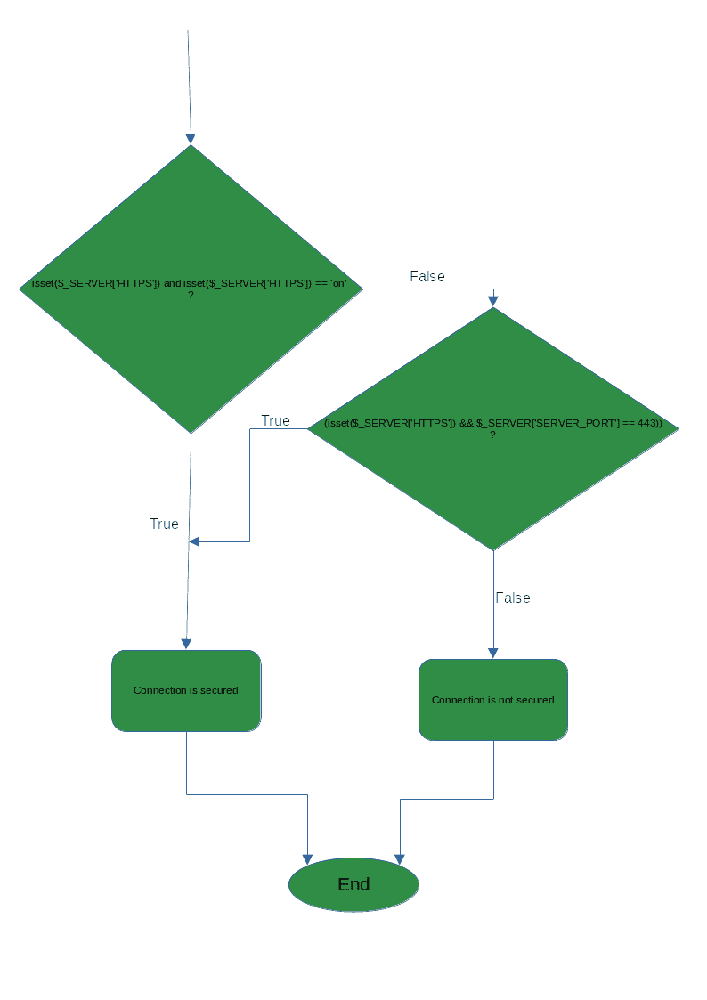

# 在 PHP 中如何检查页面是从‘https’还是‘http’调用的？

> 原文:[https://www . geesforgeks . org/how-to-check-page-是从 https 调用还是从-http-in-php/](https://www.geeksforgeeks.org/how-to-check-whether-the-page-is-called-from-https-or-http-in-php/)

本文的目的是检查页面是从‘HTTPS’还是‘HTTP’调用的，我们可以使用以下两种方法。

**方法 1:** 检查连接是否使用 [SSL](https://www.geeksforgeeks.org/secure-socket-layer-ssl/) ，如果设置了 **$_SERVER['HTTPS']** 的值，那么我们可以说连接是安全的，是从' HTTPS '调用的。如果该值为空，这意味着该值被设置为“0”或“关”，那么我们可以说连接不安全，页面是从“HTTP”调用的。

**$_SERVER** 是一个数组，包含所有关于请求头、路径和脚本位置的信息。如果请求是通过 HTTPS 发送的，它将具有“非空”值，如果请求是通过 HTTP 发送的，它将具有“0”值。

**语法:**

```
if (isset($_SERVER['HTTPS']))
{
 // page is called from https
 // Connection is secured
}
else
{
 // page is called from http
 // Connection is not secured
}
```

**流程图:**



流程图 1

**示例:**

## 服务器端编程语言（Professional Hypertext Preprocessor 的缩写）

```
<?php
  // checking if $_SERVER['HTTPS'] is set or not
  // i.e. if it is set that mean value is '1' or 'on'
  // and page is called from HTTPS 

  if (isset($_SERVER['HTTPS'])) {
    echo "Page is called from HTTPS and connection is secured.";
  }
  else
  {
    // if $_SERVER['HTTPS'] is not set mean
    // value is '0' or 'off'
    echo "Warning : Connection is not secured,Page is called from HTTP";
  }
?>
```

**输出:**

```
Warning : Connection is not secured,Page is called from HTTP
```

**方法 2:** 早期方法的一个问题是，在某些服务器中， **$_SERVER['HTTPS']** 未定义，这可能会导致在检查页面是从“HTTPS”还是从“HTTP”调用时出现错误消息。为了克服这个问题，我们还必须检查服务器端口号，如果使用的端口号是 443，则连接是通过“HTTPS”建立的。

**伪代码:**

```
check if $_SERVER['HTTPS'] is set and $_SERVER['HTTPS']
is set to 'on' then Connection is Secured and through 
HTTPS request

OR 

if  $_SERVER['HTTPS'] is set and $_SERVER['SERVER_PORT'] 
is 443 ( https use 443 ) then Connection is secured 

else

Connection is not secured and made through HTTP request

```

**语法:**

```
if ((isset($_SERVER['HTTPS']) && 
        (($_SERVER['HTTPS'] == 'on'))) 
 || (isset($_SERVER['HTTPS']) && 
           $_SERVER['SERVER_PORT'] == 443))
  {
   Page is called through HTTPS 
 }
 else
  {
   Page is called through HTTPS
  }
```

**流程图:**



流程图 2

**示例:**

## 服务器端编程语言（Professional Hypertext Preprocessor 的缩写）

```
<?php
  // checking if $_SERVER['HTTPS'] is set and its value is 'on' 
  // or '1' and if server port number is 443 then we can say the 
  // connection is made through HTTPS
 if (isset($_SERVER['HTTPS']))
 {
     if ($_SERVER['HTTPS'] == 'on')
     {    
     } 
 } 
else if (isset($_SERVER['HTTPS'])) 
{
    if ($_SERVER['SERVER_PORT'] == 443)
    {
      echo "Connection is secured and page is called from HTTPS";
    }
}
  else 
  {
    // Connection is made through HTTP
    echo "Connection is not secured and page is called from HTTP";
  }
?>
```

**输出:**

```
Connection is not secured and page is called from HTTP
```