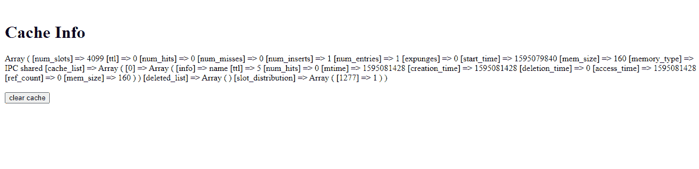
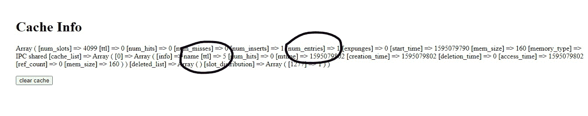
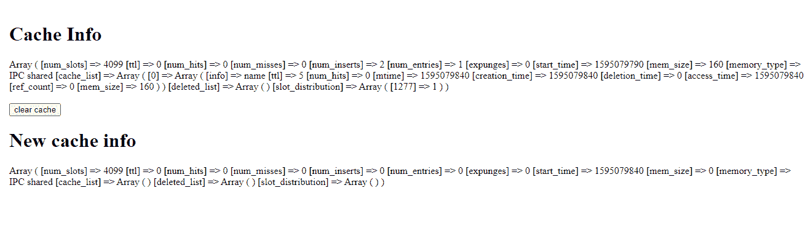

# 如何使用 PHP 清除 APC 缓存条目？

> 原文:[https://www . geesforgeks . org/how-clear-APC-cache-entries-using-PHP/](https://www.geeksforgeeks.org/how-to-clear-apc-cache-entries-using-php/)

**Alternative PHP Cache (APC)** 存储以前 PHP 编译的字节码，这样我们就不需要每次都重新编译，从而节省时间。我们必须为新的编译清理缓存条目。为此，我们可以使用 PHP 函数 **apc_clear_cache()** 删除缓存条目。此命令清除缓存，并在成功时返回“真”。

**语法:**

```
apc_clear_cache();
```

此命令将删除系统缓存。如果您想为用户清除缓存，那么只需提供“用户”作为参数。

```
apc_clear_cache('user');
```

**示例:**要清除 APC 缓存，请在您的 PHP 文件中复制并粘贴以下代码。请确保将字符串“您的 IP 地址”替换为您的实际 IP 地址。如果缓存清除成功，将显示带有“成功”消息的警告框，否则将显示“错误”警告消息。

**PHP 代码:**

## 服务器端编程语言（Professional Hypertext Preprocessor 的缩写）

```
<?php

if (in_array(@$_SERVER['REMOTE_ADDR'], 
    array('127.0.0.1', '::1', 'YOUR_IP'))) { 
    apcu_clear_cache(); 
    echo "<script>alert('success!')</script>"; 
}
else { 
    die('No valid IP'); 
} 

?>
```

现在让我们为任何网页运行这段代码。查看以下代码。我们创建了一个简单的网页，并在 APC 缓存中添加了一个变量。我们已经创建了一个值为“abc”的变量“$name”，并使用函数 *apcu_add()* 将其保存到 APC 缓存中，其中参数“name”是唯一键， *$name* 是实际变量，最后一个参数是 *TTL(生存时间)*，即变量存储在缓存中的时间。
为了验证变量，我们已经使用函数 **apcu_cache_info()** 显示了缓存信息，我们看到我们的变量被添加到缓存中。

**HTML 代码:**

## 超文本标记语言

```
<!DOCTYPE html>
<html>

<head>
    <meta name="viewport" content=
        "width=device-width, initial-scale=1">
</head>

<body>
    <div style="display: flex;">
        <div style="flex: 30%; padding-left: 4%;">
            <h1>Current Cache Info</h1>
            <?php
                //create sample variable
                $name = "abc";
                //save to APC cache         
                apcu_add ( "name", $name, 5  );

                //print APC Cache to see variable
                // has been added
                print_r(apcu_cache_info()); ?>
                //form to clear cache
            <form action="aboutus.php" method="POST">
                <input type="submit" name="submit" 
                    value="clear cache" />
            </form>
        </div>
    </div>
</body>

</html>
```

**“about us . PHP”文件:**

```
<?php 

// When form is submited "clear
// cache button pressed" 
if(isset($_POST['submit']) ) {

    // Check IP is Valid      
    if (in_array(@$_SERVER['REMOTE_ADDR'], 
    array('127.0.0.1', '::1', '192.168.10.7'))) {

        // Clear cache
        apcu_clear_cache();   

        // Show success alert
        echo "<script>alert('success!')</script>";
    }
    else {  
        // Error
        die('No valid IP'); 
    } 

    // Display updated cache info
    // after clearing
    echo "<h1>New cache info</h1>";
    print_r(apcu_cache_info());
}
?>
```

**输出:**


我们可以看到我们的名称变量已经被添加到缓存中，因为总条目是 1，在 info 中，我们可以看到我们的名称变量。


**输出:**

现在要清除缓存，我们按“清除缓存”按钮。缓存被清除并显示。我们看到新的缓存条目为 0，信息为空，从而表明缓存已被清除。



我们可以比较两个缓存，并检查命令是否成功执行。


缓存已成功清除。

**注意:**如果你不是开发人员而是系统管理员，可以通过重新加载服务器来清除缓存，如果不工作，则关闭服务器信号，重新启动。