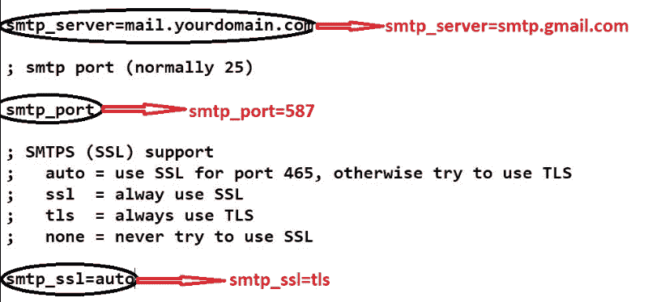
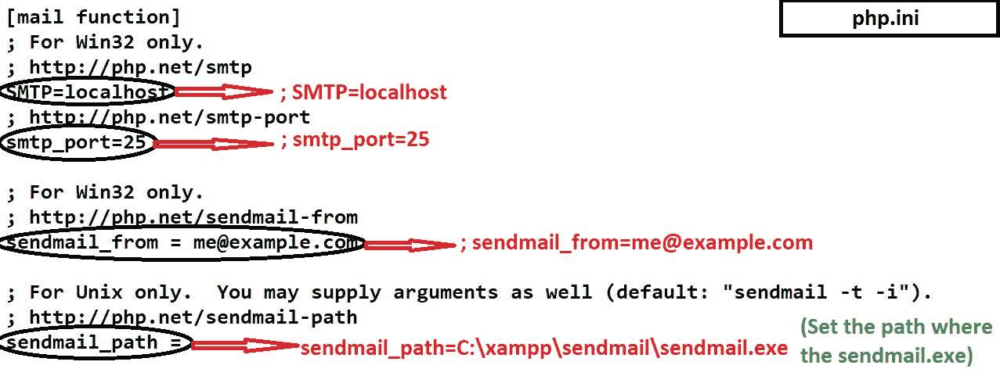

# 如何配置 XAMPP 使用 PHP 从本地主机发送邮件？

> 原文:[https://www . geeksforgeeks . org/如何配置-xampp-从-localhost-使用-php 发送邮件/](https://www.geeksforgeeks.org/how-to-configure-xampp-to-send-mail-from-localhost-using-php/)

要将 XAMPP 服务器配置为从本地主机发送邮件，我们必须对两个文件 sendmail.ini 和 php.ini 进行更改。名为“sendmail.ini”存在于 **sendmail** 文件中，“php.ini”存在于 **xampp** 文件夹中的 **php** 文件中。


**第一步:**

*   **Go to C:\xampp\sendmail:** open sendmail.ini file in notepad or any text editor and make the changes as follows.

    ```php
    change smtp_server=mail.yourdomain.com to smtp_server=smtp.gmail.com
    change smtp_port to smtp_port=587
    change smtp_ssl=auto to smtp_ssl=tls
    ```

    

    ```php
    uncomment ;error_logfile=error.log to error_logfile=error.log
    uncomment ;debug_logfile=debug.log to debug_logfile=debug.log
    write your gmail id in auth_username: auth_username=*****@gmail.com
    write your gmail assword in auth_password: auth_password=*****
    ```

    

    ```php
    write your gmail id in force_sender: *****@gmail.com
    change hostname to hostname=localhost
    ```

    

**步骤:2**

*   **Go to C:\xampp\php:** open php.ini file in notepad or any text editor goto [mail function] part and make the changes as follows.

    ```php
    comment SMTP=localhost by putting semicolon infront=>;SMTP=localhost
    comment smtp_port=25 by putting semicolon infront=>;smtp_port=25
    comment sendmail_from= by putting semicolon infront=>;sendmail_from=specify path of
     file in sendmail_path to sendmail_path=C:\xampp\sendmail\sendmail.exe

    check if extension=php_openssl.dll is enabled=>If there is semicolon in front then
     un-comment it by removing that semicolon

    ```

    
    按照给定的步骤操作后，如果没有通过调用邮件功能发送邮件，则转到 **C:\xampp\sendmail** 打开错误日志查看是否发生错误。

**注意:**这里显示的是 gmail 的程序，但是可以通过改变 smtp 服务器、端口号扩展到其他邮件。使用 gmail 时，请注意启用允许访问不太安全的 webapp 的选项。