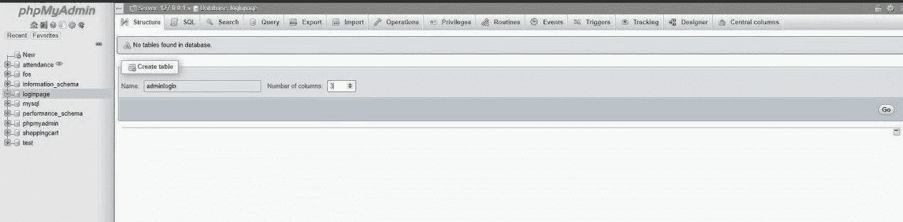
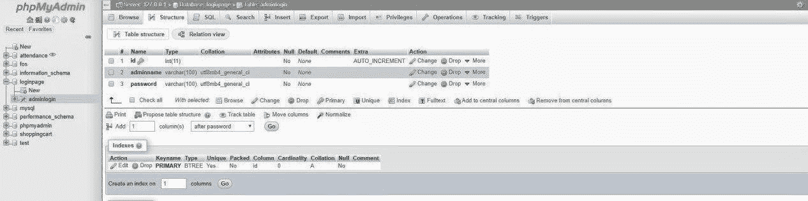
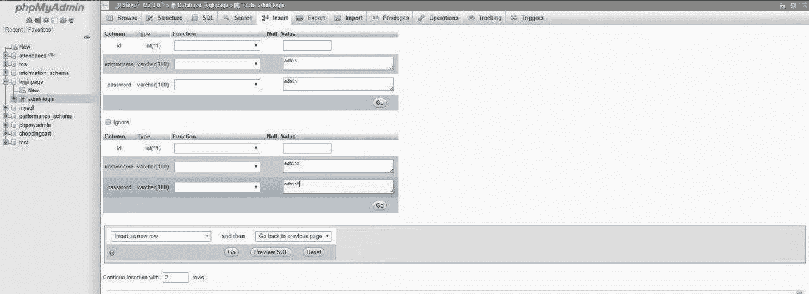

# 如何将数据库与 PHP DOM 页面连接？

> 原文:[https://www . geesforgeks . org/如何用 php-dom-page 连接数据库/](https://www.geeksforgeeks.org/how-to-connect-the-database-with-php-dom-page/)

要用 PHP DOM 页面连接数据库，请执行以下步骤:
**1。创建数据库:**使用 XAMPP 创建一个数据库，数据库的名称是“loginpage”。你可以给你的数据库起任何名字。

**2。创建表:**在“登录页”数据库中创建表。

**3。创建表结构:**根据您的需要，表应该包含字段。
例如:

*   id-主键-自动递增
*   名称–varchar(100)
*   password – varchar(100)

    名称和密码的数据类型是 varchar。尺寸可以根据需要改变。然而，100 就足够了，并且“id”的数据类型是 int，它是一个主键。主键，也称为主键，是关系数据库中对每条记录都是唯一的一个键。它是一个唯一的标识符，如驾照号码、电话号码(包括区号)或车辆识别号(VIN)。
    

    表格的结构会是这样的
    

    **4。在表格中插入数值:**
    
    插入后，表格会是这样的:
    

    **PHP 代码:**创建“connection.php”文件。这是 PHP 中的连接代码，用来连接数据库和你的任何 PHP DOM 页面。

    ```
    <?php

    $conn = "";

    try {
        $servername = "localhost:3306";
        $dbname = "loginpage"; 
        $username = "root";
        $password = "";

        $conn = new PDO(
        "mysql:host=$servername; dbname= loginpage",
        $username, $password);

        $conn->setAttribute(PDO::ATTR_ERRMODE,
                    PDO::ERRMODE_EXCEPTION);
    }
    catch(PDOException $e) {
        echo "Connection failed: " 
                . $e->getMessage();
    }

    ?>
    ```

    在 PHP DOM 页面中包含“connection.php”文件。

    ```
    <?php
    include_once('connection.php');
    ?>
    ```

    之后，数据库与 PHP DOM 页面连接。