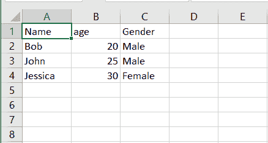
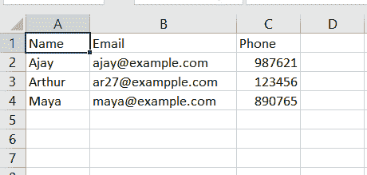

# 如何在 PHP 中将数组转换成 CSV 文件？

> 原文:[https://www . geesforgeks . org/如何将数组转换为 csv-file-in-php/](https://www.geeksforgeeks.org/how-to-convert-an-array-to-csv-file-in-php/)

要将数组转换成 CSV 文件，我们可以使用 [fputcsv()函数](https://www.geeksforgeeks.org/php-fputcsv-function/)。fputcsv()函数用于将一行格式化为 csv(逗号分隔值)文件，并将其写入打开的文件。必须读取的文件和字段作为参数发送给 fputcsv()函数，它在成功时返回写入字符串的长度，在失败时返回 FALSE。

**语法:**

```
fputcsv( file, fields, separator, enclosure, escape )
```

**例 1:**

```
<?php

// Create an array of elements
$list = array(
    ['Name', 'age', 'Gender'],
    ['Bob', 20, 'Male'],
    ['John', 25, 'Male'],
    ['Jessica', 30, 'Female']
);

// Open a file in write mode ('w')
$fp = fopen('persons.csv', 'w');

// Loop through file pointer and a line
foreach ($list as $fields) {
    fputcsv($fp, $fields);
}

fclose($fp);
?>
```

运行上述 PHP 程序后，可以在程序文件所在的同一目录下找到一个名为`persons.csv` 的文件。当您使用类似微软 Excel 的 CSV 文件阅读器应用程序打开此文件时，您将看到如下图所示的内容。



Microsoft Excel 中的输出

**示例 2:** 假设您想要将所有表单输入放在一个 CSV 文件中，然后首先创建一个表单，从用户那里获取输入并将其存储到一个数组中。然后将数组元素转换成 csv 文件。

## index.html

```
<!DOCTYPE html> 
<html>

<head>
    <title>
        How to Convert Array to
        CSV file in PHP ?
    </title>
</head>

<body> 

    <!-- form tag to create form --> 
    <form action = "gfg.php" method = "post"> 

        Name <input type = "text" name = "name" /> 

        <br><br> 

        Email <input type = "text" name = "email" /> 

        <br><br>

        Phone <input type = "text" name = "phone" /> 

        <input type = "submit" name = "submit" value = "Submit"> 
    </form> 
</body>

</html>
```

## gfg.php

```
<?php

$data = array(
    $_POST['name'],
    $_POST['email'],
    $_POST['phone']
);

// Open file in append mode
$fp = fopen('databse.csv', 'a');

// Append input data to the file  
fputcsv($fp, $data);

// close the file
fclose($fp);
?>
```

**Output:**

*   **输入表单:**
    
*   **输入数据在 excel 中显示为输出:**
    

PHP 是一种专门为 web 开发设计的服务器端脚本语言。您可以通过以下 [PHP 教程](https://www.geeksforgeeks.org/php-tutorials/)和 [PHP 示例](https://www.geeksforgeeks.org/php-examples/)从头开始学习 PHP。