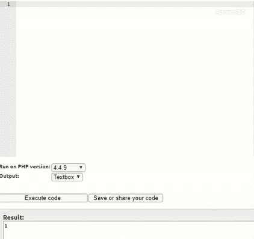

# PHP 中如何将 ereg 表达式转换为 preg？

> 原文:[https://www . geesforgeks . org/how-convert-ereg-expressions-to-preg-in-PHP/](https://www.geeksforgeeks.org/how-to-convert-ereg-expressions-to-preg-in-php/)

正则表达式是一种特殊格式的模式，可以用来在另一个字符串中查找一个字符串的实例。有多种方法可以让我们装备正则表达式来满足需求。

**ereg()函数:**PHP 的新版本已经不支持 ereg 了，所以在旧版本上试用的时候输出是用视频给出的。一种方法是使用 **ereg()** 功能。

**示例:**

*   在本例中，语句检查提供给 ereg()函数的主题是否为字符串。因为给定的比较值([a-zA-Z]，从 A 到 Z 和 A 到 Z)是一个范围。ereg()函数匹配范围中提供的大写和小写字母。这些符号有它们自己的含义。

```
Input: echo ereg("[a-zA-Z]","jack"); 
Output: 1
```

*   本示例检查主题是否以“j”开头。符号'^'用于检查主题是否以必需的字符串开头。

```
Input: echo ereg("^j","jack");
Output: 1
```

**preg()函数:**检查正则表达式的另一种方法是使用 **preg()** 函数。要在程序中使用 preg，建议创建一个**正则表达式**变量来与主题进行比较。以下示例通过使用 preg 提供了与上述代码相同的功能。

**示例:**

*   与 ereg()函数相同，只是使用 preg 函数而不是 ereg。

```
Input:  
$regex='/[a-zA-Z]/';
echo preg_match($regex,'jack');
Output:1
```

*   此示例也与第二个仅使用 preg 而不是 ereg 函数的 ereg 示例相同。

```
Input: 
$regex='/^[j]/';
echo preg_match($regex,"jack");
Output: 1
```

**将 ereg 表达式转换为 preg:** 以上信息描述了 ereg 和 preg 如何分别工作。ereg 和 preg 的工作方式基本相同，但使用方式略有不同。下面是**“如何将 ereg 转换为 preg”**问题的答案。以下步骤可以将任何 ereg 转换为 preg。

*   必须用来比较的语句应该分配给$regex 变量。
*   将双引号(" ")转换为单引号(')。
*   preg 语句总是以反斜杠(' \ ')开始和结束。
*   ereg 和 preg 具有相同的符号含义，因此逻辑保持不变。
*   ereg 和 preg 都返回布尔值作为答案。

**示例:**本示例实现了如何将 ereg 表达式转换为 preg。

## 服务器端编程语言（Professional Hypertext Preprocessor 的缩写）

```
<?php
function pregcheck($num) {
    $regex='/[0-9]/';
    return preg_match($regex,$num);
}

function eregcheck($num) {
    return ereg("[0-9]",$num);
}

$abc = "123";
echo "pregcheck at work : ";
echo pregcheck($abc);

echo " eregcheck at work : ";
echo eregcheck($abc);
?>
```

**输出:**

```
pregcheck at work : 1 eregcheck at work : 1 
```

