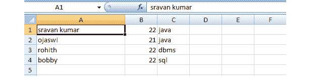

# 如何在 PHP 中将 JSON 文件转换成 CSV？

> 原文:[https://www . geesforgeks . org/how-convert-JSON-file-to-CSV-in-PHP/](https://www.geeksforgeeks.org/how-to-convert-json-file-into-csv-in-php/)

在本文中，我们将看到如何使用 PHP 将 [JSON](https://www.geeksforgeeks.org/javascript-json/) 数据转换为 CSV 文件。

JSON (JavaScript 对象符号)是一种类似字典的符号，可以用来构造数据。它与扩展名一起存储。例如 JSON–geeksforgeeks . JSON

另一方面，CSV(或逗号分隔值)文件以表格格式表示数据，有几行和几列。CSV 文件的一个例子是 Excel 电子表格。这些文件的扩展名为。例如 CSV–geeksforgeeks . CSV。

**要求:** [**XAMPP 服务器**](https://www.geeksforgeeks.org/how-to-install-xampp-on-windows/)

**JSON 的结构:**

```
[{
    "data1": "value1", 
    "data2": "value2", 
    ..., 
    "data n": "value n"
}]

```

**示例:**

```
[{
    "student": "sravan kumar",
    "age": 22,
    "subject": "java"
}]

```

**使用的方法:**

1.  [**json_decode() Method:**](https://www.geeksforgeeks.org/php-json_decode-function/) This function is used to decode or convert a JSON object to a PHP object.

    **语法:**

    ```
    json_decode( string, assoc )

    **示例:**

    ```
    $jsondata = '[{
        "student": "sravan kumar",
        "age": 22,
        "subject": "java"
    },
    {
        "student": "ojaswi",
        "age": 21,
        "subject": "java"
    },
    { 
        "student": "rohith",
        "age": 22,
        "subject": "dbms"
    },
    {
        "student": "bobby",
        "age": 22,
        "subject": "sql"
    }]';

    // Decode the json data and convert it
    // into an associative array
    $jsonans = json_decode($jsondata, true);

    ```

    ```

2.  [**fopen() Method:**](https://www.geeksforgeeks.org/php-fopen-function-open-file-or-url/) It is used to open a file.

    **语法:**

    ```
    fopen( filename, file_mode )
    ```

    **示例:**

    ```
    // File pointer in writable mode
    $file_pointer = fopen($csv, 'w');

    ```

3.  [**fclose() Method:**](https://www.geeksforgeeks.org/php-fclose-function/) It is used to close the file.

    **语法:**

    ```
    fclose( $file_pointer );
    ```

    **示例:**

    ```
    fclose( $file_pointer );
    ```

4.  [**fputcsv() Method:**](https://www.geeksforgeeks.org/php-fputcsv-function/) It is used to place the data into CSV file.

    **语法:**

    ```
    fputcsv( file, fields )
    ```

    **示例:**

    ```
    fputcsv( $file_pointer, $i );
    ```

    **运行步骤:**

    *   启动 XAMPP 服务器

    

    *   打开记事本，在*json.php*输入以下代码，放在 *htdocs* 文件夹下。

    **PHP 代码:**

    ## 服务器端编程语言（Professional Hypertext Preprocessor 的缩写）

    ```
    <?php

    // Student JSON data
    $jsondata = 
      '[
       {"student":"sravan kumar","age":22,"subject":"java"},
       {"student":"ojaswi","age":21,"subject":"java"},
       {"student":"rohith","age":22,"subject":"dbms"},
       {"student":"bobby","age":22,"subject":"sql"}]';

    // Decode json data and convert it
    // into an associative array
    $jsonans = json_decode($jsondata, true);

    // CSV file name => geeks.csv
    $csv = 'geeks.csv';

    // File pointer in writable mode
    $file_pointer = fopen($csv, 'w');

    // Traverse through the associative
    // array using for each loop
    foreach($jsonans as $i){

        // Write the data to the CSV file
        fputcsv($file_pointer, $i);
    }

    // Close the file pointer.
    fclose($file_pointer);

    ?>
    ```

    **输出:**在浏览器中键入*<u>localhost/JSON . PHP</u>*。可以看到 CSV 文件是以 *geeks.csv* 的文件名创建的

    