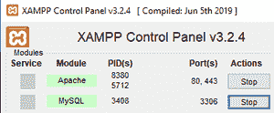

# 如何用 PHP 将 XML 数据转换成 JSON？

> 原文:[https://www . geesforgeks . org/how-convert-XML-data-in-JSON-using-PHP/](https://www.geeksforgeeks.org/how-to-convert-xml-data-into-json-using-php/)

在本文中，我们将看到如何使用 [PHP](https://www.geeksforgeeks.org/php-tutorials/) 将 [XML](https://www.geeksforgeeks.org/xml-basics/) 数据转换为 [JSON](https://www.geeksforgeeks.org/javascript-json/) 格式。

**要求:**

*   XAMPP 服务器

**简介:** PHP 代表超文本预处理器，用于创建动态网页。它还解析 XML 和 JSON 数据。XML 代表一种可扩展标记语言，我们可以在其中定义自己的数据。

**XML 的结构:**

```
<root> 
  <child>
    <subchild> ... </subchild>
  </child>
</root>

```

**示例:**我们正在考虑学生 XML 数据，并将其转换为 JSON 格式。

```
<student>
    <details>
        <address>
            <firstname>sravan kumar</firstname>
            <city>kakumanu</city>
            <zip>522112</zip>
        </address>
    </details>

    <details>
        <address>
            <firstname>sudheer</firstname>
            <city>guntur</city>
            <zip>522112</zip>
        </address>
    </details>

    <details>
        <address>
            <firstname>radha kumar</firstname>
            <city>ponnur</city>
            <zip>456345</zip>
        </address>
    </details>

    <details>
        <address>
            <firstname>vani</firstname>
            <city>noida</city>
            <zip>456644</zip>
        </address>
    </details>
</student>

```

JSON 代表 JavaScript 对象符号，它是类似数组结构的格式。

**JSON 的结构:**

```
{ 
    "data1": "value1",
    "data2": "value2",
    "datan": "valuen"
}

```

**示例:**

```
{"details":
[{ 
    "address": { 
        "firstname": "sravan kumar", 
        "city": "kakumanu", 
        "zip": "522112" 
    }
},
{ 
    "address": { 
        "firstname": "sudheer", 
        "city": "guntur", 
        "zip": "522112" 
    } 
},
{ 
    "address": { 
        "firstname": "radha kumar", 
        "city": "ponnur", 
        "zip": "456345" 
    } 
},
{ 
    "address": { 
        "firstname": "vani", 
        "city": "noida", 
        "zip": "456644" 
    } 
}]}

```

**JSON 和 XML 的相似之处:**

*   JSON 和 XML 都是自描述的。
*   JSON 和 XML 是分层的。
*   JSON 和 XML 可以被解析，这在很多编程语言中都有使用。

**JSON 与 XML 的区别:**

<figure class="table">T30 长

| ***【JSON】*** | ***XML*** |
| JSON does not use closing tags. | Use XML closing tag |
| json 比 xml 短格式 | XML 格式 |

</figure>

**使用的方法:**

*   [**simplexml_load_string()方法:**](https://www.geeksforgeeks.org/php-simplexml_load_string-function/) 该函数用于将 xml 字符串转换为对象。

*   [**json_encode()方法:**](https://www.geeksforgeeks.org/php-json_encode-function/) 该函数用于将一个值编码为 json 格式。

**步骤:**

*   启动 XAMPP 服务器



*   打开记事本，在 *<u>xampp-htdocs</u>* 文件夹中输入以下代码并保存为 base.php。

**PHP 代码:**以下为文件*【base . PHP】*文件的内容。

## 服务器端编程语言（Professional Hypertext Preprocessor 的缩写）

```
<?php

// student details xml data taken as an String
$xml = '<?xml version="1.0" encoding="utf-8"?>
<student>
    <details>
        <address>
            <firstname>sravan kumar</firstname>
            <city>kakumanu</city>
            <zip>522112</zip>
        </address>
    </details>
    <details>
        <address>
            <firstname>sudheer</firstname>
            <city>guntur</city>
            <zip>522112</zip>
        </address>
    </details>
    <details>
        <address>
            <firstname>radha kumar</firstname>
            <city>ponnur</city>
            <zip>456345</zip>
        </address>
    </details>
    <details>
        <address>
            <firstname>vani</firstname>
            <city>noida</city>
            <zip>456644</zip>
        </address>
    </details>
</student>';

// Load xml data into xml data object
$xmldata = simplexml_load_string($xml);

// Encode this xml data into json 
// using json_encoe function
$jsondata = json_encode($xmldata);

// Display json data
print_r($jsondata);

?>
```

**输出:**在浏览器中输入 *localhost/base.php* 。

```
{
    "details": [
        { 
            "address": { 
            "firstname": "sravan kumar", 
            "city": "kakumanu", 
            "zip": "522112" 
        }},
        { 
            "address": { 
            "firstname": "sudheer", 
            "city": "guntur", 
            "zip": "522112" 
        }},
        { "address": { 
            "firstname": "radha kumar", 
            "city": "ponnur", 
            "zip": "456345" 
        }},
        { "address": { 
            "firstname": "vani", 
            "city": "noida", 
            "zip": "456644" 
        }}
    ]
}
```