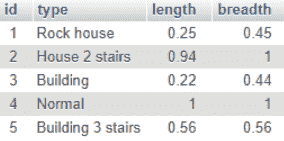
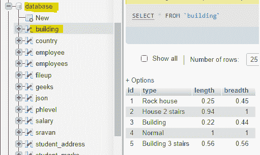
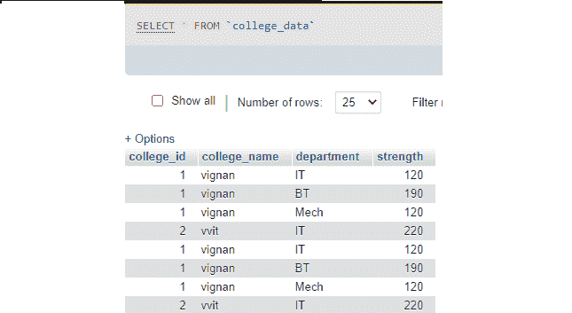

# PHP 中如何统计 MySQL 表中的行数？

> 原文:[https://www . geesforgeks . org/how-to-count-row-in-MySQL-table-in-PHP/](https://www.geeksforgeeks.org/how-to-count-rows-in-mysql-table-in-php/)

[PHP](https://www.geeksforgeeks.org/php-tutorials/) 代表超文本预处理器。 [MySQL](https://www.geeksforgeeks.org/mysql-common-mysql-queries/) 是一种用于管理数据库的数据库查询语言。

在本文中，我们将讨论如何使用 PHP 和 MySQL 获取数据库中特定表的行数。

**要求**:

*   [XAMPP](https://www.geeksforgeeks.org/performing-database-operations-in-xampp/)

**方法:**通过使用 PHP 和 MySQL，可以执行数据库操作。我们可以通过使用 MySQL[**MySQL _ num _ rows()**](https://www.geeksforgeeks.org/php-mysqli_num_rows-function/)**函数**得到一个表中的总行数。****

****语法:****

> **mysqli _ num _ rows(结果)；**

**结果就是指定[**MySQL _ query()**](https://www.geeksforgeeks.org/php-mysql-select-query/)函数返回的结果集标识符。**

****示例:**下表有 5 行。**

****

**为了计算*构建*表中的行数，使用了以下代码片段。**

```
$sql = "SELECT * from building";

if ($result = mysqli_query($con, $sql)) {

    // Return the number of rows in result set
    $rowcount = mysqli_num_rows( $result );

    // Display result
    printf("Total rows in this table :  %d\n", $rowcount);
 }
```

****输出:**预期结果如下。**

```
Total rows in this table : 5
```

****进场步骤:****

*   **创建名为*数据库*的数据库。**
*   **创建一个名为*的表，在数据库中构建*。**
*   **将记录插入其中。**
*   **编写 PHP 代码来统计行数。**

****步骤:****

*   **启动 XAMPP 服务器。**

**

XAMPP 服务器** 

*   **创建名为*数据库*的数据库，并在数据库内创建名为*建筑*的表格。**
*   **将记录插入其中**

**

建筑工作台** 

*   **编写 PHP 代码来统计行数。**

****PHP 代码:****

## **服务器端编程语言（Professional Hypertext Preprocessor 的缩写）**

```
<?php

// localhost is localhost
// servername is root
// password is empty
// database name is database
$con = mysqli_connect("localhost","root","","database");

    // SQL query to display row count
    // in building table
    $sql = "SELECT * from building";

    if ($result = mysqli_query($con, $sql)) {

    // Return the number of rows in result set
    $rowcount = mysqli_num_rows( $result );

    // Display result
    printf("Total rows in this table : %d\n", $rowcount);
}

// Close the connection
mysqli_close($con);

?>
```

****输出:**在 localhost 中运行上述 PHP 文件后，得到如下结果。**

```
Total rows in this table : 5
```

****示例 2:** 在下面的示例中，我们使用 MySQL [**count()**](https://www.geeksforgeeks.org/count-function-in-mysql/) 函数对表行进行计数。这是一个用来计算行数的聚合函数。**

****语法**:**

> **从表中选择计数(*)；**

**想想这张桌子。**

****

****PHP 代码:****

## **服务器端编程语言（Professional Hypertext Preprocessor 的缩写）**

```
<?php

// Servername
$servername = "localhost";

// Username
$username = "root";

// Empty password
$password = "";

// Database name
 $dbname = "database";

// Create connection by passing these
// connection parameters
$conn = new mysqli($servername, 
    $username, $password, $dbname);

// SQL query to find total count
// of college_data table
$sql = "SELECT count(*) FROM college_data ";
$result = $conn->query($sql);

// Display data on web page
while($row = mysqli_fetch_array($result)) {
    echo "Total Rows is ". $row['count(*)'];
    echo "<br />";
}

// Close the connection
$conn->close();

?>
```

****输出:****

```
Total Rows is 8
```