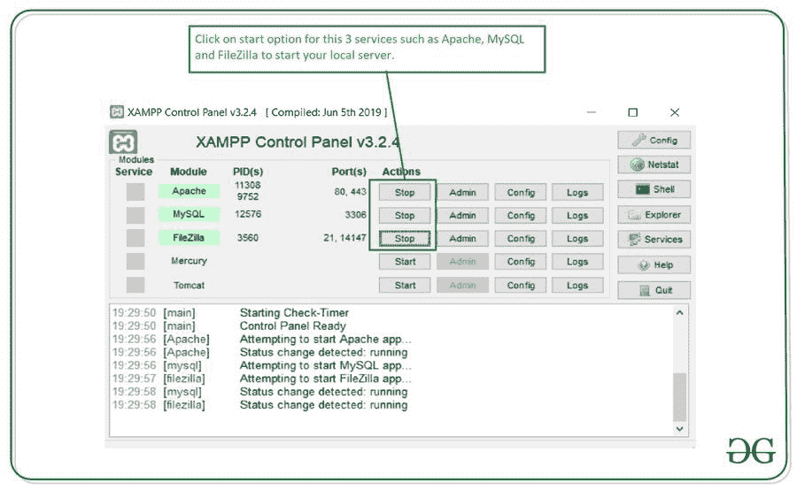
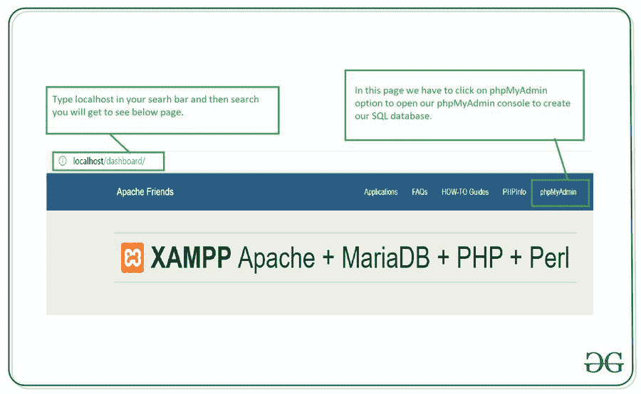
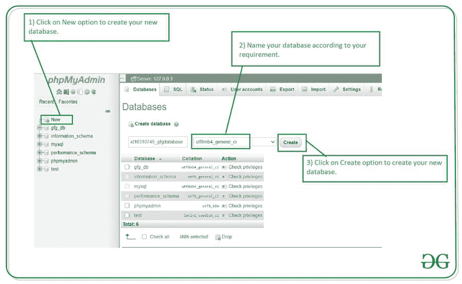
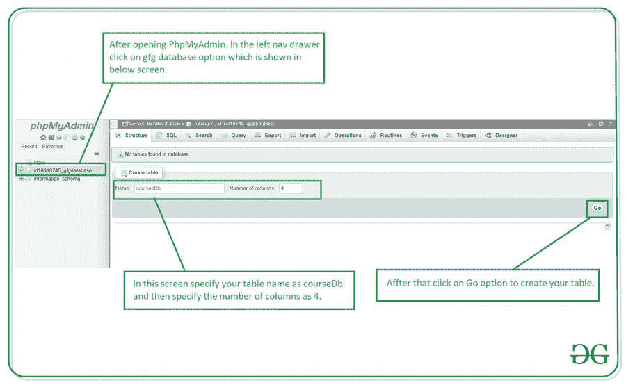
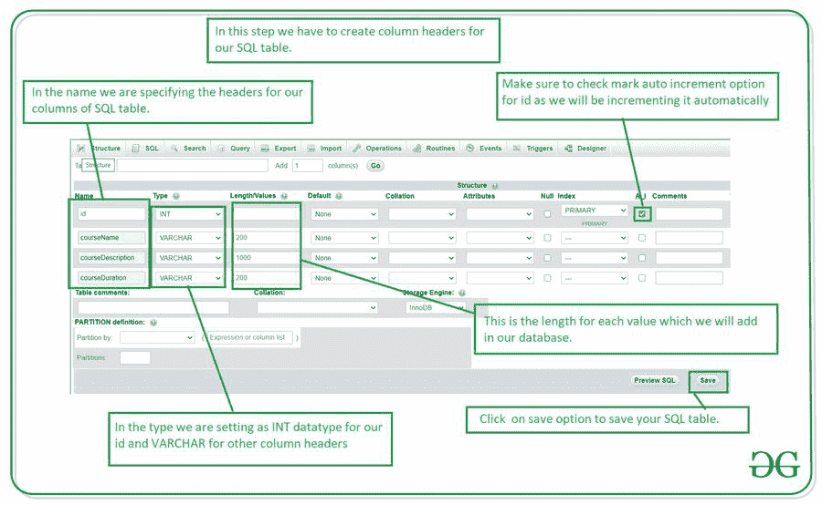

# 如何在 phpMyAdmin 中创建新数据库？

> 原文:[https://www . geesforgeks . org/如何创建新的 phpmyadmin 数据库/](https://www.geeksforgeeks.org/how-to-create-a-new-database-in-phpmyadmin/)

我们已经看到许多应用程序使用任何特定的后端数据库或服务来存储应用程序本身的数据。在本文中，我们将着眼于在 phpMyAdmin 中创建一个新的 SQL 数据库，以便我们可以使用该数据库执行 CRUD 操作。

在本文中，我们将简单地设置我们的 SQL 数据库，在其中我们将通过我们的安卓应用程序执行 CRUD 操作。为此，我们将在本地主机上使用 XAMPP 创建一个数据库。

**先决条件:**您应该已经在系统上安装了 XAMPP，这样我们就可以打开 phpMyAdmin 并在本地服务器上运行它。

**分步实施:**

**第一步:启动你的 XAMPP 服务器，如下图**

为了在 Xampp 上启动您的服务器，我们只需在 Xampp 控制台中启动服务，如下图所示。

启动此服务后，在搜索栏中键入 localhost，将会打开一个页面。在这个页面上，点击下面截图中显示的 phpMyAdmin 选项。

**步骤 2:创建新数据库**

单击屏幕下方显示的新建选项。之后，我们必须输入我们的数据库名称，然后点击创建选项来创建一个新的数据库。

创建新数据库后，我们必须继续创建新的 SQL 表。

**第三步:创建一个新的表来存储我们的数据**

创建数据库后，请参见下面的屏幕。在此屏幕中，我们将创建一个新表格。要创建新表，请指定表名和列数。在我们的例子中，我们将表名指定为 courseDb，并将列数指定为 4。4 个不同的列如下。第一列是 id，第二列是课程名称，第三列是课程描述，第四列是课程持续时间。

点击开始选项后，您的表格将被创建。现在我们必须为我们的 SQLite 表添加列标题。要添加此列标题，您将看到屏幕下方。

**创建 SQL 表的步骤:**

1.  在上面屏幕中显示的名称部分输入您的列的名称。
2.  之后，输入我们将要添加到数据库中的数据的数据类型。在本例中，我们为我们的标识指定了 INT，因为我们的标识将是一个整数。在 SQL 表中，VARCHAR 用于存储字符串。
3.  在长度/值部分，我们必须指定要添加到表中的数据的最大长度。我们不会为我们的标识指定长度，因为它是自动添加的。
4.  之后，我们必须自动增加我们的身份证。为此，我们必须选中上面截图中显示的框，这样 id 将在添加新数据时自动递增。

现在我们的数据库已经成功创建。