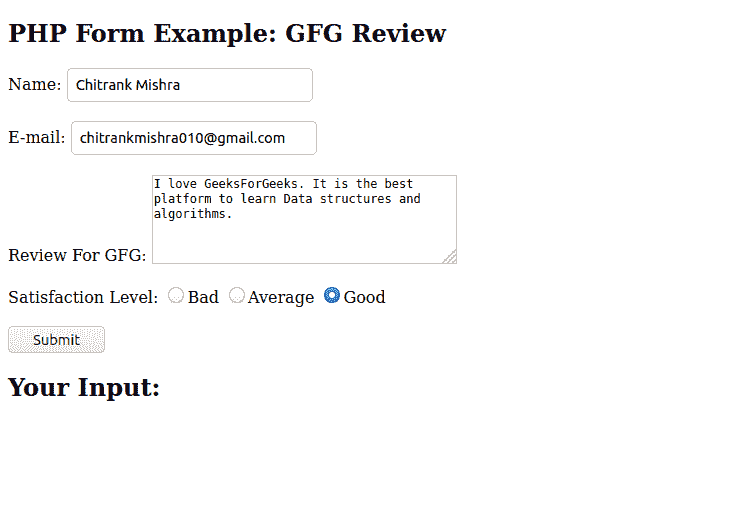
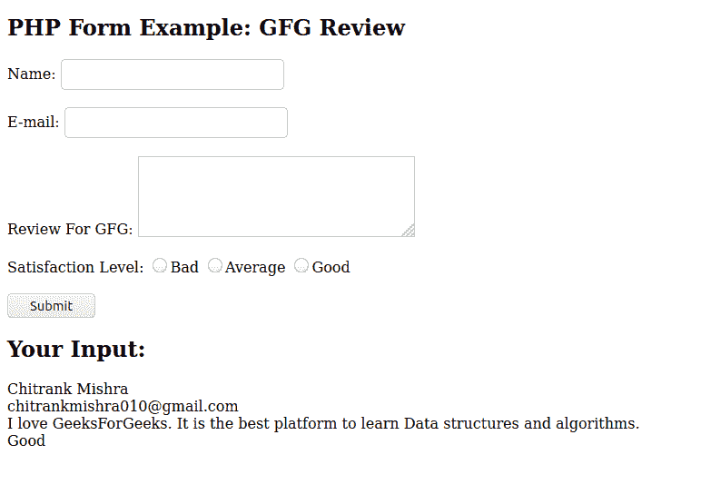

# 如何创建一个提交给自己的 PHP 表单？

> 原文:[https://www . geeksforgeeks . org/如何创建-PHP-表单-提交给自己/](https://www.geeksforgeeks.org/how-to-create-a-php-form-that-submit-to-self/)

表单可以使用 PHP 提交到网页本身。向 self 提交表单的主要目的是进行数据验证。数据验证意味着检查需要在表单字段中输入的数据。
**PHP_SELF** 是一个返回当前正在执行的脚本的变量。您可以在表单的操作字段中使用该变量。当用户按下提交按钮时，表单的操作字段指示在何处提交表单数据。大多数 PHP 页面都在表单本身所在的页面上维护数据验证。
这样做的一个好处是在网站结构发生变化的情况下，表单的数据验证码和表单保持在一起。
**代码片段:**

> <form name="”form1″" method="”post”" action="”<?php" echo="" htmlspecialchars="">”>
> </form>

**说明:**

*   **$ _ SERVER[' PHP _ Self ']:****$ _ SERVER[" PHP _ Self "]**是一个超级全局变量，返回当前正在执行的脚本的文件名。它将提交的表单数据发送到同一个页面，而不是跳到不同的页面。
*   **HTML specialcharters():****HTML specialcharrs()**函数将特殊字符转换为 HTML 实体。它会用<和>代替像这样的 HTML 字符。这可以防止攻击者通过在表单字段中插入 HTML 或 Javascript 代码来利用代码进行脚本攻击。

**注意:**黑客使用跨站点脚本很容易利用$_SERVER['PHP_SELF']在 URL 中插入“/”，然后插入易受攻击的脚本，但是 **htmlspecialcharacters()** 是解决方案，它将来自站点的 HTML 字符转换成无害的冗余代码。
以下示例说明了上述方法:
**示例:**

## 服务器端编程语言（Professional Hypertext Preprocessor 的缩写）

```html
<!DOCTYPE html>
<html>

<head>
</head>

<body>
    <?php
        // Defining variables
        $name = $email = $level = $review = "";

        // Checking for a POST request
        if ($_SERVER["REQUEST_METHOD"] == "POST") {
          $name = test_input($_POST["name"]);
          $email = test_input($_POST["email"]);
          $review = test_input($_POST["review"]);
          $level = test_input($_POST["level"]);
        }

        // Removing the redundant HTML characters if any exist.
        function test_input($data) {
          $data = trim($data);
          $data = stripslashes($data);
          $data = htmlspecialchars($data);
          return $data;
        }
        ?>

        <h2>PHP Form Example: GFG Review</h2>
        <form method="post" action=
            "<?php echo htmlspecialchars($_SERVER[" PHP_SELF "]);?>">
            Name:
            <input type="text" name="name">
            <br>
            <br>
            E-mail:
            <input type="text" name="email">
            <br>
            <br>
            Review For GFG:
            <textarea name="review"
                      rows="5" cols="40">
            </textarea>
            <br>
            <br>
            Satisfaction Level:
            <input type="radio" name="level"
                   value="Bad">Bad
            <input type="radio" name="level"
                   value="Average">Average
            <input type="radio" name="level"
                   value="Good">Good
            <br>
            <br>
            <input type="submit" name="submit"
                   value="Submit">
        </form>

        <?php
            echo "<h2>Your Input:</h2>";
            echo $name;
            echo "<br>";
            echo $email;
            echo "<br>";
            echo $review;
            echo "<br>";
            echo $level;
        ?>
</body>

</html>
```

**输出:**

*   **提交前:**



*   **提交后:**



您还可以插入函数来检查根据要求输入的值，并相应地显示验证。提交给自己的 PHP 表单在数据验证和数据库输入格式化方面有很多应用。