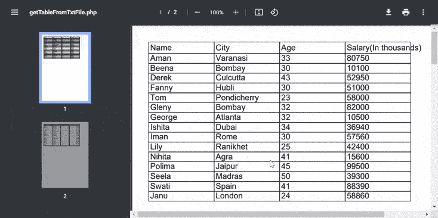

# 如何使用 PHP 从外部文本文件创建 PDF 文件中的表格？

> 原文:[https://www . geeksforgeeks . org/如何使用-php 创建外部文本文件中的 pdf 表格/](https://www.geeksforgeeks.org/how-to-create-a-table-in-pdf-file-from-external-text-files-using-php/)

在本文中，我们将学习使用 FPDF 从外部文本文件用 PHP 在 PDF 文件中创建一个表格。这是一个免费的 PHP 类，包含许多创建和修改 pdf 的函数。FPDF 类包括许多功能，如页面格式、页眉、页脚、自动分页符、换行符、图像支持、颜色、链接等。

**方法:**你需要[从](http://www.fpdf.org/en/download.php) [FPDF 网站](http://www.fpdf.org/)下载 FPDF 类，并将其包含在你的 PHP 脚本中。

```php
require('fpdf/fpdf.php');
```

根据您的需要实例化并使用 FPDF 类，如下例所示。

```php
$pdf=new FPDF();
```

**示例:**以下示例从具有员工数据的外部文本文件“employees.txt”生成 PDF 文件中的表格。可以根据需要下载或预览该文件。请参考代码中的注释，以便根据应用程序的需要更好地理解和定制。

## 服务器端编程语言（Professional Hypertext Preprocessor 的缩写）

```php
<?php

require('fpdf/fpdf.php');

class PDF extends FPDF {

    // Get data from the text file
    function getDataFrmFile($file) {

          // Read file lines
        $lines = file($file);

        // Get a array for returning output data
        $data = array();

        // Read each line and separate the semicolons
        foreach($lines as $line)
            $data[] = explode(';', chop($line));
        return $data;
    }

    // Simple table
    function getSimpleTable($header, $data) {

        // Header
        foreach($header as $column)
            $this->Cell(40, 7, $column, 1);
        $this->Ln(); // Set current position

        // Data
        foreach($data as $row) {
            foreach($row as $col)
                $this->Cell(40, 6, $col, 1);
            $this->Ln(); // Set current position
        }
    }

    // Get styled table
    function getStyledTable($header, $data) {

        // Colors, line width and bold font
        $this->SetFillColor(255, 0, 0);
        $this->SetTextColor(255);
        $this->SetDrawColor(128, 0, 0);
        $this->SetLineWidth(.3);
        $this->SetFont('', 'B');

        // Header
        $colWidth = array(40, 35, 40, 45);
        for($i = 0; $i < count($header); $i++)
            $this->Cell($colWidth[$i], 7, 
                        $header[$i], 1, 0, 'C', 1);
        $this->Ln();

        // Setting text color and color fill
        // for the background
        $this->SetFillColor(224, 235, 255);
        $this->SetTextColor(0);
        $this->SetFont('');

        // Data
        $fill = 0;
        foreach($data as $row) {

            // Prints a cell, first 2 columns  are left aligned
            $this->Cell($colWidth[0], 6, $row[0], 'LR', 0, 'L', $fill);
            $this->Cell($colWidth[1], 6, $row[1], 'LR', 0, 'L', $fill);

            // Prints a cell,last 2 columns  are right aligned
            $this->Cell($colWidth[2], 6, number_format($row[2]), 
                        'LR', 0, 'R', $fill);
            $this->Cell($colWidth[3], 6, number_format($row[3]), 
                        'LR', 0, 'R', $fill);
            $this->Ln();
            $fill=!$fill;
        }
        $this->Cell(array_sum($colWidth), 0, '', 'T');
    }
}
    // Instantiate a PDF object
    $pdf = new PDF();

    // Column titles given by the programmer
    $header = array('Name','City','Age','Salary(In thousands)');

    // Get data from the text files
    $data = $pdf->getDataFrmFile('employees.txt');

    // Set the font as required
    $pdf->SetFont('Arial', '', 14);

    // Add a new page
    $pdf->AddPage();
    $pdf->getSimpleTable($header,$data);
    $pdf->AddPage();
    $pdf->getStyledTable($header,$data);
    $pdf->Output();
?>
```

**employees.txt:** 以下是上述 HTML 文件中使用的文件“employees.txt”的内容。

```php
Aman;Varanasi;33;80750
Beena;Bombay;30;10100
Derek;Culcutta;43;52950
Fanny;Hubli;30;51000
Tom;Pondicherry;23;58000
Gleny;Bombay;32;82000
George;Atlanta;32;10500
Ishita;Dubai;34;36940
Iman;Rome;30;57560
Lily;Ranikhet;25;42400
Nihita;Agra;41;15600
Polima;Jaipur;45;99500
Seela;Madras;50;39300
Swati;Spain;41;88390
Janu;London;24;58860
```

**输出:**



PDF 文件中的表格