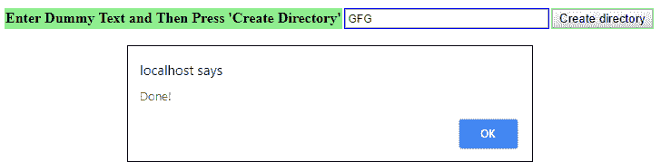

# 如何用 HTML 按钮和 PHP 创建目录？

> 原文:[https://www . geesforgeks . org/如何使用 html 按钮和 php 创建目录/](https://www.geeksforgeeks.org/how-to-create-directory-with-html-button-and-php/)

[mkdir()](https://www.geeksforgeeks.org/php-mkdir-function/) 函数用于在 PHP 中创建目录。这是 PHP 中的一个内置函数。mkdir()函数用指定的路径名创建一个新目录。路径和模式作为参数发送给 mkdir()函数，成功时返回真，失败时返回假。

**语法:**

```
mkdir( path, mode, recursive, context )
```

**返回值:**该函数成功返回真，失败返回假。

**示例:**

```
<!DOCTYPE html>
<?php
    function createDirectory() {
        $add = $_POST["add"];
        mkdir("Gfg ".$add);
        echo "<script type = 'text/javascript'>alert('Done!');</script>";
    }
?>
<html>
    <head>
        <title>
            Create directory with HTML button and PHP 
        </title>
    </head>

    <body>
    <?php
        if (!isset($_POST['submit'])) {
    ?>
        <form action = "" method = "post">

            <table> 
            <tr>
                <td style = " border-style: none;"></td>
                <td bgcolor = "lightgreen" style = "font-weight: bold">
                    Enter Dummy Text and Then Press 'Create Directory'
                </td>

                <td bgcolor = "lightred">
                    <input type = "text" style = "width: 220px;" 
                    class = "form-control" name = "add" id = "add" />
                </td>

                <td bgcolor = "lightgreen" colspan = "2">
                    <input type = "submit" name = "submit" 
                        value = "Create directory" /> 
                </td>
            </tr>
            </table>
        </form>
    <?php 
        }
        else {
            createDirectory();
        }
    ?>
    </body>
</html>
```

**输出:**
