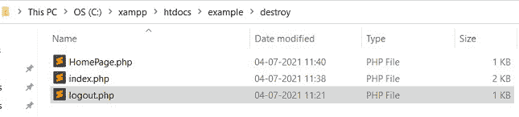
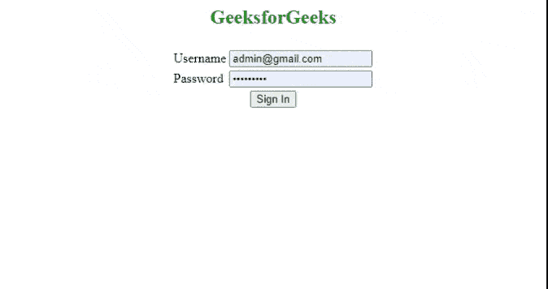

# PHP 中一段时间后如何破坏会话？

> 原文:[https://www . geesforgeks . org/如何在 php 中破坏会话/](https://www.geeksforgeeks.org/how-to-destroy-session-after-some-time-in-php/)

在 PHP 中，我们为登录的用户创建会话，并使该用户在线，直到用户退出该会话。可以通过单击注销按钮或在固定时间后销毁该会话来完成。

默认情况下，创建的任何特定会话的到期时间为 1440 秒(即 24*60)，即 24 分钟。但是在某些情况下，我们需要相应地更改默认时间。

我们可以通过两种方式做到。

1.我们可以在 *php.ini* 文件中更改它，并更改配置，但这将更改在该服务器上工作的所有站点的默认时间，这将对所有其他站点造成阻碍。所以第二种选择更可取。

2.我们可以从逻辑上改变会话的破坏时间。我们通过计算系统当前时间来计算会话的创建时间，当用户浏览脚本的不同页面时，将检查到期时间，即明确声明为会话到期。

**文件结构:**



**index.php:** 如果您输入了错误的凭据，它将抛出一个错误，如果您输入了正确的凭据，您将被重定向到“*home page . PHP”*并在 1 分钟后销毁会话。开发人员可以相应地更改时间。

## 服务器端编程语言（Professional Hypertext Preprocessor 的缩写）

```phphtml
<?php

    session_start();

    if(@$_POST['submit']) {
        $username = $_POST['email'];
        $password = $_POST['pwd'];

        if($username =="GFG@gmail.com" && $password=="gfg123") {
            $_SESSION['user'] = $username;

            // Taking current system Time
            $_SESSION['start'] = time(); 

            // Destroying session after 1 minute
            $_SESSION['expire'] = $_SESSION['start'] + (1 * 10) ; 

            header('Location: HomePage.php');
        }
        else {
            $err= "<font color='red'>Invalid user login </font>";
        }
    }
?>

<html>

<head>
    <style>
        h2 {
            text-align: center;
        }
    </style>
</head>

<body>
    <h2 style="color:green">GeeksforGeeks</h2>
    <form method="post">

        <table align="center">
            <tr>
                <td>
                    <?php echo @$err;?>
                </td>
            </tr>
            <tr>
                <td>Username </td>
                <td><input type="email" name="email" 
                    placeholder="GFG@gmail.com" required>
                </td>
            </tr>
            <tr>
                <td>Password</td>
                <td><input type="password" name="pwd" 
                    placeholder="gfg123" required>
                </td>
            </tr>
            <tr>
                <td colspan="2" align="center">
                    <input type="submit" 
                        value="Sign In" name="submit">
                </td>
            </tr>
        </table>
    </form>
</body>

</html>
```

## 主页. php

```phphtml
<?php

    session_start();

    if(!isset($_SESSION['user'])) {
        echo "<p align='center'>Want to login again";
        echo "<a href='index.php'>Click Here to Login</a></p>";
    }
    else {
        $now = time();

        if($now > $_SESSION['expire']) {
            session_destroy();
            echo "<p align='center'>Session has been destoryed!!";
            header("Location: index.php");  
        }
        else { 
?>
<html>

<head>
    <meta http-equiv="refresh" content="10">
</head>

<body>
    <p>
        Welcome
        <?php echo $_SESSION['user']; ?>

        <span style="float:right">
            <a href='logout.php'>LogOut</a></span>

        <p style="padding-top: 20px; 
            background:#CCCCCC;
            height: 400px; text-align: center">
            <span style="color:red; text-align:center">
                Your Session Will destroy after 1 minute
            </span>
            <br /><br />
        </p>
    </p>
    <?php
    }
}

?>
</body>

</html>
```

## logout.php

```phphtml
<?php

session_start();

session_destroy();

header('location:index.php');

?>
```

**输出:**



会话破坏