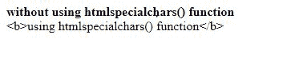
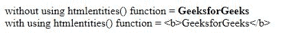
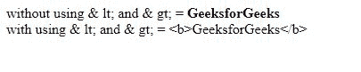

# 如何使用 PHP 将 HTML 标签显示为纯文本

> 原文:[https://www . geesforgeks . org/how-display-html-tags-as-plain-text-use-PHP/](https://www.geeksforgeeks.org/how-to-display-html-tags-as-plain-text-using-php/)

HTML 标签以小于字符开始，以大于字符结束，标签中的文本根据所使用的标签进行格式化和显示。每个标签对浏览器来说都有特殊的意义，但是在网页中显示普通的 HTML 代码是有情况的。
PHP 中有各种方法将 HTML 标签显示为纯文本，下面讨论其中一些:
**方法 1:使用 htmlspecialchars()函数:**HTML specialchars()函数是 PHP 中的内置函数，用于将所有预定义字符转换为 HTML 实体。

**语法:**

```php
string htmlspecialchars( $string, $flags, $encoding, $double_encode )
```

*   **$string:** 此参数用于保存输入字符串。
*   **$flags:** 此参数用于保存标志。它是一个或两个标志的组合，告诉如何处理报价。
*   **$encoding:** 它是一个可选参数，指定转换字符时使用的编码。如果没有给出编码，那么它将根据 PHP 默认版本进行转换。
*   **$double_encode:** 如果 double_encode 被关闭，那么 PHP 将不会对现有的 HTML 实体进行编码。默认值是转换所有内容。

**返回值:**该函数返回转换后的字符串。如果输入字符串无效，将返回空字符串。

**示例:**

```php
<?php

echo("<b>without using htmlspecialchars() function</b><br>");

$myVar = htmlspecialchars("<b>using htmlspecialchars()
                            function</b>", ENT_QUOTES);
echo($myVar);
?>
```

**输出:**


**方法二:使用 htmlentities()函数:**HTML entities()函数是 PHP 中的一个内置函数，用于转换所有适用于 HTML 实体的字符。该函数转换适用于 HTML 实体的所有字符。

**语法:**

```php
string htmlentities( $string, $flags, $encoding, $double_encode )
```

**参数:**该功能接受四个参数，如上所述，描述如下:

*   **$string:** 此参数用于保存输入字符串。
*   **$flags:** 此参数用于保存标志。它是一个或两个标志的组合，告诉如何处理报价。
*   **编码:**这是一个可选参数，指定转换字符时使用的编码。如果没有给出编码，那么它将根据 PHP 默认版本进行转换。
*   **$double_encode:** 如果 double_encode 被关闭，那么 PHP 将不会对现有的 HTML 实体进行编码。默认值是转换所有内容。

**返回值:**该函数返回已编码的字符串。

**示例:**

```php
<?php
$str = "<b>GeeksforGeeks</b>";
echo("without using htmlentities() function = ".$str."<br>");

$myVar = htmlentities($str, ENT_QUOTES);
echo("with using htmlentities() function = ".$myVar);

?>
```

**输出:**


**方法 3:** 该方法是用一组字符替换字符，得到想要的输出。在此方法中，<由& lt 代替；而>则被& gt 所取代；。

**示例:**

```php
<?php
$str = "<b>GeeksforGeeks</b>";
echo("without using & lt; and & gt; = ".$str."<br>");

$myVar = "<b>GeeksforGeeks</b>";
echo("with using & lt; and & gt; = ".$myVar);

?>
```

**输出:**
