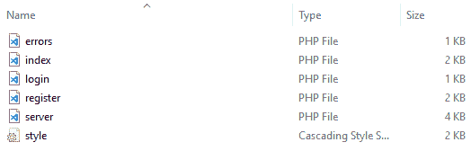

# 如何用 PHP 显示登录的用户信息？

> 原文:[https://www . geesforgeks . org/how-display-log in-user-information-in-PHP/](https://www.geeksforgeeks.org/how-to-display-logged-in-user-information-in-php/)

在脸书、Instagram 等社交网站中，已经登录的用户的用户名和个人资料图片会显示在网站的标题中，并且该标题保持不变，与用户打开的网页无关。这种功能可以通过使用**会话变量**来创建。
会话变量仅在用户会话处于活动状态时存在。会话完成后，会话变量被销毁。这些对于每个访问者都是唯一的，并且一旦用户登录，通常用于存储用户特定的信息，例如用户名、个人资料图片等。
**会话变量用于在 PHP 中显示登录的用户信息。**
**项目说明及代码:**
这是一个简单的报名系统。register.php 页面会询问用户所需的用户名、电子邮件和密码，然后单击提交按钮，将输入的数据发送到数据库中。之后，用户被重定向到 index.php 页面，在那里显示欢迎消息和登录用户的用户名。
第一步是创建一个数据库，然后在里面创建一个表。数据库名为“注册”，表名为“用户”。“用户”表将包含 4 个字段。

1.  id-主键-自动递增
2.  用户名–varchar(100)
3.  电子邮件-varchar(100)
4.  password–varchar(100)
    这个‘id’将是主键，这意味着它对于每个注册用户都是唯一的。它还会为每个新注册自动递增。用户名、电子邮件和密码的数据类型将是 varchar。尺寸可以根据需要调整，但是 100 就足够了。
    **表的 SQL 代码:**

## 结构化查询语言

```html
CREATE TABLE `users` (
    `id` int(11) NOT NULL AUTO_INCREMENT PRIMARY KEY,
    `username` varchar(100) NOT NULL,
    `email` varchar(100) NOT NULL,
    `password` varchar(100) NOT NULL
)
```


数据库和表创建后的 phpMyAdmin



项目文件夹，包含必要的文件

### error.php

## 超文本标记语言

```html
<?php  if (count($errors) > 0) : ?>
    <div class="error">
        <?php foreach ($errors as $error) : ?>

<p><?php echo $error ?></p>

        <?php endforeach ?>
    </div>
<?php  endif ?>
```

**说明:**error.php 文件负责保存系统的错误信息。假设用户输入了错误的用户名和密码组合，那么在这种情况下，错误消息将存储在$error 变量中，然后使用' echo '向用户显示；PHP 的功能。
T3】server.php

## 服务器端编程语言（Professional Hypertext Preprocessor 的缩写）

```html
<?php

// Starting the session, necessary
// for using session variables
session_start();

// Declaring and hoisting the variables
$username = "";
$email    = "";
$errors = array();
$_SESSION['success'] = "";

// DBMS connection code -> hostname,
// username, password, database name
$db = mysqli_connect('localhost', 'root', '', 'registration');

// Registration code
if (isset($_POST['reg_user'])) {

    // Receiving the values entered and storing
    // in the variables
    // Data sanitization is done to prevent
    // SQL injections
    $username = mysqli_real_escape_string($db, $_POST['username']);
    $email = mysqli_real_escape_string($db, $_POST['email']);
    $password_1 = mysqli_real_escape_string($db, $_POST['password_1']);
    $password_2 = mysqli_real_escape_string($db, $_POST['password_2']);

    // Ensuring that the user has not left any input field blank
    // error messages will be displayed for every blank input
    if (empty($username)) { array_push($errors, "Username is required"); }
    if (empty($email)) { array_push($errors, "Email is required"); }
    if (empty($password_1)) { array_push($errors, "Password is required"); }

    if ($password_1 != $password_2) {
        array_push($errors, "The two passwords do not match");
        // Checking if the passwords match
    }

    // If the form is error free, then register the user
    if (count($errors) == 0) {

        // Password encryption to increase data security
        $password = md5($password_1);

        // Inserting data into table
        $query = "INSERT INTO users (username, email, password)
                  VALUES('$username', '$email', '$password')";

        mysqli_query($db, $query);

        // Storing username of the logged in user,
        // in the session variable
        $_SESSION['username'] = $username;

        // Welcome message
        $_SESSION['success'] = "You have logged in";

        // Page on which the user will be
        // redirected after logging in
        header('location: index.php');
    }
}

// User login
if (isset($_POST['login_user'])) {

    // Data sanitization to prevent SQL injection
    $username = mysqli_real_escape_string($db, $_POST['username']);
    $password = mysqli_real_escape_string($db, $_POST['password']);

    // Error message if the input field is left blank
    if (empty($username)) {
        array_push($errors, "Username is required");
    }
    if (empty($password)) {
        array_push($errors, "Password is required");
    }

    // Checking for the errors
    if (count($errors) == 0) {

        // Password matching
        $password = md5($password);

        $query = "SELECT * FROM users WHERE username=
                '$username' AND password='$password'";
        $results = mysqli_query($db, $query);

        // $results = 1 means that one user with the
        // entered username exists
        if (mysqli_num_rows($results) == 1) {

            // Storing username in session variable
            $_SESSION['username'] = $username;

            // Welcome message
            $_SESSION['success'] = "You have logged in!";

            // Page on which the user is sent
            // to after logging in
            header('location: index.php');
        }
        else {

            // If the username and password doesn't match
            array_push($errors, "Username or password incorrect");
        }
    }
}

?>
```

**说明:**使用 session_start()方法启动会话。之后，声明变量并创建一个错误数组。它将存储所有的错误信息。然后，server.php 页面连接到之前创建的“注册”数据库。用户点击 register.php 按钮上的“注册”按钮后，输入的数据被发送到数据库，这就完成了新的注册。但是，表单验证在此之前完成，以确保用户正确填写表单。所有字段都是必需的，不能留空。
**第 18–21 行:****MySQL _ real _ escape _ string**在将数据发送到数据库之前转义特殊字符。这对于 SQL 注入带来的数据库安全性至关重要。
**第 25–27 行:**这些行确保用户正在填写所有输入框，以及“密码”和“确认密码”是否匹配。如果两个密码都匹配，那么代码将继续运行。
**第 29–32 行:**检查密码是否匹配。
**第 35–46 行:**如果到此时为止的错误数为零，则密码被“md5”加密，输入的数据被发送到数据库。注册过程完成后，用户名存储在会话变量中，用户被重定向到 index.php 页面，在那里他被要求输入登录凭据。
**第 50–80 行:**首先输入的用户名和密码经过了杀毒。这对提高数据库安全性至关重要，因为它消除了任何 SQL 注入的可能性。如果用户名或密码字段留空，用户将收到一条错误消息。
如果发现代码点之前的错误数量为 0，则运行数据库检查。如果发现数据库中存在用户输入的用户名，则用户成功登录。然后，用户被重定向到“index.php”页面。
T21login.php

## 超文本标记语言

```html
<?php include('server.php') ?>
<!DOCTYPE html>
<html>
<head>
    <title>
        Login and Registration
        System - LAMP Stack
    </title>

    <link rel="stylesheet" type="text/css"
            href="style.css">
</head>
<body>
    <div class="header">
        <h2>Login Here!</h2>
    </div>

    <form method="post" action="login.php">

        <?php include('errors.php'); ?>

        <div class="input-group">
            <label>Enter Username</label>
            <input type="text" name="username" >
        </div>
        <div class="input-group">
            <label>Enter Password</label>
            <input type="password" name="password">
        </div>
        <div class="input-group">
            <button type="submit" class="btn"
                        name="login_user">
                Login
            </button>
        </div>

<p>
            New Here?
            <a href="register.php">
                Click here to register!
            </a>
        </p>

    </form>
</body>

</html>
```

**说明:**系统登录页面。用户必须输入用户名和密码才能成功登录。按下登录按钮后，运行 server.php 页面中编写的登录代码，这将完成所有后端工作，例如检查用户名和密码是否匹配。
T3【register.php】T4

## 服务器端编程语言（Professional Hypertext Preprocessor 的缩写）

```html
<?php include('server.php') ?>
<!DOCTYPE html>
<html>
<head>
    <title>
        Registration system PHP and MySQL
    </title>
    <link rel="stylesheet" type="text/css"
                    href="style.css">
</head>

<body>
    <div class="header">
        <h2>Register</h2>
    </div>

    <form method="post" action="register.php">

        <?php include('errors.php'); ?>

        <div class="input-group">
            <label>Enter Username</label>
            <input type="text" name="username"
                value="<?php echo $username; ?>">
        </div>
        <div class="input-group">
            <label>Email</label>
            <input type="email" name="email"
                value="<?php echo $email; ?>">
        </div>
        <div class="input-group">
            <label>Enter Password</label>
            <input type="password" name="password_1">
        </div>
        <div class="input-group">
            <label>Confirm password</label>
            <input type="password" name="password_2">
        </div>
        <div class="input-group">
            <button type="submit" class="btn"
                                name="reg_user">
                Register
            </button>
        </div>

<p>
            Already having an account?
            <a href="login.php">
                Login Here!
            </a>
        </p>

    </form>
</body>
</html>
```

**说明:**本页面包含注册页面的 HTML 编码。“server.php”和“errors.php”页面分别包含在第 01 行和第 15 行。这是注册系统后端工作所必需的。系统会要求用户输入用户名、电子邮件和密码来创建帐户。填写完输入字段后，输入的数据被发送到数据库表。
T3【index.php】T4

## 超文本标记语言

```html
<?php

// Starting the session, to use and
// store data in session variable
session_start();

// If the session variable is empty, this
// means the user is yet to login
// User will be sent to 'login.php' page
// to allow the user to login
if (!isset($_SESSION['username'])) {
    $_SESSION['msg'] = "You have to log in first";
    header('location: login.php');
}

// Logout button will destroy the session, and
// will unset the session variables
// User will be headed to 'login.php'
// after logging out
if (isset($_GET['logout'])) {
    session_destroy();
    unset($_SESSION['username']);
    header("location: login.php");
}
?>
<!DOCTYPE html>
<html>
<head>
    <title>Homepage</title>
    <link rel="stylesheet" type="text/css"
                    href="style.css">
</head>
<body>
    <div class="header">
        <h2>Home Page</h2>
    </div>
    <div class="content">

        <!-- Creating notification when the
                user logs in -->

        <!-- Accessible only to the users that
                have logged in already -->
        <?php if (isset($_SESSION['success'])) : ?>
            <div class="error success" >
                <h3>
                    <?php
                        echo $_SESSION['success'];
                        unset($_SESSION['success']);
                    ?>
                </h3>
            </div>
        <?php endif ?>

        <!-- information of the user logged in -->
        <!-- welcome message for the logged in user -->
        <?php  if (isset($_SESSION['username'])) : ?>

<p>
                Welcome
                <strong>
                    <?php echo $_SESSION['username']; ?>
                </strong>
            </p>

<p>
                <a href="index.php?logout='1'" style="color: red;">
                    Click here to Logout
                </a>
            </p>

        <?php endif ?>
    </div>
</body>
</html>
```