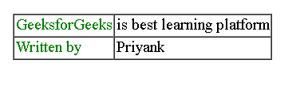

# 如何用 PHP 在表内显示字符串值？

> 原文:[https://www . geesforgeks . org/如何使用-php 显示表中的字符串值/](https://www.geeksforgeeks.org/how-to-display-string-values-within-a-table-using-php/)

表是按行和列排列的数据，也可能是更复杂的结构。表格广泛应用于通信、研究和数据分析。

*   表格对于各种任务都很有用，例如显示文本信息和数字数据。
*   表格可用于比较表格形式布局中的两个或多个项目。
*   表用于创建数据库。

**方法:**使用 PHP [**中的**](https://www.geeksforgeeks.org/html-tables/) **[HTML 表格](https://www.geeksforgeeks.org/html-tables/)元素回显** 来打印表格中的字符串值。我们可以在一个 PHP 脚本中编写 HTML 标签来显示作为 HTML 组件呈现的输出。

**PHP 代码:**

## 服务器端编程语言（Professional Hypertext Preprocessor 的缩写）

```php
<?php

// Declaration of strings
$var1 = "Geeksforgeeks";
$var2 = "Priyank";

// Display HTML table using PHP echo
// Use $variable_name to use a string
// in code
echo "<table border=1 cellspacing=1 cellpadding=1>
    <tr> 
       <td><font color=green>$var1</font></td>
       <td>is best learning platform</td>
    </tr>
    <tr> 
        <td><font color=green>Written by</font></td>
        <td>$var2</td>
    </tr>
</table>";
?>
```

**Output:**

```php
<table border=1 cellspacing=1 cellpadding=1>
    <tr> 
        <td>
            <font color=green>
                Geeksforgeeks
            </font>
        </td> 
        <td>
            is best learning platform
        </td>
    </tr>
    <tr> 
        <td>
            <font color=green>
                Written by
            </font>
        </td> 
        <td>
            Priyank
        </td>
    </tr>
</table>
```

如果我们在本地服务器上运行这段代码，那么输出将以表格的形式显示。

