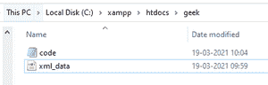
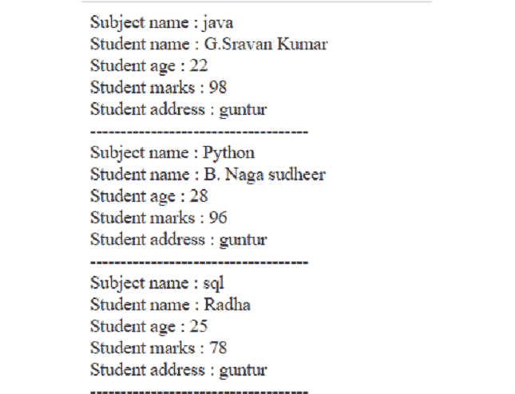

# 如何用 PHP 在网页中显示 XML 数据？

> 原文:[https://www . geesforgeks . org/how-display-XML-data-in-web-page-use-PHP/](https://www.geeksforgeeks.org/how-to-display-xml-data-in-web-page-using-php/)

在本文中，我们将通过 [XAMPP](https://www.geeksforgeeks.org/how-to-install-xampp-on-windows/) 服务器使用 [PHP](https://www.geeksforgeeks.org/php-tutorials/) 在网页上显示 XML 文件中的数据。PHP 是一种服务器端脚本语言，主要用于处理 web 数据。 [XML](https://www.geeksforgeeks.org/xml-basics/) 代表一种可扩展标记语言。

**要求:**

*   XAMPP 服务器

**语法:**

```
<root>
   <child>
   <subchild>.....</subchild>
   </child>
</root>
```

**方法:**我们将在 PHP 代码中主要使用两个函数。 *simplexml_load_file()* 函数用于将 xml 文档转换为对象。

*   [simplexml_load_file](https://www.geeksforgeeks.org/php-simplexml_load_file-function/)

    ```
    simplexml_load_file(name of XML file)

    ```

*   **[子节点():](https://www.geeksforgeeks.org/php-simplexmlelement-children-function/)***子节点()*函数查找指定节点的子节点。

    ```
    $xml_data->children()

    ```

**执行步骤:**

*   **步骤 1:** 启动 XAMPP 服务器。
    T3】
*   打开记事本，在 *xml_data.xml* 和*code.php*中键入以下代码格式 **xml_data.xml:** 以*学生* XML 数据为例。

    ## XML _ data . XML

    ```
    <?xml version = "1.0" encoding = "utf-8"?>
    <collegedata>
       <department category = "IT">
          <subjects lang = "en">java</subjects>
          <name>G.Sravan Kumar</name>
          <age>22</age>
          <marks>98</marks>
          <address>guntur</address>
       </department>

       <department category = "CSE">
          <subjects lang = "en">Python</subjects>
          <name>B. Naga sudheer</name>
          <age>28</age>
          <marks>96</marks>
           <address>guntur</address>
       </department>

       <department category = "IT">
          <subjects lang = "en">sql</subjects>
          <name>Radha</name>
          <age>25</age>
          <marks>78</marks>
           <address>guntur</address>
       </department>

    </collegedata>
    ```

*   **第三步:**以下是*code.php*文件的代码。

    ## code.php

    ```
    <?php
    // Start php code
    // Load xml file into xml_data variable
    $xml_data = simplexml_load_file("xml_data.xml") or 
    die("Error: Object Creation failure");
    // Use foreach loop to display data and for sub elements access,
    // We will use children() function
    foreach ($xml_data->children() as $data)
    {
        //display each sub element in xml file
        echo "Subject name : ", $data->subjects . "<br> ";
        echo "Student name : ", $data->name . "<br> ";
        echo "Student age : ", $data->age . "<br> ";
        echo "Student marks : ", $data->marks . "<br>";
        echo "Student address : ", $data->address . "<br>";
        echo "------------------------------------";
        echo "<br>";
    }
    ?>
    ```

*   **第四步:**将这两个文件保存在 *xampp/htdocs/geek* 文件夹中。开发者可以使用任何其他文件夹来代替*极客*文件夹。

**输出:**打开浏览器，输入 *localhost/geek/code.php* 查看输出。



XML 数据