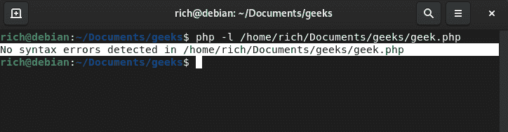
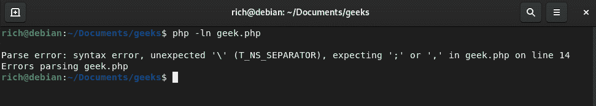

# 如何用 PHP 做语法检查？

> 原文:[https://www . geesforgeks . org/how-to-do-语法检查-使用-php/](https://www.geeksforgeeks.org/how-to-do-syntax-checking-using-php/)

语法检查是编程中最重要的任务之一。我们的编译器检查我们的代码，并显示相关的错误，如果有任何在代码中，即编译时，运行时，语法等。我们可以做同样的事情，即在 PHP 中进行语法检查。

在本文中，我们将学习如何在 PHP 中进行语法检查。语法基本上是一组定义编程语言结构的规则。我们不能手动改变语法，我们必须遵循语言的规则。

**语法:**

```php
php -ln filename
```

我们可以用**-语法检查**代替 **-ln，**可读性更强。

```php
php --syntax-check filename
```

如果所提供的 PHP 文件没有语法错误并且通过了语法检查，则返回**“**”在<文件名>“**”中没有检测到语法错误。否则，如果 PHP 文件中有语法错误，它将返回“解析<文件名>”**。****

**“-l”或“–语法检查”参数对给定的 PHP 文件执行语法检查。**

****例 1:** 下面的 PHP 代码没有语法错误。它找到两个数的和。**

## **服务器端编程语言（Professional Hypertext Preprocessor 的缩写）**

```php
<?php

    // First number
    $x = 10;

    // Second number
    $y = 20;

    // Sum of two numbers
    $c = $x + $y;

    // Displaying the sum
    echo "Sum is: ", $c;
    echo "\n"
?>
```

****Output**

```php

Sum is: 30
```** 

****语法检查命令:****

```php
php -ln /home/rich/Documents/geeks/geek.php
```

****输出:****

**

无语法错误** 

****例 2:** 在上面的代码中，我们简单地替换了“Sum:，$ z；带有“Sum:，$ z；然后它抛出一个语法错误。**

## **服务器端编程语言（Professional Hypertext Preprocessor 的缩写）**

```php
<?PHP

    // First number
    $x = 15;

    // Second number 
    $y = 30;

    // Sum
    $z = $x + $y;

    // Displaying sum
    echo "Sum:, $z;
    echo "\n";
?>
```

****进行语法检查的命令:****

```php
php -ln /home/rich/Documents/geeks/geek.php
```

****输出:****

**

句法误差**